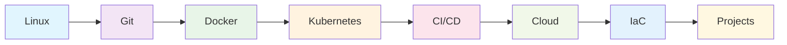
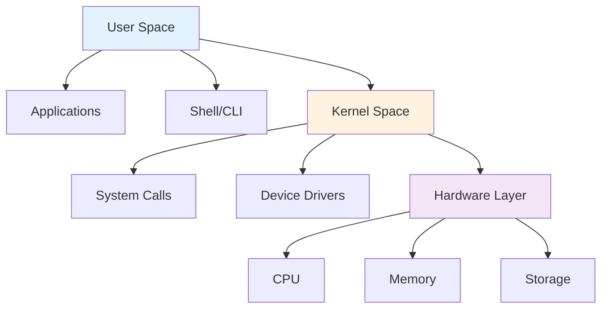
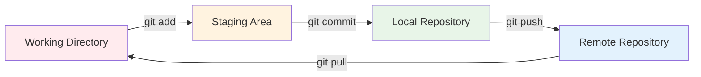

```mermaid
gantt
    title DevOps Learning Timeline
    dateFormat  X
    axisFormat %s
    
    section Foundation
    Linux Fundamentals    :done, linux, 0, 2w
    Git Version Control   :done, git, after linux, 1w
    
    section Containerization
    Docker Basics         :active, docker, after git, 2w
    Kubernetes           :k8s, after docker, 3w
    
    section Automation
    Jenkins CI/CD        :jenkins, after k8s, 2w
    SonarQube           :sonar, after jenkins, 1w
    Nexus Artifactory   :nexus, after sonar, 1w
    Build Tools         :build, after nexus, 1w
    
    section Cloud & IaC
    AWS Cloud           :aws, after build, 2w
    Ansible            :ansible, after aws, 1w
    Terraform          :terraform, after ansible, 1w
    
    section Projects
    Real-time Projects  :projects, after terraform, 3w
```

# 🚀 Cloud DevOps Engineer Complete Course Curriculum

A comprehensive guide from beginner to expert level covering all essential DevOps technologies with practical examples and real-world projects.

## 📋 Table of Contents

- [Course Overview](#-course-overview)
- [Learning Path](#-learning-path)
- [Module 1: Linux Fundamentals](#1️⃣-linux-fundamentals-week-1-2)
  - [Linux Architecture](#11-linux-basics)
  - [Essential Commands](#12-essential-commands)
  - [File Permissions](#13-file-permissions)
  - [Process Management](#14-process-management)
- [Module 2: Git Version Control](#2️⃣-git-version-control-week-3)
  - [Git Workflow](#21-git-workflow)
  - [Basic Commands](#22-basic-commands)
  - [Branching Strategy](#23-branching-strategy)
  - [Conflict Resolution](#24-conflict-resolution)
- [Module 3: Docker Containerization](#3️⃣-docker-containerization-week-4-5)
  - [Container vs VM](#31-container-vs-virtual-machine)
  - [Docker Architecture](#32-docker-architecture)
  - [Essential Commands](#33-essential-docker-commands)
  - [Dockerfile](#34-dockerfile-example)
  - [Docker Compose](#35-docker-compose)
- [Module 4: Kubernetes Orchestration](#4️⃣-kubernetes-orchestration-week-6-8)
  - [K8s Architecture](#41-kubernetes-architecture)
  - [Core Concepts](#42-core-concepts)
  - [kubectl Commands](#43-essential-kubectl-commands)
  - [YAML Manifests](#44-yaml-manifests)
  - [Networking](#45-networking-concepts)
- [Module 5: CI/CD with Jenkins](#5️⃣-cicd-with-jenkins-week-9-10)
  - [Pipeline Flow](#51-cicd-pipeline-flow)
  - [Jenkins Architecture](#52-jenkins-architecture)
  - [Jenkinsfile](#53-jenkinsfile-pipeline)
  - [Multi-branch Strategy](#54-multi-branch-pipeline-strategy)
- [Module 6: SonarQube Code Quality](#6️⃣-sonarqube-code-quality-week-11)
  - [Quality Metrics](#61-code-quality-metrics)
  - [Quality Gates](#62-quality-gates)
  - [Jenkins Integration](#63-jenkins-integration)
  - [Language Configuration](#64-language-specific-configuration)
- [Module 7: Artifactory - Nexus](#7️⃣-artifactory---nexus-week-12)
  - [Repository Types](#71-repository-types)
  - [Maven Integration](#72-maven-integration)
  - [Docker Registry](#73-docker-registry)
  - [NPM Registry](#74-npm-registry)
  - [Security Policies](#75-security-and-cleanup-policies)
- [Module 8: Build Tools](#8️⃣-build-tools-week-13)
  - [Build Tools Overview](#81-build-tools-overview)
  - [Maven (Java)](#82-maven-java)
  - [NPM (Node.js)](#83-npm-nodejs)
  - [MSBuild (.NET)](#84-msbuild-net)
  - [Python Tools](#85-python-pippoetry)
- [Module 9: AWS Cloud](#9️⃣-aws-cloud-week-14-15)
  - [Core Services](#91-aws-core-services)
  - [Architecture Patterns](#92-three-tier-architecture)
  - [AWS CLI](#93-aws-cli-commands)
  - [IAM Policies](#94-iam-policies)
  - [EKS Deployment](#95-eks-deployment)
- [Module 10: Ansible](#🔟-ansible-configuration-management-week-16)
  - [Ansible Architecture](#101-ansible-architecture)
  - [Inventory Management](#102-inventory-file)
  - [Playbooks](#103-playbook-example)
  - [Roles Structure](#104-roles-structure)
  - [Ansible Vault](#105-ansible-vault)
- [Module 11: Terraform](#1️⃣1️⃣-terraform-infrastructure-as-code-week-17)
  - [Terraform Workflow](#111-terraform-workflow)
  - [Configuration](#112-basic-configuration)
  - [Modules](#113-modules-structure)
  - [Module Usage](#114-module-usage)
  - [State Management](#115-state-management)
- [Module 12: Real-time Projects](#1️⃣2️⃣-real-time-projects-week-18-20)
  - [E-commerce Platform](#project-1-e-commerce-microservices-platform)
  - [DevOps PaaS](#project-2-devops-platform-as-a-service)
  - [Cloud Migration](#project-3-hybrid-cloud-migration)
- [Assessment & Certification](#-assessment-and-certification)
- [Additional Resources](#-additional-resources)
- [Community Support](#-community-and-support)

## 📚 Course Overview



**Duration**: 16-20 weeks | **Level**: Beginner to Advanced | **Projects**: 12+ hands-on projects

## 🛤️ Learning Path



---

## 1️⃣ Linux Fundamentals (Week 1-2)

### 📖 Learning Objectives
Master Linux command line, file systems, and system administration basics.

### 📋 Topics Covered

#### 1.1 Linux Basics



#### 1.2 Essential Commands
```bash
# File Operations
ls -la                    # List files with details
cd /path/to/directory    # Change directory
mkdir project            # Create directory
cp file1 file2          # Copy files
mv old_name new_name     # Move/rename
rm -rf folder           # Remove files/folders

# Text Processing
cat file.txt            # Display file content
grep "pattern" file     # Search in files
sed 's/old/new/g' file  # Replace text
awk '{print $1}' file   # Process columns

# System Monitoring
ps aux                  # Running processes
top                     # Real-time processes
df -h                   # Disk usage
free -h                 # Memory usage
```

#### 1.3 File Permissions
```
┌─────────────────────────────────────────┐
│  rwx rwx rwx  │  Owner Group Others     │
│  421 421 421  │  Read Write Execute     │
├─────────────────────────────────────────┤
│  Example: 755 = rwxr-xr-x              │
│  Owner: Read+Write+Execute (7)          │
│  Group: Read+Execute (5)                │
│  Others: Read+Execute (5)               │
└─────────────────────────────────────────┘
```

#### 1.4 Process Management
```bash
# Background processes
command &               # Run in background
nohup command &         # Run after logout
jobs                    # List background jobs
kill -9 PID            # Force kill process

# Service management (systemd)
systemctl start nginx   # Start service
systemctl enable nginx  # Enable on boot
systemctl status nginx  # Check status
```

### 🎯 Practical Exercise
Create a simple backup script that archives log files older than 7 days.

---

## 2️⃣ Git Version Control (Week 3)

### 📖 Learning Objectives
Master Git workflows, branching strategies, and collaboration techniques.

### 📋 Topics Covered

#### 2.1 Git Workflow



#### 2.2 Basic Commands
```bash
# Repository setup
git init                    # Initialize repository
git clone <url>            # Clone remote repository
git remote add origin <url> # Add remote repository

# Daily workflow
git add .                  # Stage all changes
git commit -m "message"    # Commit changes
git push origin main       # Push to remote
git pull origin main       # Pull latest changes

# Branch management
git branch feature-login   # Create branch
git checkout feature-login # Switch branch
git merge feature-login    # Merge branch
git branch -d feature-login # Delete branch
```

#### 2.3 Branching Strategy

```mermaid
gitgraph
    commit id: "Initial"
    branch develop
    checkout develop
    commit id: "Dev-1"
    branch feature
    checkout feature
    commit id: "Feature-1"
    commit id: "Feature-2"
    checkout develop
    merge feature
    commit id: "Dev-2"
    checkout main
    merge develop
    commit id: "Release-1"
    branch hotfix
    checkout hotfix
    commit id: "Hotfix-1"
    checkout main
    merge hotfix
    commit id: "Release-1.1"
```

#### 2.4 Conflict Resolution
```bash
# When merge conflicts occur
git status                 # Check conflicted files
# Edit files to resolve conflicts
git add resolved_file.txt  # Stage resolved files
git commit -m "Resolve merge conflict"
```

### 🎯 Practical Exercise
Create a collaborative project with multiple branches and practice merge conflicts resolution.

---

## 3️⃣ Docker Containerization (Week 4-5)

### 📖 Learning Objectives
Master containerization concepts, Docker commands, and multi-container applications.

### 📋 Topics Covered

#### 3.1 Container vs Virtual Machine
```
┌─────────────────────────────┐  ┌─────────────────────────────┐
│         Containers          │  │      Virtual Machines       │
├─────────────────────────────┤  ├─────────────────────────────┤
│ App1 │ App2 │ App3 │ App4   │  │ App1 │ App2 │ App3 │ App4   │
├──────┼──────┼──────┼────────┤  ├──────┼──────┼──────┼────────┤
│   Container Runtime         │  │ OS1  │ OS2  │ OS3  │ OS4    │
├─────────────────────────────┤  ├──────┼──────┼──────┼────────┤
│      Host Operating System  │  │      Hypervisor             │
├─────────────────────────────┤  ├─────────────────────────────┤
│         Infrastructure      │  │      Host Operating System  │
└─────────────────────────────┘  └─────────────────────────────┘
```

#### 3.2 Docker Architecture
```
┌─────────────────────────────────────────────────────────────┐
│                    Docker Client                            │
│  docker build │ docker run │ docker push │ docker pull     │
└─────────────────┬───────────────────────────────────────────┘
                  │ Docker API
┌─────────────────▼───────────────────────────────────────────┐
│                 Docker Daemon                               │
│ ┌─────────────┐ ┌─────────────┐ ┌─────────────┐            │
│ │ Container 1 │ │ Container 2 │ │ Container 3 │            │
│ └─────────────┘ └─────────────┘ └─────────────┘            │
└─────────────────────────────────────────────────────────────┘
```

#### 3.3 Essential Docker Commands
```bash
# Image management
docker images                    # List images
docker pull nginx:latest         # Pull image
docker build -t myapp:v1 .      # Build image
docker rmi image_id              # Remove image

# Container lifecycle
docker run -d -p 80:80 nginx    # Run container
docker ps                       # List running containers
docker stop container_id        # Stop container
docker rm container_id          # Remove container

# Container interaction
docker exec -it container_id bash # Access container
docker logs container_id         # View logs
docker cp file.txt container_id:/app/ # Copy files
```

#### 3.4 Dockerfile Example
```dockerfile
# Simple Node.js application
FROM node:16-alpine

# Set working directory
WORKDIR /app

# Copy package files
COPY package*.json ./

# Install dependencies
RUN npm install

# Copy application code
COPY . .

# Expose port
EXPOSE 3000

# Start application
CMD ["npm", "start"]
```

#### 3.5 Docker Compose
```yaml
# docker-compose.yml
version: '3.8'
services:
  web:
    build: .
    ports:
      - "3000:3000"
    depends_on:
      - db
    environment:
      - DB_HOST=db
  
  db:
    image: postgres:13
    environment:
      - POSTGRES_DB=myapp
      - POSTGRES_PASSWORD=secret
    volumes:
      - postgres_data:/var/lib/postgresql/data

volumes:
  postgres_data:
```

### 🎯 Practical Exercise
Containerize a full-stack application (frontend, backend, database) using Docker Compose.

---

## 4️⃣ Kubernetes Orchestration (Week 6-8)

### 📖 Learning Objectives
Master container orchestration, Kubernetes architecture, and deployment strategies.

### 📋 Topics Covered

#### 4.1 Kubernetes Architecture
```
┌─────────────────────────────────────────────────────────────┐
│                    Master Node                              │
│ ┌─────────────┐ ┌─────────────┐ ┌─────────────┐            │
│ │ API Server  │ │   etcd      │ │ Scheduler   │            │
│ └─────────────┘ └─────────────┘ └─────────────┘            │
│ ┌─────────────┐ ┌─────────────┐                            │
│ │ Controller  │ │ Cloud Ctrl  │                            │
│ │ Manager     │ │ Manager     │                            │
│ └─────────────┘ └─────────────┘                            │
└─────────────────────────────────────────────────────────────┘
                          │
┌─────────────────────────┼─────────────────────────────────────┐
│                    Worker Nodes                             │
│ ┌─────────────┐ ┌─────────────┐ ┌─────────────┐            │
│ │   kubelet   │ │ kube-proxy  │ │ Container   │            │
│ │             │ │             │ │ Runtime     │            │
│ └─────────────┘ └─────────────┘ └─────────────┘            │
│ ┌─────────────────────────────────────────────────────────┐ │
│ │                    Pods                                 │ │
│ │ ┌─────────┐ ┌─────────┐ ┌─────────┐ ┌─────────┐        │ │
│ │ │Container│ │Container│ │Container│ │Container│        │ │
│ │ └─────────┘ └─────────┘ └─────────┘ └─────────┘        │ │
│ └─────────────────────────────────────────────────────────┘ │
└─────────────────────────────────────────────────────────────┘
```

#### 4.2 Core Concepts
```
Pod ──────────▶ ReplicaSet ──────────▶ Deployment
 │                   │                      │
 │                   │                      │
 ▼                   ▼                      ▼
Service ◀─────── ConfigMap ◀─────── Namespace
 │                   │                      │
 │                   │                      │
 ▼                   ▼                      ▼
Ingress ◀─────── Secret ◀──────────── PersistentVolume
```

#### 4.3 Essential kubectl Commands
```bash
# Cluster information
kubectl cluster-info            # Cluster details
kubectl get nodes              # List nodes
kubectl get namespaces         # List namespaces

# Pod management
kubectl get pods               # List pods
kubectl describe pod pod-name  # Pod details
kubectl logs pod-name          # Pod logs
kubectl exec -it pod-name bash # Access pod

# Deployment management
kubectl create deployment nginx --image=nginx
kubectl get deployments       # List deployments
kubectl scale deployment nginx --replicas=3
kubectl rollout status deployment/nginx

# Service management
kubectl expose deployment nginx --port=80 --type=LoadBalancer
kubectl get services          # List services
```

#### 4.4 YAML Manifests

**Deployment Example:**
```yaml
apiVersion: apps/v1
kind: Deployment
metadata:
  name: nginx-deployment
spec:
  replicas: 3
  selector:
    matchLabels:
      app: nginx
  template:
    metadata:
      labels:
        app: nginx
    spec:
      containers:
      - name: nginx
        image: nginx:1.21
        ports:
        - containerPort: 80
```

**Service Example:**
```yaml
apiVersion: v1
kind: Service
metadata:
  name: nginx-service
spec:
  selector:
    app: nginx
  ports:
  - port: 80
    targetPort: 80
  type: LoadBalancer
```

#### 4.5 Networking Concepts
```
┌─────────────────────────────────────────────────────────────┐
│                    Ingress Controller                       │
│  ┌─────────────────────────────────────────────────────┐   │
│  │ app1.example.com ──▶ Service A ──▶ Pod A1, A2, A3  │   │
│  │ app2.example.com ──▶ Service B ──▶ Pod B1, B2      │   │
│  │ api.example.com  ──▶ Service C ──▶ Pod C1, C2, C3  │   │
│  └─────────────────────────────────────────────────────┘   │
└─────────────────────────────────────────────────────────────┘
```

### 🎯 Practical Exercise
Deploy a microservices application with multiple services, ingress, and persistent storage.

---

## 5️⃣ CI/CD with Jenkins (Week 9-10)

### 📖 Learning Objectives
Master continuous integration and deployment pipelines using Jenkins.

### 📋 Topics Covered

#### 5.1 CI/CD Pipeline Flow
```
┌─────────────┐  ┌─────────────┐  ┌─────────────┐  ┌─────────────┐
│   Source    │─▶│   Build     │─▶│    Test     │─▶│   Deploy    │
│   Control   │  │             │  │             │  │             │
└─────────────┘  └─────────────┘  └─────────────┘  └─────────────┘
       │                │                │                │
       ▼                ▼                ▼                ▼
┌─────────────┐  ┌─────────────┐  ┌─────────────┐  ┌─────────────┐
│ Git Webhook │  │ Compile     │  │ Unit Tests  │  │ Production  │
│ Trigger     │  │ Package     │  │ Integration │  │ Staging     │
│             │  │ Docker      │  │ Security    │  │ Rollback    │
└─────────────┘  └─────────────┘  └─────────────┘  └─────────────┘
```

#### 5.2 Jenkins Architecture
```
┌─────────────────────────────────────────────────────────────┐
│                    Jenkins Master                           │
│ ┌─────────────┐ ┌─────────────┐ ┌─────────────┐            │
│ │   Web UI    │ │ Job Scheduler│ │ Plugin Mgmt │            │
│ └─────────────┘ └─────────────┘ └─────────────┘            │
└─────────────────┬───────────────────────────────────────────┘
                  │
┌─────────────────▼───────────────────────────────────────────┐
│                Jenkins Agents                               │
│ ┌─────────────┐ ┌─────────────┐ ┌─────────────┐            │
│ │   Agent 1   │ │   Agent 2   │ │   Agent 3   │            │
│ │   (Linux)   │ │  (Windows)  │ │  (Docker)   │            │
│ └─────────────┘ └─────────────┘ └─────────────┘            │
└─────────────────────────────────────────────────────────────┘
```

#### 5.3 Jenkinsfile Pipeline
```groovy
pipeline {
    agent any
    
    environment {
        DOCKER_REGISTRY = 'your-registry.com'
        IMAGE_NAME = 'myapp'
    }
    
    stages {
        stage('Checkout') {
            steps {
                git branch: 'main', url: 'https://github.com/user/repo.git'
            }
        }
        
        stage('Build') {
            steps {
                sh 'npm install'
                sh 'npm run build'
            }
        }
        
        stage('Test') {
            parallel {
                stage('Unit Tests') {
                    steps {
                        sh 'npm test'
                    }
                }
                stage('Security Scan') {
                    steps {
                        sh 'npm audit'
                    }
                }
            }
        }
        
        stage('Docker Build') {
            steps {
                script {
                    def image = docker.build("${IMAGE_NAME}:${BUILD_NUMBER}")
                    docker.withRegistry("https://${DOCKER_REGISTRY}") {
                        image.push()
                        image.push('latest')
                    }
                }
            }
        }
        
        stage('Deploy') {
            when {
                branch 'main'
            }
            steps {
                sh 'kubectl apply -f k8s-manifests/'
                sh "kubectl set image deployment/myapp myapp=${DOCKER_REGISTRY}/${IMAGE_NAME}:${BUILD_NUMBER}"
            }
        }
    }
    
    post {
        always {
            cleanWs()
        }
        success {
            emailext subject: 'Build Success', body: 'Build completed successfully'
        }
        failure {
            emailext subject: 'Build Failed', body: 'Build failed. Please check logs.'
        }
    }
}
```

#### 5.4 Multi-branch Pipeline Strategy
```
main branch     ──▶ Production Deployment
develop branch  ──▶ Staging Deployment
feature/*       ──▶ Feature Environment
hotfix/*        ──▶ Hotfix Testing
pull requests   ──▶ PR Validation
```

### 🎯 Practical Exercise
Create a complete CI/CD pipeline that builds, tests, and deploys a containerized application to Kubernetes.

---

## 6️⃣ SonarQube Code Quality (Week 11)

### 📖 Learning Objectives
Implement code quality gates and security scanning in CI/CD pipelines.

### 📋 Topics Covered

#### 6.1 Code Quality Metrics
```
┌─────────────────────────────────────────────────────────────┐
│                    SonarQube Dashboard                      │
├─────────────────────────────────────────────────────────────┤
│ Reliability    │ Security      │ Maintainability │ Coverage │
│ ┌─────────────┐│ ┌───────────┐ │ ┌─────────────┐ │ ┌──────┐ │
│ │ Bugs: 0     ││ │ Vulns: 2  │ │ │ Code Smells │ │ │ 85%  │ │
│ │ Rating: A   ││ │ Rating: B │ │ │ Tech Debt   │ │ │      │ │
│ └─────────────┘│ └───────────┘ │ │ Rating: A   │ │ └──────┘ │
└─────────────────────────────────────────────────────────────┘
```

#### 6.2 Quality Gates
```
┌─────────────────────────────────────────────────────────────┐
│                    Quality Gate Rules                       │
├─────────────────────────────────────────────────────────────┤
│ ✓ Coverage > 80%                                           │
│ ✓ Duplicated Lines < 3%                                    │
│ ✗ Security Rating = A                                      │
│ ✓ Reliability Rating = A                                   │
│ ✓ Maintainability Rating = A                               │
├─────────────────────────────────────────────────────────────┤
│ Status: FAILED - Fix security issues before deployment     │
└─────────────────────────────────────────────────────────────┘
```

#### 6.3 Jenkins Integration
```groovy
stage('SonarQube Analysis') {
    steps {
        withSonarQubeEnv('SonarQube') {
            sh 'mvn sonar:sonar'
        }
    }
}

stage('Quality Gate') {
    steps {
        timeout(time: 1, unit: 'HOURS') {
            waitForQualityGate abortPipeline: true
        }
    }
}
```

#### 6.4 Language-Specific Configuration

**Java (Maven):**
```xml
<plugin>
    <groupId>org.sonarsource.scanner.maven</groupId>
    <artifactId>sonar-maven-plugin</artifactId>
    <version>3.9.1.2184</version>
</plugin>
```

**JavaScript/Node.js:**
```json
{
  "scripts": {
    "sonar": "sonar-scanner"
  }
}
```

### 🎯 Practical Exercise
Integrate SonarQube into existing CI/CD pipeline and configure quality gates.

---

## 7️⃣ Artifactory - Nexus (Week 12)

### 📖 Learning Objectives
Master artifact management, repository configuration, and security policies.

### 📋 Topics Covered

#### 7.1 Repository Types
```
┌─────────────────────────────────────────────────────────────┐
│                    Nexus Repository Manager                 │
├─────────────────────────────────────────────────────────────┤
│ Hosted Repos     │ Proxy Repos      │ Group Repos         │
│ ┌─────────────┐  │ ┌─────────────┐  │ ┌─────────────┐     │
│ │ maven-releases│ │ │maven-central│  │ │maven-public │     │
│ │ maven-snapshots│ │ │npm-proxy    │  │ │docker-group │     │
│ │ docker-hosted │  │ │docker-proxy │  │ │npm-group    │     │
│ │ npm-hosted    │  │ │pypi-proxy   │  │ │             │     │
│ └─────────────┘  │ └─────────────┘  │ └─────────────┘     │
└─────────────────────────────────────────────────────────────┘
```

#### 7.2 Maven Integration
```xml
<!-- pom.xml -->
<distributionManagement>
    <repository>
        <id>nexus-releases</id>
        <url>http://nexus:8081/repository/maven-releases/</url>
    </repository>
    <snapshotRepository>
        <id>nexus-snapshots</id>
        <url>http://nexus:8081/repository/maven-snapshots/</url>
    </snapshotRepository>
</distributionManagement>

<repositories>
    <repository>
        <id>nexus-public</id>
        <url>http://nexus:8081/repository/maven-public/</url>
    </repository>
</repositories>
```

#### 7.3 Docker Registry
```bash
# Configure Docker to use Nexus
docker login nexus:8082

# Tag and push images
docker tag myapp:latest nexus:8082/myapp:1.0.0
docker push nexus:8082/myapp:1.0.0

# Pull from Nexus
docker pull nexus:8082/myapp:1.0.0
```

#### 7.4 NPM Registry
```json
// .npmrc
registry=http://nexus:8081/repository/npm-group/
//nexus:8081/repository/npm-hosted/:_authToken=your-token
```

#### 7.5 Security and Cleanup Policies
```
┌─────────────────────────────────────────────────────────────┐
│                    Cleanup Policies                         │
├─────────────────────────────────────────────────────────────┤
│ Policy Name: cleanup-snapshots                             │
│ ┌─────────────────────────────────────────────────────────┐ │
│ │ Criteria:                                               │ │
│ │ • Component age > 30 days                               │ │
│ │ • Version matches: .*-SNAPSHOT                          │ │
│ │ • Last downloaded > 7 days ago                          │ │
│ └─────────────────────────────────────────────────────────┘ │
└─────────────────────────────────────────────────────────────┘
```

### 🎯 Practical Exercise
Set up Nexus repository manager and integrate with multiple build tools and CI/CD pipeline.

---

## 8️⃣ Build Tools (Week 13)

### 📖 Learning Objectives
Master various build tools and package managers across different technologies.

### 📋 Topics Covered

#### 8.1 Build Tools Overview
```
┌─────────────────────────────────────────────────────────────┐
│                    Build Tools Ecosystem                    │
├─────────────────────────────────────────────────────────────┤
│ Java      │ JavaScript │ .NET      │ Python    │ Go        │
│ ┌───────┐ │ ┌────────┐ │ ┌───────┐ │ ┌───────┐ │ ┌───────┐ │
│ │ Maven │ │ │  NPM   │ │ │MSBuild│ │ │  pip  │ │ │ go mod│ │
│ │Gradle │ │ │ Yarn   │ │ │ NuGet │ │ │pipenv │ │ │       │ │
│ │  Ant  │ │ │Webpack │ │ │       │ │ │poetry │ │ │       │ │
│ └───────┘ │ └────────┘ │ └───────┘ │ └───────┘ │ └───────┘ │
└─────────────────────────────────────────────────────────────┘
```

#### 8.2 Maven (Java)
```xml
<!-- pom.xml -->
<project>
    <modelVersion>4.0.0</modelVersion>
    <groupId>com.example</groupId>
    <artifactId>my-app</artifactId>
    <version>1.0.0</version>
    <packaging>jar</packaging>
    
    <properties>
        <maven.compiler.source>11</maven.compiler.source>
        <maven.compiler.target>11</maven.compiler.target>
    </properties>
    
    <dependencies>
        <dependency>
            <groupId>junit</groupId>
            <artifactId>junit</artifactId>
            <version>4.13.2</version>
            <scope>test</scope>
        </dependency>
    </dependencies>
    
    <build>
        <plugins>
            <plugin>
                <groupId>org.springframework.boot</groupId>
                <artifactId>spring-boot-maven-plugin</artifactId>
            </plugin>
        </plugins>
    </build>
</project>
```

```bash
# Maven commands
mvn clean compile          # Compile source code
mvn test                  # Run tests
mvn package              # Create JAR/WAR
mvn install              # Install to local repository
mvn deploy               # Deploy to remote repository
```

#### 8.3 NPM (Node.js)
```json
{
  "name": "my-app",
  "version": "1.0.0",
  "scripts": {
    "start": "node server.js",
    "dev": "nodemon server.js",
    "build": "webpack --mode production",
    "test": "jest",
    "lint": "eslint src/",
    "docker:build": "docker build -t my-app ."
  },
  "dependencies": {
    "express": "^4.18.0",
    "mongoose": "^6.3.0"
  },
  "devDependencies": {
    "jest": "^28.0.0",
    "nodemon": "^2.0.0",
    "webpack": "^5.70.0"
  }
}
```

```bash
# NPM commands
npm install              # Install dependencies
npm run build           # Build application
npm test               # Run tests
npm run lint           # Code linting
npm publish            # Publish package
```

#### 8.4 MSBuild (.NET)
```xml
<!-- MyApp.csproj -->
<Project Sdk="Microsoft.NET.Sdk.Web">
  <PropertyGroup>
    <TargetFramework>net6.0</TargetFramework>
    <Nullable>enable</Nullable>
    <ImplicitUsings>enable</ImplicitUsings>
  </PropertyGroup>
  
  <ItemGroup>
    <PackageReference Include="Microsoft.EntityFrameworkCore" Version="6.0.0" />
    <PackageReference Include="Swashbuckle.AspNetCore" Version="6.2.3" />
  </ItemGroup>
</Project>
```

```bash
# .NET CLI commands
dotnet restore           # Restore dependencies
dotnet build            # Build application
dotnet test             # Run tests
dotnet publish          # Publish application
dotnet run              # Run application
```

#### 8.5 Python (pip/poetry)
```toml
# pyproject.toml (Poetry)
[tool.poetry]
name = "my-app"
version = "1.0.0"
description = "My Python application"

[tool.poetry.dependencies]
python = "^3.9"
fastapi = "^0.75.0"
uvicorn = "^0.17.0"

[tool.poetry.dev-dependencies]
pytest = "^7.0.0"
black = "^22.0.0"
flake8 = "^4.0.0"

[build-system]
requires = ["poetry-core>=1.0.0"]
build-backend = "poetry.core.masonry.api"
```

```bash
# Python commands
pip install -r requirements.txt  # Install dependencies
python -m pytest               # Run tests
python -m black .              # Format code
python setup.py sdist          # Create distribution
```

### 🎯 Practical Exercise
Create build pipelines for applications in different languages using their respective build tools.

---

## 9️⃣ AWS Cloud (Week 14-15)

### 📖 Learning Objectives
Master AWS core services, architecture patterns, and cloud-native deployments.

### 📋 Topics Covered

#### 9.1 AWS Core Services
```
┌─────────────────────────────────────────────────────────────┐
│                    AWS Service Categories                   │
├─────────────────────────────────────────────────────────────┤
│ Compute      │ Storage      │ Database     │ Networking    │
│ ┌─────────┐  │ ┌─────────┐  │ ┌─────────┐  │ ┌─────────┐   │
│ │   EC2   │  │ │   S3    │  │ │   RDS   │  │ │   VPC   │   │
│ │ Lambda  │  │ │   EBS   │  │ │DynamoDB │  │ │   ELB   │   │
│ │   ECS   │  │ │   EFS   │  │ │ElastiCache│ │ │Route 53 │   │
│ │   EKS   │  │ │Glacier  │  │ │Redshift │  │ │CloudFront│   │
│ └─────────┘  │ └─────────┘  │ └─────────┘  │ └─────────┘   │
└─────────────────────────────────────────────────────────────┘
```

#### 9.2 Three-Tier Architecture
```
┌─────────────────────────────────────────────────────────────┐
│                    Internet Gateway                         │
└─────────────────┬───────────────────────────────────────────┘
                  │
┌─────────────────▼───────────────────────────────────────────┐
│                 Public Subnet (Web Tier)                   │
│ ┌─────────────┐ ┌─────────────┐ ┌─────────────┐            │
│ │     ALB     │ │   Web Server│ │   Web Server│            │
│ │             │ │    (EC2)    │ │    (EC2)    │            │
│ └─────────────┘ └─────────────┘ └─────────────┘            │
└─────────────────┬───────────────────────────────────────────┘
                  │
┌─────────────────▼───────────────────────────────────────────┐
│               Private Subnet (App Tier)                    │
│ ┌─────────────┐ ┌─────────────┐ ┌─────────────┐            │
│ │ App Server  │ │ App Server  │ │ App Server  │            │
│ │   (EC2)     │ │   (EC2)     │ │   (EC2)     │            │
│ └─────────────┘ └─────────────┘ └─────────────┘            │
└─────────────────┬───────────────────────────────────────────┘
                  │
┌─────────────────▼───────────────────────────────────────────┐
│              Private Subnet (DB Tier)                      │
│ ┌─────────────┐ ┌─────────────┐                            │
│ │   RDS       │ │   RDS       │                            │
│ │  Primary    │ │  Standby    │                            │
│ └─────────────┘ └─────────────┘                            │
└─────────────────────────────────────────────────────────────┘
```

#### 9.3 AWS CLI Commands
```bash
# EC2 Management
aws ec2 describe-instances
aws ec2 run-instances --image-id ami-12345 --instance-type t2.micro
aws ec2 stop-instances --instance-ids i-1234567890abcdef0

# S3 Operations
aws s3 ls                           # List buckets
aws s3 cp file.txt s3://my-bucket/  # Upload file
aws s3 sync ./local-folder s3://my-bucket/folder/

# EKS Cluster
aws eks create-cluster --name my-cluster
aws eks update-kubeconfig --name my-cluster

# CloudFormation
aws cloudformation create-stack --stack-name my-stack --template-body file://template.yaml
aws cloudformation describe-stacks --stack-name my-stack
```

#### 9.4 IAM Policies
```json
{
  "Version": "2012-10-17",
  "Statement": [
    {
      "Effect": "Allow",
      "Action": [
        "s3:GetObject",
        "s3:PutObject"
      ],
      "Resource": "arn:aws:s3:::my-bucket/*"
    },
    {
      "Effect": "Allow",
      "Action": "ec2:DescribeInstances",
      "Resource": "*"
    }
  ]
}
```

#### 9.5 EKS Deployment
```yaml
# eks-cluster.yaml
apiVersion: eksctl.io/v1alpha5
kind: ClusterConfig

metadata:
  name: my-cluster
  region: us-west-2

nodeGroups:
  - name: worker-nodes
    instanceType: t3.medium
    desiredCapacity: 2
    minSize: 1
    maxSize: 4
    
managedNodeGroups:
  - name: managed-nodes
    instanceType: t3.medium
    minSize: 1
    maxSize: 3
    desiredCapacity: 2
```

### 🎯 Practical Exercise
Deploy a scalable web application on AWS using EKS, RDS, and S3 with proper security configurations.

---

## 🔟 Ansible Configuration Management (Week 16)

### 📖 Learning Objectives
Master infrastructure automation, configuration management, and application deployment with Ansible.

### 📋 Topics Covered

#### 10.1 Ansible Architecture
```
┌─────────────────────────────────────────────────────────────┐
│                 Control Node (Ansible)                     │
│ ┌─────────────┐ ┌─────────────┐ ┌─────────────┐            │
│ │ Playbooks   │ │ Inventory   │ │   Modules   │            │
│ └─────────────┘ └─────────────┘ └─────────────┘            │
└─────────────────┬───────────────────────────────────────────┘
                  │ SSH/WinRM
┌─────────────────▼───────────────────────────────────────────┐
│                 Managed Nodes                               │
│ ┌─────────────┐ ┌─────────────┐ ┌─────────────┐            │
│ │   Web       │ │     DB      │ │   Load      │            │
│ │  Servers    │ │   Servers   │ │ Balancer    │            │
│ └─────────────┘ └─────────────┘ └─────────────┘            │
└─────────────────────────────────────────────────────────────┘
```

#### 10.2 Inventory File
```ini
# inventory/hosts
[webservers]
web1 ansible_host=192.168.1.10
web2 ansible_host=192.168.1.11

[databases]
db1 ansible_host=192.168.1.20
db2 ansible_host=192.168.1.21

[loadbalancers]
lb1 ansible_host=192.168.1.30

[production:children]
webservers
databases
loadbalancers

[production:vars]
ansible_user=ubuntu
ansible_ssh_private_key_file=~/.ssh/production.pem
```

#### 10.3 Playbook Example
```yaml
# site.yml
---
- name: Configure Web Servers
  hosts: webservers
  become: yes
  vars:
    app_name: myapp
    app_version: "1.0.0"
  
  tasks:
    - name: Update package cache
      apt:
        update_cache: yes
        cache_valid_time: 3600
    
    - name: Install required packages
      apt:
        name:
          - nginx
          - python3-pip
          - git
        state: present
    
    - name: Start and enable nginx
      systemd:
        name: nginx
        state: started
        enabled: yes
    
    - name: Deploy application
      git:
        repo: "https://github.com/user/{{ app_name }}.git"
        dest: "/var/www/{{ app_name }}"
        version: "{{ app_version }}"
      notify: restart nginx
  
  handlers:
    - name: restart nginx
      systemd:
        name: nginx
        state: restarted
```

#### 10.4 Roles Structure
```
roles/
├── webserver/
│   ├── tasks/
│   │   └── main.yml
│   ├── handlers/
│   │   └── main.yml
│   ├── templates/
│   │   └── nginx.conf.j2
│   ├── files/
│   │   └── index.html
│   ├── vars/
│   │   └── main.yml
│   └── defaults/
│       └── main.yml
└── database/
    ├── tasks/
    │   └── main.yml
    └── templates/
        └── my.cnf.j2
```

#### 10.5 Ansible Vault
```bash
# Create encrypted file
ansible-vault create secrets.yml

# Edit encrypted file
ansible-vault edit secrets.yml

# Run playbook with vault
ansible-playbook site.yml --ask-vault-pass

# Vault file example
$ANSIBLE_VAULT;1.1;AES256
66386439653...encrypted_content...
```

### 🎯 Practical Exercise
Create Ansible playbooks to automate the deployment of a complete LAMP stack with SSL certificates.

---

## 1️⃣1️⃣ Terraform Infrastructure as Code (Week 17)

### 📖 Learning Objectives
Master infrastructure provisioning, state management, and multi-cloud deployments with Terraform.

### 📋 Topics Covered

#### 11.1 Terraform Workflow
```
┌─────────────────────────────────────────────────────────────┐
│                    Terraform Workflow                       │
├─────────────────────────────────────────────────────────────┤
│ Write ──▶ Plan ──▶ Apply ──▶ Manage ──▶ Destroy           │
│   │        │        │         │          │                │
│   ▼        ▼        ▼         ▼          ▼                │
│ .tf     terraform terraform terraform terraform            │
│ files    plan     apply     refresh   destroy              │
└─────────────────────────────────────────────────────────────┘
```

#### 11.2 Basic Configuration
```hcl
# main.tf
terraform {
  required_version = ">= 1.0"
  required_providers {
    aws = {
      source  = "hashicorp/aws"
      version = "~> 5.0"
    }
  }
  
  backend "s3" {
    bucket = "my-terraform-state"
    key    = "infrastructure/terraform.tfstate"
    region = "us-west-2"
  }
}

provider "aws" {
  region = var.aws_region
}

# Variables
variable "aws_region" {
  description = "AWS region"
  type        = string
  default     = "us-west-2"
}

variable "environment" {
  description = "Environment name"
  type        = string
}

# VPC
resource "aws_vpc" "main" {
  cidr_block           = "10.0.0.0/16"
  enable_dns_hostnames = true
  enable_dns_support   = true
  
  tags = {
    Name        = "${var.environment}-vpc"
    Environment = var.environment
  }
}

# Subnets
resource "aws_subnet" "public" {
  count             = 2
  vpc_id            = aws_vpc.main.id
  cidr_block        = "10.0.${count.index + 1}.0/24"
  availability_zone = data.aws_availability_zones.available.names[count.index]
  
  map_public_ip_on_launch = true
  
  tags = {
    Name = "${var.environment}-public-subnet-${count.index + 1}"
    Type = "Public"
  }
}

# Data sources
data "aws_availability_zones" "available" {
  state = "available"
}

# Outputs
output "vpc_id" {
  description = "VPC ID"
  value       = aws_vpc.main.id
}

output "public_subnet_ids" {
  description = "Public subnet IDs"
  value       = aws_subnet.public[*].id
}
```

#### 11.3 Modules Structure
```
modules/
├── vpc/
│   ├── main.tf
│   ├── variables.tf
│   └── outputs.tf
├── ec2/
│   ├── main.tf
│   ├── variables.tf
│   └── outputs.tf
└── rds/
    ├── main.tf
    ├── variables.tf
    └── outputs.tf

environments/
├── dev/
│   ├── main.tf
│   ├── terraform.tfvars
│   └── backend.tf
└── prod/
    ├── main.tf
    ├── terraform.tfvars
    └── backend.tf
```

#### 11.4 Module Usage
```hcl
# environments/dev/main.tf
module "vpc" {
  source = "../../modules/vpc"
  
  environment = "dev"
  cidr_block  = "10.0.0.0/16"
}

module "web_servers" {
  source = "../../modules/ec2"
  
  vpc_id          = module.vpc.vpc_id
  subnet_ids      = module.vpc.public_subnet_ids
  instance_type   = "t3.micro"
  instance_count  = 2
  
  tags = {
    Environment = "dev"
    Project     = "web-app"
  }
}
```

#### 11.5 State Management
```bash
# Initialize Terraform
terraform init

# Plan changes
terraform plan -var-file="terraform.tfvars"

# Apply changes
terraform apply -var-file="terraform.tfvars"

# Show current state
terraform show

# Import existing resource
terraform import aws_instance.example i-1234567890abcdef0

# Destroy infrastructure
terraform destroy -var-file="terraform.tfvars"
```

### 🎯 Practical Exercise
Create Terraform modules to provision a complete AWS infrastructure including VPC, EKS cluster, RDS, and monitoring.

---

## 1️⃣2️⃣ Real-time Projects (Week 18-20)

### 📖 Learning Objectives
Apply all learned concepts in comprehensive real-world projects.

### 📋 Project Portfolio

#### Project 1: E-commerce Microservices Platform
```
┌─────────────────────────────────────────────────────────────┐
│                    E-commerce Architecture                  │
├─────────────────────────────────────────────────────────────┤
│ Frontend (React) ──▶ API Gateway ──▶ Microservices        │
│                           │              │                 │
│                           ▼              ▼                 │
│ CDN (CloudFront) ──▶ Load Balancer ──▶ Service Mesh       │
│                           │              │                 │
│                           ▼              ▼                 │
│ WAF Security ──────▶ Kubernetes ────▶ Databases           │
└─────────────────────────────────────────────────────────────┘
```

**Technologies Used:**
- **Frontend**: React.js, Redux, Material-UI
- **Backend**: Node.js, Python (FastAPI), Java (Spring Boot)
- **Databases**: PostgreSQL, MongoDB, Redis
- **Infrastructure**: AWS EKS, RDS, ElastiCache
- **CI/CD**: Jenkins, GitLab CI, ArgoCD
- **Monitoring**: Prometheus, Grafana, ELK Stack

**Project Components:**
1. User Service (Authentication/Authorization)
2. Product Catalog Service
3. Shopping Cart Service
4. Order Management Service
5. Payment Processing Service
6. Notification Service
7. Inventory Management Service

#### Project 2: DevOps Platform as a Service
```
┌─────────────────────────────────────────────────────────────┐
│                    DevOps PaaS Platform                     │
├─────────────────────────────────────────────────────────────┤
│ Git Repos ──▶ CI/CD Pipeline ──▶ Container Registry        │
│     │              │                    │                  │
│     ▼              ▼                    ▼                  │
│ Code Quality ──▶ Security Scan ──▶ Deployment             │
│     │              │                    │                  │
│     ▼              ▼                    ▼                  │
│ Monitoring ────▶ Logging ──────▶ Alerting                 │
└─────────────────────────────────────────────────────────────┘
```

**Features Implemented:**
- Multi-tenant CI/CD pipelines
- Automated security scanning
- Infrastructure provisioning
- Application deployment
- Monitoring and alerting
- Cost optimization

#### Project 3: Hybrid Cloud Migration
```
┌─────────────────────────────────────────────────────────────┐
│                    Migration Strategy                       │
├─────────────────────────────────────────────────────────────┤
│ On-Premises ──▶ Assessment ──▶ Migration ──▶ Cloud Native  │
│      │              │              │              │        │
│      ▼              ▼              ▼              ▼        │
│ Legacy Apps ──▶ Containerize ──▶ Kubernetes ──▶ Optimize  │
└─────────────────────────────────────────────────────────────┘
```

**Migration Phases:**
1. **Assessment**: Application inventory and dependencies
2. **Containerization**: Legacy application modernization
3. **Infrastructure**: Terraform-based cloud provisioning
4. **Migration**: Phased application migration
5. **Optimization**: Performance and cost optimization

### 🎯 Project Deliverables

#### Documentation Requirements
- Architecture diagrams
- API documentation
- Deployment guides
- Monitoring runbooks
- Disaster recovery procedures

#### Code Repositories
- Infrastructure as Code (Terraform)
- Application source code
- CI/CD pipeline definitions
- Monitoring configurations
- Security policies

#### Presentations
- Project overview and architecture
- Technical implementation details
- Lessons learned and best practices
- Future improvements and roadmap

---

## 📊 Assessment and Certification

### 📝 Weekly Assessments
- **Quizzes**: Theoretical knowledge (20%)
- **Labs**: Practical exercises (40%)
- **Projects**: Real-world applications (40%)

### 🏆 Final Certification Requirements
1. Complete all weekly assignments (80% minimum score)
2. Successfully deploy and present final project
3. Pass comprehensive practical examination
4. Demonstrate troubleshooting skills in live scenarios

### 📈 Career Progression Path
```
┌─────────────────────────────────────────────────────────────┐
│                    Career Progression                       │
├─────────────────────────────────────────────────────────────┤
│ Junior DevOps ──▶ DevOps Engineer ──▶ Senior DevOps        │
│      │                  │                    │             │
│      ▼                  ▼                    ▼             │
│ Cloud Engineer ──▶ Platform Engineer ──▶ Architect         │
│      │                  │                    │             │
│      ▼                  ▼                    ▼             │
│ Site Reliability ──▶ Engineering Manager ──▶ CTO          │
└─────────────────────────────────────────────────────────────┘
```

---

## 🔗 Additional Resources

### 📚 Recommended Reading
- "The Phoenix Project" by Gene Kim
- "The DevOps Handbook" by Gene Kim
- "Site Reliability Engineering" by Google
- "Kubernetes in Action" by Marko Lukša
- "Terraform: Up & Running" by Yevgeniy Brikman

### 🌐 Online Platforms
- **AWS Training**: aws.training
- **Kubernetes Academy**: kubernetes.academy
- **Docker Training**: docker.com/training
- **Jenkins University**: jenkins.io/doc/
- **Terraform Learn**: learn.hashicorp.com

### 🎓 Certifications to Pursue
- AWS Certified DevOps Engineer
- Certified Kubernetes Administrator (CKA)
- Docker Certified Associate (DCA)
- Jenkins Engineer Certification
- Terraform Associate Certification

---

## 🤝 Community and Support

### 💬 Discussion Forums
- Stack Overflow DevOps tags
- Reddit r/devops community
- CNCF Slack channels
- AWS Community forums

### 🎪 Events and Conferences
- DevOpsDays (Global)
- KubeCon + CloudNativeCon
- AWS re:Invent
- DockerCon
- HashiConf

### 📞 Getting Help
- Course instructor office hours
- Peer study groups
- Online mentorship programs
- Industry meetups and networking

---

**Ready to start your DevOps journey? Let's build the future of software delivery together! 🚀**