```mermaid
flowchart LR
    A["💻 Working Directory"] -->|git add| B["📦 Staging Area"]
    B -->|git commit| C["📚 Repository"]
    C -->|git push| D["☁️ Remote Repo"]
    
    style A fill:#ffebee
    style B fill:#fff3e0
    style C fill:#e8f5e8
    style D fill:#e3f2fd
```

<div align="center">

# 🚀 Cloud DevOps Engineer Complete Course Curriculum

*Master the Art of Modern Software Delivery*

[](https://github.com)
[](https://github.com)
[](https://github.com)
[](https://github.com)

</div>

---

## 🎯 **What You'll Master**

Transform from a beginner to a **DevOps Expert** with our comprehensive curriculum designed by industry professionals. Learn the tools and practices used by top tech companies worldwide.

### 🌟 **Why This Course?**

- ✅ **Industry-Relevant**: Learn tools used by Netflix, Google, Amazon
- ✅ **Hands-On Projects**: 12+ real-world scenarios
- ✅ **Career-Focused**: Direct path to DevOps Engineer roles
- ✅ **Expert-Designed**: Created by senior DevOps professionals

---

## 📚 **Complete Course Curriculum**

<div align="center">

| **Technology** | **Course** | **Description** | **Duration** | **Level** |
|:-------------:|:-----------|:----------------|:------------:|:---------:|
|  | [**Git For Beginners**](#-git-for-beginners-course) | Master version control fundamentals and collaborative development workflows | **1 Week** |  |
|  | [**Linux Basics**](#-linux-basics-course) | Command line mastery, system administration, and server management | **2 Weeks** |  |
|  | [**CI/CD with Jenkins**](#-cicd-with-jenkins) | Build automated pipelines for continuous integration and deployment | **2 Weeks** |  |
|  | [**Docker & Compose**](#-docker--docker-compose) | Containerization, microservices, and multi-container applications | **2 Weeks** |  |
|  | [**Kubernetes**](#️-kubernetes) | Container orchestration, scaling, and production-grade deployments | **3 Weeks** |  |
|  | [**AWS Cloud**](#️-aws-cloud) | Cloud computing, serverless, and scalable infrastructure solutions | **2 Weeks** |  |
|  | [**Terraform**](#️-terraform) | Infrastructure as Code, automated provisioning, and cloud resources | **1 Week** |  |
|  | [**Ansible**](#-ansible) | Configuration management, automation, and infrastructure orchestration | **1 Week** |  |
|  | [**Python/Bash Scripting**](#-pythonbash-scripting) | Automation scripting, DevOps utilities, and custom tool development | **2 Weeks** |  |

</div>

---

## 📊 **Course Statistics**

<div align="center">

| **Metric** | **Value** |
|:----------:|:---------:|
| 📅 **Total Duration** | **16 Weeks** |
| 🎯 **Skill Level** | **Beginner → Advanced** |
| 🛠️ **Hands-on Projects** | **12+ Real-world Scenarios** |
| 🏆 **Technologies Covered** | **9 Core DevOps Tools** |
| 💼 **Career Outcomes** | **DevOps Engineer Ready** |
| 🌟 **Industry Relevance** | **Fortune 500 Company Standards** |

</div>

---

## 🚀 **Learning Path Visualization**

```mermaid
flowchart TD
    A["🌟 Git<br/>Version Control"] --> B["🐧 Linux<br/>System Admin"]
    B --> C["🔧 Jenkins<br/>CI/CD Pipelines"]
    C --> D["🐳 Docker<br/>Containerization"]
    D --> E["⚙️ Kubernetes<br/>Orchestration"]
    E --> F["☁️ AWS<br/>Cloud Platform"]
    F --> G["🏗️ Terraform<br/>Infrastructure as Code"]
    G --> H["🤖 Ansible<br/>Configuration Management"]
    H --> I["🐍 Python/Bash<br/>Automation Scripting"]
    I --> J["🎓 DevOps Expert<br/>Career Ready"]
    
    style A fill:#e1f5fe
    style B fill:#f3e5f5
    style C fill:#e8f5e8
    style D fill:#fff3e0
    style E fill:#fce4ec
    style F fill:#ffebee
    style G fill:#f1f8e9
    style H fill:#e3f2fd
    style I fill:#fff8e1
    style J fill:#c8e6c9
```



---

## 🏆 **Career Outcomes**

Upon completion, you'll be qualified for:

- 🎯 **DevOps Engineer** ($95k - $150k)
- 🎯 **Site Reliability Engineer** ($110k - $180k)
- 🎯 **Cloud Engineer** ($90k - $140k)
- 🎯 **Platform Engineer** ($100k - $160k)
- 🎯 **Infrastructure Engineer** ($85k - $135k)

*Salary ranges based on US market data (Glassdoor, 2024)*

---

<div align="center">

# 🌟 Git For Beginners Course


*Master Version Control and Collaborative Development*

[](https://git-scm.com/)
[](https://github.com/)
[](https://gitlab.com/)

</div>

## 📋 Table of Contents

- [1. Git Course Introduction](#1-git-course-introduction)
- [2. Git Introduction](#2-git-introduction)
- [3. Git Branches](#3-git-branches)
- [4. Initialize Remote Repositories](#4-initialize-remote-repositories)
- [5. Git Rebasing](#5-git-rebasing)
- [6. Resetting and Reverting](#6-resetting-and-reverting)

---

## 1. 🚀 Git Course Introduction

### What is Git?

```mermaid
flowchart TD
    A["📝 Version Control"] --> B["🔄 Track Changes"]
    A --> C["👥 Collaboration"]
    A --> D["📚 History"]
    A --> E["🌿 Branching"]
    
    style A fill:#4caf50
    style B fill:#2196f3
    style C fill:#ff9800
    style D fill:#9c27b0
    style E fill:#f44336
```



**Key Benefits:**
- 🔄 **Track every change**
- 👥 **Team collaboration**
- 🌿 **Parallel development**
- 📚 **Complete history**
- 🔒 **Backup & recovery**

---

## 2. 📁 Git Introduction

### Basic Git Workflow



### Essential Commands

```bash
# Setup
git config --global user.name "Your Name"
git config --global user.email "your.email@example.com"

# Basic workflow
git init                    # Initialize repository
git add .                   # Stage changes
git commit -m "message"     # Commit changes
git status                  # Check status
git log                     # View history
```

---

## 3. 🌿 Git Branches

### Branch Management

```bash
# Branch operations
git branch                 # List branches
git branch feature-login   # Create branch
git checkout feature-login # Switch branch
git checkout -b new-feature # Create and switch

# Modern syntax
git switch feature-login   # Switch branch
git switch -c new-feature  # Create and switch
```

### Merging Branches

```bash
# Merge branches
git checkout main          # Switch to main
git merge feature-login    # Merge feature
git branch -d feature-login # Delete branch
```

---

## 4. ☁️ Initialize Remote Repositories

### Remote Operations

```bash
# Add remote repository
git remote add origin https://github.com/user/repo.git
git remote -v              # View remotes

# Push to remote
git push origin main       # Push main branch
git push -u origin main    # Set upstream

# Clone repository
git clone https://github.com/user/repo.git
```

### Collaboration Workflow

```bash
# Fetch and pull
git fetch origin           # Fetch changes
git pull origin main       # Pull and merge

# Resolve conflicts
git status                 # See conflicted files
# Edit files manually
git add resolved-file.txt  # Mark as resolved
git commit                 # Complete merge
```

---

## 5. 🔄 Git Rebasing

### Rebasing vs Merging

```bash
# Rebase branch
git checkout feature-branch
git rebase main            # Rebase onto main

# Interactive rebase
git rebase -i HEAD~3       # Last 3 commits
```

### Cherry-Picking

```bash
# Cherry-pick commits
git cherry-pick abc123     # Pick single commit
git cherry-pick abc123..def456 # Pick range
```

---

## 6. ⚡ Resetting and Reverting

### Undo Changes

```bash
# Reset (rewrites history)
git reset --soft HEAD~1    # Keep changes staged
git reset --mixed HEAD~1   # Keep changes unstaged
git reset --hard HEAD~1    # Discard all changes

# Revert (creates new commit)
git revert HEAD            # Revert last commit
git revert abc123          # Revert specific commit
```

### Stashing

```bash
# Stash operations
git stash                  # Stash current changes
git stash list             # List stashes
git stash pop              # Apply and remove latest
git stash apply stash@{1}  # Apply specific stash
```

---

<div align="center">

# 🐧 Linux Basics Course


*Master Command Line and System Administration*

[](https://www.linux.org/)
[](https://ubuntu.com/)
[](https://www.centos.org/)
[](https://www.gnu.org/software/bash/)

</div>

## 📋 Table of Contents

- [1. Introduction](#1-introduction)
- [2. Working With Shell](#2-working-with-shell)
- [3. Linux Core Concepts](#3-linux-core-concepts)
- [4. Package Management](#4-package-management)
- [5. Security and File Permissions](#5-security-and-file-permissions)
- [6. Networking](#6-networking)

---

## 1. 🚀 Introduction

### What is Linux?

```mermaid
flowchart TD
    A["🖥️ Operating System"] --> B["🐧 Linux Kernel"]
    B --> C["📁 File System"]
    B --> D["⚡ Process Management"]
    B --> E["🔧 Hardware Control"]
    B --> F["🌐 Network Stack"]
    
    style A fill:#e3f2fd
    style B fill:#4caf50
    style C fill:#fff3e0
    style D fill:#f3e5f5
    style E fill:#ffebee
    style F fill:#e8f5e8
```



**Key Features:**
- 🆓 **Free & Open Source**
- 🔒 **Secure & Stable**
- 🚀 **High Performance**
- 🔧 **Highly Customizable**

---

## 2. 💻 Working With Shell

### Basic Commands

```bash
# Navigation
ls                    # List files
ls -la               # List with details
cd /home/user        # Change directory
pwd                  # Print working directory

# File Operations
touch file.txt       # Create empty file
mkdir folder         # Create directory
cp file1 file2       # Copy file
mv old new           # Move/rename
rm file.txt          # Remove file
rm -rf folder        # Remove directory

# Text Processing
cat file.txt         # Display content
grep "pattern" file  # Search in files
find /path -name "*.txt" # Find files
```

---

## 3. 🔧 Linux Core Concepts

### File System Hierarchy

```
/
├── bin/          # Essential binaries
├── boot/         # Boot files
├── dev/          # Device files
├── etc/          # Configuration files
├── home/         # User directories
├── lib/          # Libraries
├── tmp/          # Temporary files
├── usr/          # User programs
└── var/          # Variable data
```

### Process Management

```bash
# Process commands
ps aux                  # Running processes
top                     # Real-time processes
kill -9 PID            # Force kill process
nohup command &         # Run after logout
jobs                    # List background jobs
```

---

## 4. 📦 Package Management

### APT (Ubuntu/Debian)

```bash
# APT Commands
apt update              # Update package list
apt upgrade             # Upgrade packages
apt install package     # Install package
apt remove package      # Remove package
apt search keyword      # Search packages
```

### YUM (CentOS/RHEL)

```bash
# YUM Commands
yum update              # Update all packages
yum install package     # Install package
yum remove package      # Remove package
yum search keyword      # Search packages
```

---

## 5. 🔒 Security and File Permissions

### File Permissions

```
┌─────────────────────────────────────────┐
│         File Permissions                │
├─────────────────────────────────────────┤
│  rwx rwx rwx  │  Owner Group Others     │
│  421 421 421  │  Read Write Execute     │
├─────────────────────────────────────────┤
│  Example: 755 = rwxr-xr-x              │
│  Owner: Read+Write+Execute (7)          │
│  Group: Read+Execute (5)                │
│  Others: Read+Execute (5)               │
└─────────────────────────────────────────┘
```

### Permission Commands

```bash
# Permission Commands
chmod 755 file.txt          # Change permissions
chmod u+x file.txt          # Add execute for owner
chown user:group file.txt   # Change ownership
sudo command                # Run as root
```

---

## 6. 🌐 Networking

### Network Commands

```bash
# Network Commands
ping google.com            # Test connectivity
wget http://example.com    # Download files
curl -I http://example.com # HTTP headers
netstat -tuln              # Show listening ports
ss -tuln                   # Modern netstat
```

---

<div align="center">

# 🔧 CI/CD with Jenkins


*Build Automated Pipelines for Modern Software Delivery*

[](https://www.jenkins.io/)
[](https://www.jenkins.io/doc/book/pipeline/)

</div>

## 📋 Table of Contents

- [1. Jenkins Introduction](#1-jenkins-introduction)
- [2. Pipeline Creation](#2-pipeline-creation)
- [3. Docker Integration](#3-docker-integration)
- [4. Kubernetes Deployment](#4-kubernetes-deployment)

---

## 1. 🔧 Jenkins Introduction

### Basic Jenkinsfile

```groovy
pipeline {
    agent any
    
    stages {
        stage('Build') {
            steps {
                echo 'Building...'
                sh 'npm install'
            }
        }
        
        stage('Test') {
            steps {
                echo 'Testing...'
                sh 'npm test'
            }
        }
        
        stage('Deploy') {
            steps {
                echo 'Deploying...'
                sh 'npm run deploy'
            }
        }
    }
}
```

---

## 2. 📋 Pipeline Creation

### Multi-branch Pipeline

```groovy
pipeline {
    agent any
    
    environment {
        DOCKER_REGISTRY = 'your-registry.com'
        IMAGE_NAME = 'myapp'
    }
    
    stages {
        stage('Checkout') {
            steps {
                git branch: 'main', url: 'https://github.com/user/repo.git'
            }
        }
        
        stage('Build') {
            steps {
                sh 'npm install'
                sh 'npm run build'
            }
        }
        
        stage('Test') {
            parallel {
                stage('Unit Tests') {
                    steps {
                        sh 'npm test'
                    }
                }
                stage('Security Scan') {
                    steps {
                        sh 'npm audit'
                    }
                }
            }
        }
    }
}
```

---

<div align="center">

# 🐳 Docker & Docker Compose


*Containerize Applications and Orchestrate Multi-Service Architectures*

[](https://www.docker.com/)
[](https://docs.docker.com/compose/)

</div>

## 📋 Table of Contents

- [1. Docker Fundamentals](#1-docker-fundamentals)
- [2. Dockerfile Creation](#2-dockerfile-creation)
- [3. Docker Compose](#3-docker-compose)

---

## 1. 🐳 Docker Fundamentals

### Basic Docker Commands

```bash
# Image management
docker images                    # List images
docker pull nginx:latest         # Pull image
docker build -t myapp:v1 .      # Build image
docker rmi image_id              # Remove image

# Container lifecycle
docker run -d -p 80:80 nginx    # Run container
docker ps                       # List running containers
docker stop container_id        # Stop container
docker rm container_id          # Remove container

# Container interaction
docker exec -it container_id bash # Access container
docker logs container_id         # View logs
```

---

## 2. 📦 Dockerfile Creation

```dockerfile
# Multi-stage Dockerfile
FROM node:16-alpine AS builder
WORKDIR /app
COPY package*.json ./
RUN npm install
COPY . .
RUN npm run build

FROM nginx:alpine
COPY --from=builder /app/dist /usr/share/nginx/html
EXPOSE 80
CMD ["nginx", "-g", "daemon off;"]
```

---

## 3. 🎼 Docker Compose

```yaml
# docker-compose.yml
version: '3.8'
services:
  web:
    build: .
    ports:
      - "3000:3000"
    depends_on:
      - db
      - redis
    environment:
      - DB_HOST=db
      - REDIS_HOST=redis
  
  db:
    image: postgres:13
    environment:
      - POSTGRES_DB=myapp
      - POSTGRES_PASSWORD=secret
    volumes:
      - postgres_data:/var/lib/postgresql/data
  
  redis:
    image: redis:alpine
    ports:
      - "6379:6379"

volumes:
  postgres_data:
```

```bash
# Docker Compose commands
docker-compose up -d            # Start services
docker-compose down             # Stop services
docker-compose logs web         # View service logs
docker-compose scale web=3      # Scale service
```

---

<div align="center">

# ☸️ Kubernetes


*Master Container Orchestration at Enterprise Scale*

[](https://kubernetes.io/)
[](https://helm.sh/)

</div>

## 📋 Table of Contents

- [1. Kubernetes Architecture](#1-kubernetes-architecture)
- [2. Pods and Deployments](#2-pods-and-deployments)
- [3. Services and Networking](#3-services-and-networking)
- [4. ConfigMaps and Secrets](#4-configmaps-and-secrets)

---

## 1. ☸️ Kubernetes Architecture

### Essential kubectl Commands

```bash
# Cluster information
kubectl cluster-info            # Cluster details
kubectl get nodes              # List nodes
kubectl get namespaces         # List namespaces

# Pod management
kubectl get pods               # List pods
kubectl describe pod pod-name  # Pod details
kubectl logs pod-name          # Pod logs
kubectl exec -it pod-name bash # Access pod

# Deployment management
kubectl create deployment nginx --image=nginx
kubectl get deployments       # List deployments
kubectl scale deployment nginx --replicas=3
kubectl rollout status deployment/nginx
```

---

## 2. 📦 Pods and Deployments

### Deployment YAML

```yaml
apiVersion: apps/v1
kind: Deployment
metadata:
  name: nginx-deployment
spec:
  replicas: 3
  selector:
    matchLabels:
      app: nginx
  template:
    metadata:
      labels:
        app: nginx
    spec:
      containers:
      - name: nginx
        image: nginx:1.21
        ports:
        - containerPort: 80
```

---

## 3. 🌐 Services and Networking

### Service YAML

```yaml
apiVersion: v1
kind: Service
metadata:
  name: nginx-service
spec:
  selector:
    app: nginx
  ports:
  - port: 80
    targetPort: 80
  type: LoadBalancer
```

---

## 4. 🔐 ConfigMaps and Secrets

```yaml
apiVersion: v1
kind: ConfigMap
metadata:
  name: app-config
data:
  database_url: "postgresql://localhost:5432/mydb"
  debug: "true"
---
apiVersion: v1
kind: Secret
metadata:
  name: app-secret
type: Opaque
data:
  password: cGFzc3dvcmQxMjM=  # base64 encoded
```

---

<div align="center">

# ☁️ AWS Cloud


*Build Scalable Cloud Infrastructure and Serverless Solutions*

[](https://aws.amazon.com/)
[](https://aws.amazon.com/ec2/)
[](https://aws.amazon.com/s3/)

</div>

## 📋 Table of Contents

- [1. AWS Fundamentals](#1-aws-fundamentals)
- [2. EC2 and VPC](#2-ec2-and-vpc)
- [3. S3 and Storage](#3-s3-and-storage)
- [4. EKS and Containers](#4-eks-and-containers)

---

## 1. ☁️ AWS Fundamentals

### Core Services

```
┌─────────────────────────────────────────────────────────────┐
│                    AWS Service Categories                   │
├─────────────────────────────────────────────────────────────┤
│ Compute      │ Storage      │ Database     │ Networking    │
│ ┌─────────┐  │ ┌─────────┐  │ ┌─────────┐  │ ┌─────────┐   │
│ │   EC2   │  │ │   S3    │  │ │   RDS   │  │ │   VPC   │   │
│ │ Lambda  │  │ │   EBS   │  │ │DynamoDB │  │ │   ELB   │   │
│ │   ECS   │  │ │   EFS   │  │ │ElastiCache│ │ │Route 53 │   │
│ │   EKS   │  │ │Glacier  │  │ │Redshift │  │ │CloudFront│   │
│ └─────────┘  │ └─────────┘  │ └─────────┘  │ └─────────┘   │
└─────────────────────────────────────────────────────────────┘
```

---

## 2. 🖥️ EC2 and VPC

### AWS CLI Commands

```bash
# EC2 Management
aws ec2 describe-instances
aws ec2 run-instances --image-id ami-12345 --instance-type t2.micro
aws ec2 stop-instances --instance-ids i-1234567890abcdef0

# VPC Operations
aws ec2 create-vpc --cidr-block 10.0.0.0/16
aws ec2 create-subnet --vpc-id vpc-12345 --cidr-block 10.0.1.0/24
```

---

## 3. 💾 S3 and Storage

```bash
# S3 operations
aws s3 mb s3://my-bucket-name       # Create bucket
aws s3 cp file.txt s3://my-bucket/  # Upload file
aws s3 sync ./folder s3://my-bucket/folder/  # Sync folder
aws s3 ls s3://my-bucket/           # List objects
```

---

## 4. ☸️ EKS and Containers

```bash
# Create EKS cluster
aws eks create-cluster \
    --name my-cluster \
    --version 1.21 \
    --role-arn arn:aws:iam::123456789012:role/eks-service-role

# Update kubeconfig
aws eks update-kubeconfig --name my-cluster
```

---

<div align="center">

# 🏗️ Terraform


*Automate Infrastructure Provisioning with Code*

[](https://www.terraform.io/)
[](https://www.terraform.io/docs/language/index.html)

</div>

## 📋 Table of Contents

- [1. Terraform Fundamentals](#1-terraform-fundamentals)
- [2. HCL Configuration](#2-hcl-configuration)
- [3. Modules and Reusability](#3-modules-and-reusability)

---

## 1. 🏗️ Terraform Fundamentals

### Basic Commands

```bash
# Initialize Terraform
terraform init

# Plan changes
terraform plan

# Apply changes
terraform apply

# Show current state
terraform show

# Destroy infrastructure
terraform destroy
```

---

## 2. 📝 HCL Configuration

```hcl
# main.tf
terraform {
  required_version = ">= 1.0"
  required_providers {
    aws = {
      source  = "hashicorp/aws"
      version = "~> 5.0"
    }
  }
}

provider "aws" {
  region = var.aws_region
}

variable "aws_region" {
  description = "AWS region"
  type        = string
  default     = "us-west-2"
}

resource "aws_instance" "web" {
  ami           = "ami-12345678"
  instance_type = "t3.micro"
  
  tags = {
    Name = "WebServer"
  }
}

output "instance_ip" {
  value = aws_instance.web.public_ip
}
```

---

## 3. 📦 Modules and Reusability

```hcl
# Using modules
module "vpc" {
  source = "./modules/vpc"
  
  cidr_block = "10.0.0.0/16"
  name       = "production"
}

module "web_servers" {
  source = "./modules/ec2"
  
  vpc_id        = module.vpc.vpc_id
  subnet_id     = module.vpc.public_subnet_id
  instance_type = "t3.micro"
  count         = 2
}
```

---

<div align="center">

# 🤖 Ansible


*Automate Configuration Management and Application Deployment*

[](https://www.ansible.com/)
[](https://yaml.org/)

</div>

## 📋 Table of Contents

- [1. Ansible Architecture](#1-ansible-architecture)
- [2. Inventory Management](#2-inventory-management)
- [3. Playbooks and Tasks](#3-playbooks-and-tasks)

---

## 1. 🤖 Ansible Architecture

### Inventory File

```ini
# inventory/hosts
[webservers]
web1 ansible_host=192.168.1.10
web2 ansible_host=192.168.1.11

[databases]
db1 ansible_host=192.168.1.20
db2 ansible_host=192.168.1.21

[production:children]
webservers
databases

[production:vars]
ansible_user=ubuntu
ansible_ssh_private_key_file=~/.ssh/production.pem
```

---

## 2. 📋 Inventory Management

### Basic Ansible Commands

```bash
# Test connectivity
ansible all -m ping

# Run ad-hoc commands
ansible webservers -m shell -a "uptime"

# Run playbooks
ansible-playbook site.yml

# Check syntax
ansible-playbook site.yml --syntax-check
```

---

## 3. 📖 Playbooks and Tasks

```yaml
# site.yml
---
- name: Configure Web Servers
  hosts: webservers
  become: yes
  
  tasks:
    - name: Update package cache
      apt:
        update_cache: yes
        cache_valid_time: 3600
    
    - name: Install nginx
      apt:
        name: nginx
        state: present
    
    - name: Start nginx service
      systemd:
        name: nginx
        state: started
        enabled: yes
    
    - name: Deploy website
      template:
        src: index.html.j2
        dest: /var/www/html/index.html
      notify: restart nginx
  
  handlers:
    - name: restart nginx
      systemd:
        name: nginx
        state: restarted
```

---

<div align="center">

# 🐍 Python/Bash Scripting

 

*Master Automation Through Powerful Scripting Languages*

[](https://www.python.org/)
[](https://www.gnu.org/software/bash/)

</div>

## 📋 Table of Contents

- [1. Python Fundamentals](#1-python-fundamentals)
- [2. Bash Scripting](#2-bash-scripting)
- [3. Automation Scripts](#3-automation-scripts)

---

## 1. 🐍 Python Fundamentals

### Basic Python for DevOps

```python
#!/usr/bin/env python3
import os
import sys
import subprocess
import json

# System information
def get_system_info():
    info = {
        'hostname': os.uname().nodename,
        'platform': sys.platform,
        'python_version': sys.version,
        'current_dir': os.getcwd()
    }
    return info

# Run shell commands
def run_command(command):
    try:
        result = subprocess.run(
            command, 
            shell=True, 
            capture_output=True, 
            text=True
        )
        return result.stdout.strip()
    except Exception as e:
        print(f"Error: {e}")
        return None

# Example usage
if __name__ == "__main__":
    print(json.dumps(get_system_info(), indent=2))
    disk_usage = run_command("df -h")
    print(disk_usage)
```

---

## 2. 📜 Bash Scripting

### System Administration Script

```bash
#!/bin/bash

# System monitoring script
monitor_system() {
    echo "=== System Monitor ==="
    echo "Date: $(date)"
    echo "Uptime: $(uptime -p)"
    echo "Memory Usage:"
    free -h | grep -E '^Mem|^Swap'
    echo "Disk Usage:"
    df -h | grep -E '^/dev/'
    echo "Top 5 CPU processes:"
    ps aux --sort=-%cpu | head -6
}

# Service management
manage_service() {
    local service=$1
    local action=$2
    
    case $action in
        "start")
            sudo systemctl start $service
            echo "Started $service"
            ;;
        "stop")
            sudo systemctl stop $service
            echo "Stopped $service"
            ;;
        "status")
            systemctl status $service
            ;;
        *)
            echo "Usage: manage_service <service> <start|stop|status>"
            ;;
    esac
}

# Main execution
case "$1" in
    "monitor")
        monitor_system
        ;;
    "service")
        manage_service "$2" "$3"
        ;;
    *)
        echo "Usage: $0 <monitor|service> [args]"
        ;;
esac
```

---

## 3. 🔧 Automation Scripts

### Deployment Automation

```python
#!/usr/bin/env python3
import subprocess
import yaml
from datetime import datetime

class DeploymentManager:
    def __init__(self, config_file):
        with open(config_file, 'r') as f:
            self.config = yaml.safe_load(f)
    
    def deploy_application(self, environment):
        env_config = self.config['environments'][environment]
        
        print(f"Deploying to {environment}...")
        
        # Build application
        self.run_command("docker build -t myapp:latest .")
        
        # Tag for registry
        registry = env_config['registry']
        tag = f"{registry}/myapp:{datetime.now().strftime('%Y%m%d-%H%M%S')}"
        self.run_command(f"docker tag myapp:latest {tag}")
        
        # Push to registry
        self.run_command(f"docker push {tag}")
        
        # Deploy to Kubernetes
        self.run_command(f"kubectl set image deployment/myapp myapp={tag}")
        
        print(f"Deployment to {environment} completed successfully!")
    
    def run_command(self, command):
        print(f"Running: {command}")
        result = subprocess.run(command, shell=True, capture_output=True, text=True)
        if result.returncode != 0:
            print(f"Error: {result.stderr}")
            raise Exception(f"Command failed: {command}")
        return result.stdout

# Usage
if __name__ == "__main__":
    import sys
    if len(sys.argv) != 2:
        print("Usage: deploy.py <environment>")
        sys.exit(1)
    
    deployer = DeploymentManager('deploy-config.yml')
    deployer.deploy_application(sys.argv[1])
```

---

## 🏆 **Final Project Ideas**

### Project 1: Complete CI/CD Pipeline
- Git repository with multi-branch strategy
- Jenkins pipeline with automated testing
- Docker containerization
- Kubernetes deployment
- Monitoring and alerting

### Project 2: Infrastructure as Code
- Terraform modules for AWS infrastructure
- Ansible playbooks for configuration
- Automated backup and disaster recovery
- Security hardening and compliance

### Project 3: Monitoring and Logging
- ELK stack deployment
- Prometheus and Grafana setup
- Custom dashboards and alerts
- Log aggregation and analysis

---

**Ready to start your DevOps journey? Let's build the future of software delivery together! 🚀**