# 🚀 Cloud DevOps Engineer Complete Course Curriculum

A comprehensive guide from beginner to expert level covering all essential DevOps technologies with practical examples and real-world projects.

## 📚 Course Curriculum Overview

| Course | Description | Duration | Level |
|--------|-------------|----------|-------|
| [🌟 Git For Beginners Course](#-git-for-beginners-course) | Version control fundamentals | 1 Week | Beginner |
| [🐧 Linux Basics Course](#-linux-basics-course) | Operating system and command line | 2 Weeks | Beginner |
| [🔧 CI/CD with Jenkins](#-cicd-with-jenkins) | Continuous integration and deployment | 2 Weeks | Intermediate |
| [🐳 Docker & Docker Compose](#-docker--docker-compose) | Containerization technology | 2 Weeks | Intermediate |
| [⚙️ Kubernetes](#️-kubernetes) | Container orchestration | 3 Weeks | Advanced |
| [☁️ AWS Cloud](#️-aws-cloud) | Cloud computing platform | 2 Weeks | Intermediate |
| [🏗️ Terraform](#️-terraform) | Infrastructure as Code | 1 Week | Advanced |
| [🤖 Ansible](#-ansible) | Configuration management | 1 Week | Advanced |
| [🐍 Python/Bash Scripting](#-pythonbash-scripting) | Automation and scripting | 2 Weeks | Intermediate |

**Total Duration**: 16 Weeks | **Level**: Beginner to Advanced | **Projects**: 12+ hands-on projects

---

# 🌟 Git For Beginners Course

*Notes from the Git for Beginners Course hosted on KodeKloud*

## 📚 Course Overview

```mermaid
flowchart LR
    A["🚀<br/>Introduction"] --> B["📁<br/>Local Repos"]
    B --> C["🌿<br/>Branches"]
    C --> D["☁️<br/>Remote Repos"]
    D --> E["🔄<br/>Rebasing"]
    E --> F["⚡<br/>Advanced Git"]
    
    style A fill:#e1f5fe
    style B fill:#f3e5f5
    style C fill:#e8f5e8
    style D fill:#fff3e0
    style E fill:#fce4ec
    style F fill:#ffebee
```

## 📋 Table of Contents

### Git for Beginners Course
- [1. Git Course Introduction](#1--git-course-introduction)
- [2. Git Introduction](#2--git-introduction)
  - [2.1 Git Introduction](#21-git-introduction)
  - [2.2 Local and Remote Repositories](#22-local-and-remote-repositories)
  - [2.3 Install Git](#23-install-git)
  - [2.4 Initialize a Git Repository](#24-initialize-a-git-repository)
  - [2.5 Git Log](#25-git-log)
- [3. Git Branches](#3--git-branches)
  - [3.1 Git Branches](#31-git-branches)
  - [3.2 Git Merging Branches](#32-git-merging-branches)
- [4. Initialize Remote Repositories](#4-️-initialize-remote-repositories)
  - [4.1 Initialize Remote Repositories](#41-initialize-remote-repositories)
  - [4.2 Pushing to Remote Repositories](#42-pushing-to-remote-repositories)
  - [4.3 Cloning Remote Repositories](#43-cloning-remote-repositories)
  - [4.4 Pull Requests](#44-pull-requests)
  - [4.5 Fetching and Pulling](#45-fetching-and-pulling)
  - [4.6 Merge Conflicts](#46-merge-conflicts)
  - [4.7 Fork](#47-fork)
- [5. Git Rebasing](#5--git-rebasing)
  - [5.1 Rebasing](#51-rebasing)
  - [5.2 Interactive Rebasing](#52-interactive-rebasing)
  - [5.3 Cherry-Picking](#53-cherry-picking)
- [6. Resetting and Reverting](#6-️-resetting-and-reverting)
  - [6.1 Resetting and Reverting](#61-resetting-and-reverting)
  - [6.2 Stashing](#62-stashing)
  - [6.3 Reflog](#63-reflog)
  - [6.4 Understanding GIT](#64-understanding-git)

---

# 📖 Git for Beginners Course Content

## 1. 🚀 Git Course Introduction

### What is Git?

```mermaid
flowchart TD
    A["📝 Version Control"] --> B["🔄 Track Changes"]
    A --> C["👥 Collaboration"]
    A --> D["📚 History"]
    A --> E["🌿 Branching"]
    
    style A fill:#4caf50
    style B fill:#2196f3
    style C fill:#ff9800
    style D fill:#9c27b0
    style E fill:#f44336
```

**Key Benefits:**
- 🔄 **Track every change**
- 👥 **Team collaboration**
- 🌿 **Parallel development**
- 📚 **Complete history**
- 🔒 **Backup & recovery**

---

## 2. 📁 Git Introduction

### 2.1 Git Introduction

```mermaid
flowchart LR
    A["💻 Working Directory"] -->|git add| B["📦 Staging Area"]
    B -->|git commit| C["📚 Repository"]
    C -->|git push| D["☁️ Remote Repo"]
    
    style A fill:#ffebee
    style B fill:#fff3e0
    style C fill:#e8f5e8
    style D fill:#e3f2fd
```

### 2.2 Local and Remote Repositories

```mermaid
flowchart TD
    subgraph "Local Machine"
        A["📁 Working Directory"]
        B["📦 Staging Area"]
        C["📚 Local Repository"]
    end
    
    subgraph "Remote Server"
        D["☁️ Remote Repository"]
        E["🌐 GitHub/GitLab"]
    end
    
    A --> B
    B --> C
    C <-->|push/pull| D
    D --> E
    
    style A fill:#e3f2fd
    style B fill:#fff3e0
    style C fill:#e8f5e8
    style D fill:#f3e5f5
    style E fill:#ffebee
```

### 2.3 Install Git

```bash
# Linux (Ubuntu/Debian)
sudo apt update
sudo apt install git

# Linux (CentOS/RHEL)
sudo yum install git

# macOS
brew install git

# Windows
# Download from: https://git-scm.com/download/win

# Verify installation
git --version
```

### 2.4 Initialize a Git Repository

```bash
# Create new repository
mkdir my-project
cd my-project
git init

# Configure user
git config --global user.name "Your Name"
git config --global user.email "your.email@example.com"

# Check status
git status
```

### 2.5 Git Log

```bash
# View commit history
git log                    # Full log
git log --oneline         # Compact view
git log --graph           # Visual graph
git log --author="John"    # Filter by author
git log --since="2 weeks ago" # Time filter

# Pretty format
git log --pretty=format:"%h - %an, %ar : %s"
```

---

## 3. 🌿 Git Branches

### 3.1 Git Branches


```bash
# Branch operations
git branch                 # List branches
git branch feature-login   # Create branch
git checkout feature-login # Switch branch
git checkout -b new-feature # Create and switch

# Modern syntax
git switch feature-login   # Switch branch
git switch -c new-feature  # Create and switch
```

### 3.2 Git Merging Branches


```bash
# Merge branches
git checkout main          # Switch to main
git merge feature-login    # Merge feature
git branch -d feature-login # Delete branch

# Merge types
git merge --ff-only branch    # Fast-forward only
git merge --no-ff branch      # Force merge commit
git merge --squash branch     # Squash commits
```

---

## 4. ☁️ Initialize Remote Repositories

### 4.1 Initialize Remote Repositories

```mermaid
flowchart LR
    A["📱 Local Repo"] --> B["🔗 Add Remote"]
    B --> C["📤 Push Code"]
    C --> D["☁️ GitHub/GitLab"]
    
    style A fill:#e3f2fd
    style B fill:#fff3e0
    style C fill:#e8f5e8
    style D fill:#f3e5f5
```

```bash
# Add remote repository
git remote add origin https://github.com/user/repo.git
git remote -v              # View remotes

# Rename/remove remotes
git remote rename origin upstream
git remote remove upstream
```

### 4.2 Pushing to Remote Repositories

```bash
# Push to remote
git push origin main       # Push main branch
git push -u origin main    # Set upstream
git push                   # Push to upstream

# Push all branches
git push --all origin

# Push tags
git push --tags origin
```

### 4.3 Cloning Remote Repositories

```bash
# Clone repository
git clone https://github.com/user/repo.git
git clone https://github.com/user/repo.git my-folder

# Clone specific branch
git clone -b develop https://github.com/user/repo.git

# Shallow clone (recent commits only)
git clone --depth 1 https://github.com/user/repo.git
```

### 4.4 Pull Requests

```mermaid
flowchart TD
    A["🌿 Create Feature Branch"] --> B["💻 Make Changes"]
    B --> C["📤 Push Branch"]
    C --> D["🔄 Create PR"]
    D --> E["👀 Code Review"]
    E --> F{"Approved?"}
    F -->|Yes| G["✅ Merge PR"]
    F -->|No| H["🔧 Fix Issues"]
    H --> B
    
    style A fill:#e3f2fd
    style D fill:#fff3e0
    style E fill:#e8f5e8
    style G fill:#4caf50
    style H fill:#ff9800
```

### 4.5 Fetching and Pulling

```bash
# Fetch changes (no merge)
git fetch origin           # Fetch all branches
git fetch origin main      # Fetch specific branch

# Pull changes (fetch + merge)
git pull origin main       # Pull and merge
git pull --rebase origin main # Pull and rebase

# Check what's new
git log HEAD..origin/main  # See new commits
```

### 4.6 Merge Conflicts

```mermaid
flowchart TD
    A["🔄 Merge Attempt"] --> B{"Conflict?"}
    B -->|No| C["✅ Auto Merge"]
    B -->|Yes| D["⚠️ Manual Resolution"]
    D --> E["📝 Edit Files"]
    E --> F["➕ Add Resolved"]
    F --> G["💾 Commit Merge"]
    
    style A fill:#e3f2fd
    style C fill:#4caf50
    style D fill:#ff9800
    style G fill:#2196f3
```

```bash
# Resolve conflicts
git status                 # See conflicted files
# Edit files manually
git add resolved-file.txt  # Mark as resolved
git commit                 # Complete merge

# Abort merge
git merge --abort
```

### 4.7 Fork

```mermaid
flowchart LR
    A["🏠 Original Repo"] --> B["🍴 Fork"]
    B --> C["📥 Clone Fork"]
    C --> D["🔧 Make Changes"]
    D --> E["📤 Push to Fork"]
    E --> F["🔄 Pull Request"]
    F --> A
    
    style A fill:#4caf50
    style B fill:#2196f3
    style F fill:#ff9800
```

---

## 5. 🔄 Git Rebasing

### 5.1 Rebasing


```bash
# Rebase branch
git checkout feature-branch
git rebase main            # Rebase onto main

# Interactive rebase
git rebase -i HEAD~3       # Last 3 commits

# Rebase options in interactive mode:
# pick   = use commit
# reword = edit commit message
# edit   = edit commit
# squash = combine with previous
# drop   = remove commit
```

### 5.2 Interactive Rebasing

```bash
# Interactive rebase example
git rebase -i HEAD~4

# Example interactive rebase file:
# pick abc123 Add login feature
# squash def456 Fix login bug
# reword ghi789 Update documentation
# drop jkl012 Remove debug code
```

### 5.3 Cherry-Picking


```bash
# Cherry-pick commits
git cherry-pick abc123     # Pick single commit
git cherry-pick abc123..def456 # Pick range
git cherry-pick -n abc123  # Pick without commit

# Resolve conflicts during cherry-pick
git cherry-pick --continue # Continue after resolving
git cherry-pick --abort    # Abort cherry-pick
```

---

## 6. ⚡ Resetting and Reverting

### 6.1 Resetting and Reverting

```mermaid
flowchart TD
    A["💾 Committed Changes"] --> B{"Undo Method"}
    B -->|"Reset"| C["🔄 Rewrite History"]
    B -->|"Revert"| D["➕ New Commit"]
    
    C --> E["⚠️ Dangerous"]
    D --> F["✅ Safe"]
    
    style C fill:#ff5722
    style D fill:#4caf50
    style E fill:#f44336
    style F fill:#2196f3
```

```bash
# Reset (rewrites history)
git reset --soft HEAD~1    # Keep changes staged
git reset --mixed HEAD~1   # Keep changes unstaged
git reset --hard HEAD~1    # Discard all changes

# Revert (creates new commit)
git revert HEAD            # Revert last commit
git revert abc123          # Revert specific commit
git revert HEAD~2..HEAD    # Revert range
```

### 6.2 Stashing


```bash
# Stash operations
git stash                  # Stash current changes
git stash push -m "WIP: feature" # Stash with message
git stash list             # List stashes
git stash pop              # Apply and remove latest
git stash apply stash@{1}  # Apply specific stash
git stash drop stash@{0}   # Delete stash
git stash clear            # Delete all stashes
```

### 6.3 Reflog

```bash
# View reflog (reference log)
git reflog                 # Show all ref changes
git reflog --oneline       # Compact view
git reflog branch-name     # Specific branch

# Recover lost commits
git checkout abc123        # Go to lost commit
git branch recovery abc123 # Create branch from it
```

### 6.4 Understanding GIT

```mermaid
flowchart TD
    A["🗂️ Git Objects"] --> B["📄 Blob (File)"]
    A --> C["🌳 Tree (Directory)"]
    A --> D["📝 Commit"]
    A --> E["🏷️ Tag"]
    
    F["📍 References"] --> G["🌿 Branches"]
    F --> H["🏷️ Tags"]
    F --> I["👤 HEAD"]
    
    style A fill:#4caf50
    style F fill:#2196f3
```

---

# 🎯 Git Practical Exercises

## Exercise 1: Basic Workflow
```bash
# Initialize repository
mkdir git-practice
cd git-practice
git init

# Create and commit files
echo "# My Project" > README.md
git add README.md
git commit -m "Initial commit"

# Create feature branch
git checkout -b feature/user-auth
echo "User authentication code" > auth.js
git add auth.js
git commit -m "Add user authentication"

# Merge back to main
git checkout main
git merge feature/user-auth
git branch -d feature/user-auth
```

## Exercise 2: Remote Collaboration
```bash
# Add remote and push
git remote add origin https://github.com/username/repo.git
git push -u origin main

# Simulate collaboration
git checkout -b feature/dashboard
echo "Dashboard component" > dashboard.js
git add dashboard.js
git commit -m "Add dashboard component"
git push origin feature/dashboard

# Create pull request on GitHub/GitLab
# After review and merge, clean up
git checkout main
git pull origin main
git branch -d feature/dashboard
```

## Exercise 3: Conflict Resolution
```bash
# Create conflicting changes
git checkout -b branch-a
echo "Version A" > conflict.txt
git add conflict.txt
git commit -m "Version A"

git checkout main
echo "Version B" > conflict.txt
git add conflict.txt
git commit -m "Version B"

# Attempt merge (will conflict)
git merge branch-a

# Resolve manually
# Edit conflict.txt to resolve
git add conflict.txt
git commit -m "Resolve merge conflict"
```

## Exercise 4: Advanced Git
```bash
# Interactive rebase
git checkout -b feature/cleanup
echo "File 1" > file1.txt && git add . && git commit -m "Add file1"
echo "File 2" > file2.txt && git add . && git commit -m "Add file2"
echo "Fix typo" >> file1.txt && git add . && git commit -m "Fix typo"

# Squash commits
git rebase -i HEAD~3
# Change 'pick' to 'squash' for last two commits

# Cherry-pick specific commit
git checkout main
git cherry-pick <commit-hash>
```

---

# 🏆 Git Mastery Checklist

## Beginner Level ✅
- [ ] Initialize repositories
- [ ] Add and commit files
- [ ] View commit history
- [ ] Create and switch branches
- [ ] Basic merging
- [ ] Clone repositories

## Intermediate Level 🔥
- [ ] Remote repositories
- [ ] Push and pull changes
- [ ] Resolve merge conflicts
- [ ] Create pull requests
- [ ] Stash changes
- [ ] Basic rebasing

## Advanced Level 🚀
- [ ] Interactive rebasing
- [ ] Cherry-picking
- [ ] Reset vs revert
- [ ] Reflog recovery
- [ ] Complex merge strategies
- [ ] Git hooks

## Expert Level 💎
- [ ] Git internals understanding
- [ ] Custom workflows
- [ ] Advanced conflict resolution
- [ ] Git automation
- [ ] Performance optimization
- [ ] Git server administration

---

# 🐧 Linux Basics Course

*Notes from the Linux Basics Course hosted on KodeKloud*

## 📚 Course Overview

```mermaid
flowchart LR
    A["🐧<br/>Introduction"] --> B["💻<br/>Shell Basics"]
    B --> C["🔧<br/>Core Concepts"]
    C --> D["📦<br/>Package Management"]
    D --> E["⚡<br/>Advanced Shell"]
    E --> F["🔒<br/>Security"]
    F --> G["🌐<br/>Networking"]
    G --> H["💾<br/>Storage"]
    H --> I["⚙️<br/>Services"]
    I --> J["🎯<br/>Projects"]
    
    style A fill:#e1f5fe
    style B fill:#f3e5f5
    style C fill:#e8f5e8
    style D fill:#fff3e0
    style E fill:#fce4ec
    style F fill:#ffebee
    style G fill:#f1f8e9
    style H fill:#e3f2fd
    style I fill:#fff8e1
    style J fill:#f9fbe7
```

## 📋 Table of Contents

### Linux Basics Course
- [01 - Introduction](#01---introduction)
- [02 - Working With Shell Part I](#02---working-with-shell-part-i)
- [03 - Linux Core Concepts](#03---linux-core-concepts)
- [04 - Package Management](#04---package-management)
- [05 - Working With Shell Part II](#05---working-with-shell-part-ii)
- [06 - Security and File Permissions](#06---security-and-file-permissions)
- [07 - Networking](#07---networking)
- [08 - Storage in Linux](#08---storage-in-linux)
- [09 - Service Management with SYSTEMD](#09---service-management-with-systemd)
- [10 - The Client Demonstration](#10---the-client-demonstration)

### DevOps Course Modules
- [Course Overview](#-course-overview)
- [Learning Path](#-learning-path)
- [Module 1: Linux Fundamentals](#1️⃣-linux-fundamentals-week-1-2)
  - [Linux Architecture](#11-linux-basics)
  - [Essential Commands](#12-essential-commands)
  - [File Permissions](#13-file-permissions)
  - [Process Management](#14-process-management)
- [Module 2: Git Version Control](#2️⃣-git-version-control-week-3)
  - [Git Workflow](#21-git-workflow)
  - [Basic Commands](#22-basic-commands)
  - [Branching Strategy](#23-branching-strategy)
  - [Conflict Resolution](#24-conflict-resolution)
- [Module 3: Docker Containerization](#3️⃣-docker-containerization-week-4-5)
  - [Container vs VM](#31-container-vs-virtual-machine)
  - [Docker Architecture](#32-docker-architecture)
  - [Essential Commands](#33-essential-docker-commands)
  - [Dockerfile](#34-dockerfile-example)
  - [Docker Compose](#35-docker-compose)
- [Module 4: Kubernetes Orchestration](#4️⃣-kubernetes-orchestration-week-6-8)
  - [K8s Architecture](#41-kubernetes-architecture)
  - [Core Concepts](#42-core-concepts)
  - [kubectl Commands](#43-essential-kubectl-commands)
  - [YAML Manifests](#44-yaml-manifests)
  - [Networking](#45-networking-concepts)
- [Module 5: CI/CD with Jenkins](#5️⃣-cicd-with-jenkins-week-9-10)
  - [Pipeline Flow](#51-cicd-pipeline-flow)
  - [Jenkins Architecture](#52-jenkins-architecture)
  - [Jenkinsfile](#53-jenkinsfile-pipeline)
  - [Multi-branch Strategy](#54-multi-branch-pipeline-strategy)
- [Module 6: SonarQube Code Quality](#6️⃣-sonarqube-code-quality-week-11)
  - [Quality Metrics](#61-code-quality-metrics)
  - [Quality Gates](#62-quality-gates)
  - [Jenkins Integration](#63-jenkins-integration)
  - [Language Configuration](#64-language-specific-configuration)
- [Module 7: Artifactory - Nexus](#7️⃣-artifactory---nexus-week-12)
  - [Repository Types](#71-repository-types)
  - [Maven Integration](#72-maven-integration)
  - [Docker Registry](#73-docker-registry)
  - [NPM Registry](#74-npm-registry)
  - [Security Policies](#75-security-and-cleanup-policies)
- [Module 8: Build Tools](#8️⃣-build-tools-week-13)
  - [Build Tools Overview](#81-build-tools-overview)
  - [Maven (Java)](#82-maven-java)
  - [NPM (Node.js)](#83-npm-nodejs)
  - [MSBuild (.NET)](#84-msbuild-net)
  - [Python Tools](#85-python-pippoetry)
- [Module 9: AWS Cloud](#9️⃣-aws-cloud-week-14-15)
  - [Core Services](#91-aws-core-services)
  - [Architecture Patterns](#92-three-tier-architecture)
  - [AWS CLI](#93-aws-cli-commands)
  - [IAM Policies](#94-iam-policies)
  - [EKS Deployment](#95-eks-deployment)
- [Module 10: Ansible](#🔟-ansible-configuration-management-week-16)
  - [Ansible Architecture](#101-ansible-architecture)
  - [Inventory Management](#102-inventory-file)
  - [Playbooks](#103-playbook-example)
  - [Roles Structure](#104-roles-structure)
  - [Ansible Vault](#105-ansible-vault)
- [Module 11: Terraform](#1️⃣1️⃣-terraform-infrastructure-as-code-week-17)
  - [Terraform Workflow](#111-terraform-workflow)
  - [Configuration](#112-basic-configuration)
  - [Modules](#113-modules-structure)
  - [Module Usage](#114-module-usage)
  - [State Management](#115-state-management)
- [Module 12: Real-time Projects](#1️⃣2️⃣-real-time-projects-week-18-20)
  - [E-commerce Platform](#project-1-e-commerce-microservices-platform)
  - [DevOps PaaS](#project-2-devops-platform-as-a-service)
  - [Cloud Migration](#project-3-hybrid-cloud-migration)
- [Assessment & Certification](#-assessment-and-certification)
- [Additional Resources](#-additional-resources)
- [Community Support](#-community-and-support)

## 📚 Course Overview


**Duration**: 16-20 weeks | **Level**: Beginner to Advanced | **Projects**: 12+ hands-on projects

## 🛤️ Learning Path


---

# 📖 Linux Basics Course Content

## 01 - 🚀 Introduction

### What is Linux?

```mermaid
flowchart TD
    A["🖥️ Operating System"] --> B["🐧 Linux Kernel"]
    B --> C["📁 File System"]
    B --> D["⚡ Process Management"]
    B --> E["🔧 Hardware Control"]
    B --> F["🌐 Network Stack"]
    
    style A fill:#e3f2fd
    style B fill:#4caf50
    style C fill:#fff3e0
    style D fill:#f3e5f5
    style E fill:#ffebee
    style F fill:#e8f5e8
```

**Key Features:**
- 🆓 **Free & Open Source**
- 🔒 **Secure & Stable**
- 🚀 **High Performance**
- 🔧 **Highly Customizable**

---

## 02 - 💻 Working With Shell Part I

### 02.1 Introduction to Shell

```mermaid
flowchart LR
    A["👤 User"] --> B["💻 Shell"]
    B --> C["🐧 Kernel"]
    C --> D["🖥️ Hardware"]
    
    style A fill:#e1f5fe
    style B fill:#4caf50
    style C fill:#ff9800
    style D fill:#9e9e9e
```

**Shell Types:**
- `bash` - Bourne Again Shell (most common)
- `zsh` - Z Shell
- `fish` - Friendly Interactive Shell

### 02.2 Basic Commands

```bash
# Navigation
ls                    # List files
ls -la               # List with details
cd /home/user        # Change directory
pwd                  # Print working directory

# File Operations
touch file.txt       # Create empty file
mkdir folder         # Create directory
cp file1 file2       # Copy file
mv old new           # Move/rename
rm file.txt          # Remove file
rm -rf folder        # Remove directory
```

### 02.3 Command Line Help

```bash
# Getting Help
man ls               # Manual page for ls
ls --help           # Quick help
which ls            # Find command location
type ls             # Command type info
```

### 02.4 Bash Shell Features

```mermaid
flowchart TD
    A["🐚 Bash Shell"] --> B["📝 Command History"]
    A --> C["🔄 Tab Completion"]
    A --> D["🔗 Aliases"]
    A --> E["📊 Variables"]
    A --> F["🔧 Functions"]
    
    style A fill:#4caf50
    style B fill:#2196f3
    style C fill:#ff9800
    style D fill:#9c27b0
    style E fill:#f44336
    style F fill:#00bcd4
```

```bash
# Bash Features
history              # Command history
!!                   # Repeat last command
alias ll='ls -la'    # Create alias
export VAR=value     # Set variable
echo $VAR           # Use variable
```

---

## 03 - 🔧 Linux Core Concepts

### 03.1 The Linux Kernel

```mermaid
flowchart TD
    subgraph "User Space"
        A["📱 Applications"]
        B["🐚 Shell"]
        C["📚 Libraries"]
    end
    
    subgraph "Kernel Space"
        D["🐧 Linux Kernel"]
        E["🔧 Device Drivers"]
        F["📁 File Systems"]
        G["🌐 Network Stack"]
    end
    
    subgraph "Hardware"
        H["💾 CPU"]
        I["🧠 Memory"]
        J["💿 Storage"]
        K["🌐 Network"]
    end
    
    A --> D
    B --> D
    C --> D
    D --> E
    D --> F
    D --> G
    E --> H
    E --> I
    E --> J
    E --> K
```

### 03.2 Working With Hardware

```bash
# Hardware Information
lscpu                # CPU information
lsmem                # Memory information
lsblk                # Block devices
lsusb                # USB devices
lspci                # PCI devices

# System Information
uname -a             # System info
hostname             # System name
uptime               # System uptime
free -h              # Memory usage
df -h                # Disk usage
```

### 03.3 Linux Boot Sequence

```mermaid
flowchart LR
    A["⚡ Power On"] --> B["🔧 BIOS/UEFI"]
    B --> C["🥾 Bootloader"]
    C --> D["🐧 Kernel"]
    D --> E["🎯 Init Process"]
    E --> F["⚙️ Services"]
    F --> G["🖥️ Login"]
    
    style A fill:#f44336
    style B fill:#ff9800
    style C fill:#ffc107
    style D fill:#4caf50
    style E fill:#2196f3
    style F fill:#9c27b0
    style G fill:#00bcd4
```

### 03.4 Run Levels

```
┌─────────────────────────────────────────┐
│              Run Levels                 │
├─────────────────────────────────────────┤
│ 0 │ Halt (Shutdown)                   │
│ 1 │ Single User Mode (Recovery)       │
│ 2 │ Multi-user without Network        │
│ 3 │ Multi-user with Network (CLI)     │
│ 4 │ Unused                           │
│ 5 │ Multi-user with GUI              │
│ 6 │ Reboot                           │
└─────────────────────────────────────────┘
```

### 03.5 File Types

```bash
# File Type Indicators
-        # Regular file
d        # Directory
l        # Symbolic link
c        # Character device
b        # Block device
p        # Named pipe (FIFO)
s        # Socket
```

### 03.6 Filesystem Hierarchy

```
/
├── bin/          # Essential binaries
├── boot/         # Boot files
├── dev/          # Device files
├── etc/          # Configuration files
├── home/         # User directories
├── lib/          # Libraries
├── media/        # Removable media
├── mnt/          # Mount points
├── opt/          # Optional software
├── proc/         # Process information
├── root/         # Root user home
├── run/          # Runtime data
├── sbin/         # System binaries
├── srv/          # Service data
├── sys/          # System information
├── tmp/          # Temporary files
├── usr/          # User programs
└── var/          # Variable data
```

---

## 04 - 📦 Package Management

### 04.1 Package Management Distribution

```mermaid
flowchart TD
    A["📦 Package Managers"] --> B["🔴 RPM-based"]
    A --> C["🟠 DEB-based"]
    
    B --> D["📋 YUM/DNF"]
    B --> E["⚙️ RPM"]
    B --> F["🎩 Red Hat"]
    B --> G["🐧 CentOS"]
    B --> H["🦎 SUSE"]
    
    C --> I["📦 APT"]
    C --> J["🔧 DPKG"]
    C --> K["🐧 Ubuntu"]
    C --> L["🌀 Debian"]
    C --> M["🥝 Kali"]
    
    style A fill:#e3f2fd
    style B fill:#ffebee
    style C fill:#fff3e0
```

### 04.2 RPM and YUM

```bash
# RPM Commands
rpm -qa              # List all packages
rpm -qi package      # Package info
rpm -ql package      # List package files
rpm -ivh package.rpm # Install package
rpm -e package       # Remove package

# YUM Commands
yum list             # List packages
yum search keyword   # Search packages
yum install package  # Install package
yum update          # Update all packages
yum remove package   # Remove package
yum info package     # Package information
```

### 04.3 DPKG and APT

```bash
# DPKG Commands
dpkg -l              # List packages
dpkg -i package.deb  # Install package
dpkg -r package      # Remove package
dpkg -s package      # Package status

# APT Commands
apt list             # List packages
apt search keyword   # Search packages
apt install package  # Install package
apt update          # Update package list
apt upgrade         # Upgrade packages
apt remove package   # Remove package
apt autoremove      # Remove unused packages
```

### 04.4 APT vs APT-GET

```mermaid
flowchart LR
    A["📦 APT"] --> B["🎯 User-friendly"]
    A --> C["🎨 Colored output"]
    A --> D["📊 Progress bar"]
    
    E["⚙️ APT-GET"] --> F["🔧 Script-friendly"]
    E --> G["📝 Stable interface"]
    E --> H["🤖 Automation"]
    
    style A fill:#4caf50
    style E fill:#2196f3
```

---

##  Linux Fundamentals (Week 1-2)

## 05 - ⚡ Working With Shell Part II

### 05.1 File Compression and Archival

```mermaid
flowchart TD
    A["📁 Files"] --> B["📦 Archive"]
    B --> C["🗜️ Compress"]
    
    D["tar"] --> E[".tar"]
    F["gzip"] --> G[".gz"]
    H["zip"] --> I[".zip"]
    J["bzip2"] --> K[".bz2"]
    
    style A fill:#e3f2fd
    style B fill:#fff3e0
    style C fill:#e8f5e8
```

```bash
# TAR Commands
tar -cvf archive.tar files/     # Create archive
tar -xvf archive.tar           # Extract archive
tar -czvf archive.tar.gz files/ # Create compressed
tar -xzvf archive.tar.gz       # Extract compressed

# ZIP Commands
zip -r archive.zip folder/     # Create zip
unzip archive.zip              # Extract zip

# GZIP Commands
gzip file.txt                  # Compress file
gunzip file.txt.gz            # Decompress file
```

### 05.2 Searching For Files and Patterns

```bash
# Find Files
find /path -name "*.txt"       # Find by name
find /path -type f -size +1M   # Find large files
find /path -mtime -7           # Modified in last 7 days

# Search in Files
grep "pattern" file.txt        # Search pattern
grep -r "pattern" /path/       # Recursive search
grep -i "pattern" file.txt     # Case insensitive
grep -n "pattern" file.txt     # Show line numbers
```

### 05.3 IO Redirection

```mermaid
flowchart LR
    A["📥 Input"] --> B["⚙️ Command"]
    B --> C["📤 Output"]
    B --> D["❌ Error"]
    
    E["< file"] --> A
    C --> F["> file"]
    C --> G[">> file"]
    D --> H["2> file"]
    
    style A fill:#4caf50
    style B fill:#2196f3
    style C fill:#ff9800
    style D fill:#f44336
```

```bash
# Redirection
command > output.txt           # Redirect output
command >> output.txt          # Append output
command < input.txt            # Input from file
command 2> error.txt           # Redirect errors
command &> all.txt             # Redirect all

# Pipes
ls -la | grep ".txt"           # Pipe output
cat file.txt | sort | uniq     # Chain commands
```

### 05.4 Vi Editor

```
┌─────────────────────────────────────────┐
│              Vi Editor Modes            │
├─────────────────────────────────────────┤
│ Normal Mode  │ Navigation & Commands   │
│ Insert Mode  │ Text Editing           │
│ Visual Mode  │ Text Selection         │
│ Command Mode │ Save, Quit, Search     │
└─────────────────────────────────────────┘
```

```bash
# Vi Commands
vi filename          # Open file
i                   # Insert mode
Esc                 # Normal mode
:w                  # Save
:q                  # Quit
:wq                 # Save and quit
:q!                 # Quit without saving
/pattern            # Search
dd                  # Delete line
yy                  # Copy line
p                   # Paste
```

---

## 06 - 🔒 Security and File Permissions

### 06.1 Linux Accounts

```mermaid
flowchart TD
    A["👤 User Accounts"] --> B["👑 Root (UID 0)"]
    A --> C["👥 System Users"]
    A --> D["🏠 Regular Users"]
    
    E["👥 Groups"] --> F["🔧 Primary Group"]
    E --> G["➕ Secondary Groups"]
    
    style A fill:#e3f2fd
    style B fill:#f44336
    style C fill:#ff9800
    style D fill:#4caf50
```

### 06.2 User Management

```bash
# User Commands
useradd username             # Add user
usermod -aG group username   # Add to group
userdel username            # Delete user
passwd username             # Change password
su - username               # Switch user
sudo command                # Run as root

# Group Commands
groupadd groupname          # Add group
groupdel groupname          # Delete group
groups username             # Show user groups
id username                 # User/group IDs
```

### 06.3 File Permissions

```
┌─────────────────────────────────────────┐
│         File Permissions                │
├─────────────────────────────────────────┤
│  rwx rwx rwx  │  Owner Group Others     │
│  421 421 421  │  Read Write Execute     │
├─────────────────────────────────────────┤
│  Example: 755 = rwxr-xr-x              │
│  Owner: Read+Write+Execute (7)          │
│  Group: Read+Execute (5)                │
│  Others: Read+Execute (5)               │
└─────────────────────────────────────────┘
```

```bash
# Permission Commands
chmod 755 file.txt          # Change permissions
chmod u+x file.txt          # Add execute for owner
chmod g-w file.txt          # Remove write for group
chown user:group file.txt   # Change ownership
chgrp group file.txt        # Change group
umask 022                   # Set default permissions
```

### 06.4 SSH and SCP

```bash
# SSH Commands
ssh user@hostname           # Connect to remote
ssh -i key.pem user@host    # Connect with key
ssh-keygen -t rsa           # Generate SSH key
ssh-copy-id user@host       # Copy public key

# SCP Commands
scp file.txt user@host:/path/    # Copy to remote
scp user@host:/path/file.txt .   # Copy from remote
scp -r folder/ user@host:/path/  # Copy directory
```

### 06.5 IPtables

```bash
# IPtables Commands
iptables -L                 # List rules
iptables -A INPUT -p tcp --dport 22 -j ACCEPT
iptables -A INPUT -p tcp --dport 80 -j ACCEPT
iptables -A INPUT -j DROP   # Drop all other
iptables-save > rules.txt   # Save rules
```

### 06.6 Cronjob

```bash
# Crontab Format
# * * * * * command
# │ │ │ │ │
# │ │ │ │ └─── Day of week (0-7)
# │ │ │ └───── Month (1-12)
# │ │ └─────── Day of month (1-31)
# │ └───────── Hour (0-23)
# └─────────── Minute (0-59)

# Crontab Commands
crontab -e                  # Edit crontab
crontab -l                  # List crontab
crontab -r                  # Remove crontab

# Examples
0 2 * * * /backup.sh        # Daily at 2 AM
*/15 * * * * /check.sh       # Every 15 minutes
0 0 1 * * /monthly.sh       # Monthly on 1st
```

---

## 07 - 🌐 Networking

### 07.1 DNS

```mermaid
flowchart LR
    A["💻 Client"] --> B["🏠 Local DNS"]
    B --> C["🌐 Root DNS"]
    C --> D["🏢 TLD DNS"]
    D --> E["📍 Authoritative DNS"]
    E --> F["📧 IP Address"]
    
    style A fill:#e3f2fd
    style B fill:#fff3e0
    style C fill:#e8f5e8
    style D fill:#ffebee
    style E fill:#f3e5f5
    style F fill:#e1f5fe
```

```bash
# DNS Commands
nslookup google.com         # DNS lookup
dig google.com              # Detailed DNS info
host google.com             # Simple DNS lookup

# DNS Configuration
/etc/hosts                  # Local DNS entries
/etc/resolv.conf           # DNS servers
```

### 07.2 Networking Basics

```bash
# Network Commands
ifconfig                    # Network interfaces
ip addr show               # Show IP addresses
ip route show              # Show routing table
netstat -tuln              # Show listening ports
ss -tuln                   # Modern netstat
ping google.com            # Test connectivity
traceroute google.com      # Trace route

# Network Configuration
/etc/network/interfaces    # Network config (Debian)
/etc/sysconfig/network-scripts/ # Network config (RHEL)
```

### 07.3 Troubleshooting

```mermaid
flowchart TD
    A["🔍 Network Issue"] --> B["📡 Check Interface"]
    B --> C["🌐 Check IP"]
    C --> D["🚪 Check Gateway"]
    D --> E["📍 Check DNS"]
    E --> F["🎯 Check Service"]
    
    style A fill:#f44336
    style B fill:#ff9800
    style C fill:#ffc107
    style D fill:#4caf50
    style E fill:#2196f3
    style F fill:#9c27b0
```

```bash
# Troubleshooting Steps
1. ping 127.0.0.1          # Test loopback
2. ping gateway_ip          # Test gateway
3. ping 8.8.8.8            # Test internet
4. nslookup google.com      # Test DNS
5. telnet host port         # Test service
```

---

## 08 - 💾 Storage in Linux

### 08.1 Storage Basics

```mermaid
flowchart TD
    A["💾 Physical Storage"] --> B["🔧 Partitions"]
    B --> C["📁 File Systems"]
    C --> D["📂 Mount Points"]
    
    E["HDD/SSD"] --> F["/dev/sda"]
    F --> G["/dev/sda1"]
    G --> H["ext4"]
    H --> I["/home"]
    
    style A fill:#e3f2fd
    style B fill:#fff3e0
    style C fill:#e8f5e8
    style D fill:#ffebee
```

### 08.2 File System in Linux

```bash
# File System Commands
lsblk                       # List block devices
fdisk -l                    # List partitions
df -h                       # Disk usage
du -sh /path               # Directory size

# Partition Management
fdisk /dev/sda             # Partition disk
mkfs.ext4 /dev/sda1        # Create file system
mount /dev/sda1 /mnt       # Mount partition
umount /mnt                # Unmount partition

# Permanent Mounts
/etc/fstab                 # File system table
```

### 08.3 DAS, NAS, and SAN

```
┌─────────────────────────────────────────┐
│            Storage Types                │
├─────────────────────────────────────────┤
│ DAS │ Direct Attached Storage         │
│     │ - Local disks                   │
│     │ - USB drives                    │
├─────────────────────────────────────────┤
│ NAS │ Network Attached Storage        │
│     │ - File-level access             │
│     │ - NFS, SMB protocols            │
├─────────────────────────────────────────┤
│ SAN │ Storage Area Network            │
│     │ - Block-level access            │
│     │ - Fibre Channel, iSCSI          │
└─────────────────────────────────────────┘
```

### 08.4 LVM (Logical Volume Manager)

```mermaid
flowchart TD
    A["💿 Physical Volumes"] --> B["📦 Volume Group"]
    B --> C["📁 Logical Volumes"]
    
    D["/dev/sda1"] --> E["vg_main"]
    F["/dev/sdb1"] --> E
    E --> G["lv_root"]
    E --> H["lv_home"]
    E --> I["lv_var"]
    
    style A fill:#e3f2fd
    style B fill:#fff3e0
    style C fill:#e8f5e8
```

```bash
# LVM Commands
pvcreate /dev/sda1          # Create physical volume
vgcreate vg_main /dev/sda1  # Create volume group
lvcreate -L 10G -n lv_root vg_main # Create logical volume

# LVM Management
pvdisplay                   # Show physical volumes
vgdisplay                   # Show volume groups
lvdisplay                   # Show logical volumes

# Extend LVM
lvextend -L +5G /dev/vg_main/lv_root
resize2fs /dev/vg_main/lv_root
```

---

## 09 - ⚙️ Service Management with SYSTEMD

### 09.1 Creating a SYSTEMD Service

```bash
# Service File Location
/etc/systemd/system/myapp.service
```

```ini
# myapp.service
[Unit]
Description=My Application
After=network.target

[Service]
Type=simple
User=myuser
WorkingDirectory=/opt/myapp
ExecStart=/opt/myapp/start.sh
Restart=always
RestartSec=10

[Install]
WantedBy=multi-user.target
```

### 09.2 SYSTEMD Tools

```bash
# Service Management
systemctl start myapp       # Start service
systemctl stop myapp        # Stop service
systemctl restart myapp     # Restart service
systemctl enable myapp      # Enable on boot
systemctl disable myapp     # Disable on boot
systemctl status myapp      # Check status

# System Management
systemctl list-units        # List all units
systemctl list-unit-files   # List unit files
systemctl daemon-reload     # Reload systemd
journalctl -u myapp         # View service logs
journalctl -f               # Follow logs
```

### 09.3 Service States

```mermaid
flowchart LR
    A["⏹️ Stopped"] --> B["▶️ Starting"]
    B --> C["✅ Running"]
    C --> D["⏸️ Stopping"]
    D --> A
    C --> E["🔄 Reloading"]
    E --> C
    C --> F["❌ Failed"]
    F --> A
    
    style A fill:#9e9e9e
    style B fill:#ff9800
    style C fill:#4caf50
    style D fill:#ff5722
    style E fill:#2196f3
    style F fill:#f44336
```

---

## 10 - 🎯 The Client Demonstration

### 10.1 Troubleshoot the Development Environment

```mermaid
flowchart TD
    A["🔍 Problem Report"] --> B["📊 Gather Information"]
    B --> C["🔧 Identify Issue"]
    C --> D["💡 Implement Solution"]
    D --> E["✅ Verify Fix"]
    E --> F["📝 Document"]
    
    style A fill:#f44336
    style B fill:#ff9800
    style C fill:#ffc107
    style D fill:#4caf50
    style E fill:#2196f3
    style F fill:#9c27b0
```

### Common Troubleshooting Steps

```bash
# System Health Check
top                         # CPU/Memory usage
df -h                       # Disk space
free -h                     # Memory usage
ps aux                      # Running processes

# Service Issues
systemctl status service    # Check service status
journalctl -u service       # Check service logs
systemctl restart service   # Restart service

# Network Issues
ping gateway               # Test connectivity
netstat -tuln              # Check ports
ss -tuln                   # Modern port check

# File Permission Issues
ls -la file                # Check permissions
chmod 644 file             # Fix permissions
chown user:group file      # Fix ownership
```

### Performance Monitoring

```bash
# System Monitoring
htop                       # Interactive process viewer
iotop                      # I/O monitoring
nload                      # Network monitoring
vmstat 1                   # Virtual memory stats
sar -u 1 10               # CPU utilization
```

---

# 🔧 CI/CD with Jenkins

*Continuous Integration and Continuous Deployment Pipeline*

## 📚 Course Overview

```mermaid
flowchart LR
    A["🔧<br/>Jenkins Setup"] --> B["📋<br/>Pipeline Basics"]
    B --> C["🔄<br/>CI/CD Flow"]
    C --> D["🐳<br/>Docker Integration"]
    D --> E["☸️<br/>K8s Deployment"]
    E --> F["📊<br/>Monitoring"]
    
    style A fill:#e1f5fe
    style B fill:#f3e5f5
    style C fill:#e8f5e8
    style D fill:#fff3e0
    style E fill:#fce4ec
    style F fill:#ffebee
```

## 📋 Table of Contents

### CI/CD with Jenkins Course
- [1. Jenkins Introduction](#1-jenkins-introduction)
- [2. Pipeline Creation](#2-pipeline-creation)
- [3. Multi-branch Pipelines](#3-multi-branch-pipelines)
- [4. Docker Integration](#4-docker-integration)
- [5. Kubernetes Deployment](#5-kubernetes-deployment)
- [6. Monitoring and Notifications](#6-monitoring-and-notifications)

---

# 📖 CI/CD with Jenkins Course Content

## 1. 🔧 Jenkins Introduction

### What is Jenkins?

```mermaid
flowchart TD
    A["📝 Source Code"] --> B["🔧 Jenkins"]
    B --> C["🏗️ Build"]
    B --> D["🧪 Test"]
    B --> E["📦 Package"]
    B --> F["🚀 Deploy"]
    
    style A fill:#e3f2fd
    style B fill:#4caf50
    style C fill:#ff9800
    style D fill:#2196f3
    style E fill:#9c27b0
    style F fill:#f44336
```

**Key Features:**
- 🔄 **Continuous Integration**
- 🚀 **Automated Deployment**
- 🔌 **Plugin Ecosystem**
- 📊 **Build Monitoring**

## 2. 📋 Pipeline Creation

### Basic Jenkinsfile
```groovy
pipeline {
    agent any
    
    stages {
        stage('Build') {
            steps {
                echo 'Building...'
                sh 'npm install'
            }
        }
        
        stage('Test') {
            steps {
                echo 'Testing...'
                sh 'npm test'
            }
        }
        
        stage('Deploy') {
            steps {
                echo 'Deploying...'
                sh 'npm run deploy'
            }
        }
    }
}
```

## 3. 🌿 Multi-branch Pipelines

```mermaid
flowchart LR
    A["main"] --> B["🚀 Production"]
    C["develop"] --> D["🧪 Staging"]
    E["feature/*"] --> F["🔧 Testing"]
    
    style A fill:#28a745
    style C fill:#17a2b8
    style E fill:#ffc107
```

## 4. 🐳 Docker Integration

```groovy
stage('Docker Build') {
    steps {
        script {
            def image = docker.build("myapp:${BUILD_NUMBER}")
            docker.withRegistry('https://registry.hub.docker.com') {
                image.push()
            }
        }
    }
}
```

## 5. ☸️ Kubernetes Deployment

```groovy
stage('Deploy to K8s') {
    steps {
        sh 'kubectl apply -f k8s-manifests/'
        sh "kubectl set image deployment/myapp myapp=myapp:${BUILD_NUMBER}"
    }
}
```

## 6. 📊 Monitoring and Notifications

```groovy
post {
    success {
        emailext subject: 'Build Success', body: 'Deployment completed'
    }
    failure {
        slackSend channel: '#alerts', message: 'Build failed!'
    }
}
```

---

# 🐳 Docker & Docker Compose

*Containerization and Multi-Container Applications*

## 📚 Course Overview

```mermaid
flowchart LR
    A["🐳<br/>Docker Basics"] --> B["📦<br/>Images"]
    B --> C["🏃<br/>Containers"]
    C --> D["🔗<br/>Networks"]
    D --> E["💾<br/>Volumes"]
    E --> F["🎼<br/>Compose"]
    
    style A fill:#e1f5fe
    style B fill:#f3e5f5
    style C fill:#e8f5e8
    style D fill:#fff3e0
    style E fill:#fce4ec
    style F fill:#ffebee
```

## 📋 Table of Contents

### Docker & Docker Compose Course
- [1. Docker Fundamentals](#1-docker-fundamentals)
- [2. Dockerfile Creation](#2-dockerfile-creation)
- [3. Container Management](#3-container-management)
- [4. Docker Networks](#4-docker-networks)
- [5. Docker Volumes](#5-docker-volumes)
- [6. Docker Compose](#6-docker-compose)

---

# 📖 Docker & Docker Compose Course Content

## 1. 🐳 Docker Fundamentals

### Container vs VM

```mermaid
flowchart TD
    subgraph "Containers"
        A1["App1"] 
        A2["App2"]
        A3["App3"]
        CR["Container Runtime"]
        HOS1["Host OS"]
        HW1["Hardware"]
        
        A1 --> CR
        A2 --> CR
        A3 --> CR
        CR --> HOS1
        HOS1 --> HW1
    end
    
    subgraph "Virtual Machines"
        B1["App1"]
        B2["App2"]
        OS1["Guest OS1"]
        OS2["Guest OS2"]
        HV["Hypervisor"]
        HOS2["Host OS"]
        HW2["Hardware"]
        
        B1 --> OS1
        B2 --> OS2
        OS1 --> HV
        OS2 --> HV
        HV --> HOS2
        HOS2 --> HW2
    end
    
    style A1 fill:#e8f5e8
    style A2 fill:#e8f5e8
    style A3 fill:#e8f5e8
    style B1 fill:#ffebee
    style B2 fill:#ffebee
```

### Basic Docker Commands
```bash
# Image management
docker images                    # List images
docker pull nginx:latest         # Pull image
docker build -t myapp:v1 .      # Build image
docker rmi image_id              # Remove image

# Container lifecycle
docker run -d -p 80:80 nginx    # Run container
docker ps                       # List running containers
docker stop container_id        # Stop container
docker rm container_id          # Remove container
```

## 2. 📦 Dockerfile Creation

```dockerfile
# Multi-stage Dockerfile
FROM node:16-alpine AS builder
WORKDIR /app
COPY package*.json ./
RUN npm install
COPY . .
RUN npm run build

FROM nginx:alpine
COPY --from=builder /app/dist /usr/share/nginx/html
EXPOSE 80
CMD ["nginx", "-g", "daemon off;"]
```

## 3. 🏃 Container Management

```bash
# Container interaction
docker exec -it container_id bash # Access container
docker logs container_id         # View logs
docker cp file.txt container_id:/app/ # Copy files
docker stats                     # Resource usage
```

## 4. 🔗 Docker Networks

```bash
# Network management
docker network create mynetwork  # Create network
docker network ls               # List networks
docker run --network mynetwork nginx # Run with network
```

## 5. 💾 Docker Volumes

```bash
# Volume management
docker volume create myvolume    # Create volume
docker run -v myvolume:/data nginx # Mount volume
docker volume ls                # List volumes
```

## 6. 🎼 Docker Compose

```yaml
# docker-compose.yml
version: '3.8'
services:
  web:
    build: .
    ports:
      - "3000:3000"
    depends_on:
      - db
      - redis
    environment:
      - DB_HOST=db
      - REDIS_HOST=redis
  
  db:
    image: postgres:13
    environment:
      - POSTGRES_DB=myapp
      - POSTGRES_PASSWORD=secret
    volumes:
      - postgres_data:/var/lib/postgresql/data
  
  redis:
    image: redis:alpine
    ports:
      - "6379:6379"

volumes:
  postgres_data:
```

```bash
# Docker Compose commands
docker-compose up -d            # Start services
docker-compose down             # Stop services
docker-compose logs web         # View service logs
docker-compose scale web=3      # Scale service
```

---

# ☸️ Kubernetes

*Container Orchestration Platform*

## 📚 Course Overview

```mermaid
flowchart LR
    A["☸️<br/>K8s Basics"] --> B["🏗️<br/>Architecture"]
    B --> C["📦<br/>Pods"]
    C --> D["🚀<br/>Deployments"]
    D --> E["🌐<br/>Services"]
    E --> F["📊<br/>Monitoring"]
    
    style A fill:#e1f5fe
    style B fill:#f3e5f5
    style C fill:#e8f5e8
    style D fill:#fff3e0
    style E fill:#fce4ec
    style F fill:#ffebee
```

## 📋 Table of Contents

### Kubernetes Course
- [1. Kubernetes Architecture](#1-kubernetes-architecture)
- [2. Pods and Containers](#2-pods-and-containers)
- [3. Deployments and ReplicaSets](#3-deployments-and-replicasets)
- [4. Services and Networking](#4-services-and-networking)
- [5. ConfigMaps and Secrets](#5-configmaps-and-secrets)
- [6. Persistent Volumes](#6-persistent-volumes)

---

# 📖 Kubernetes Course Content

## 1. ☸️ Kubernetes Architecture

```mermaid
flowchart TD
    subgraph "Master Node"
        A["API Server"]
        B["etcd"]
        C["Scheduler"]
        D["Controller Manager"]
    end
    
    subgraph "Worker Node 1"
        E["kubelet"]
        F["kube-proxy"]
        G["Container Runtime"]
        subgraph "Pods"
            H["Container 1"]
            I["Container 2"]
        end
    end
    
    A --> E
    E --> H
    E --> I
    
    style A fill:#ff6b6b
    style B fill:#4ecdc4
    style C fill:#45b7d1
    style D fill:#96ceb4
```

## 2. 📦 Pods and Containers

```yaml
apiVersion: v1
kind: Pod
metadata:
  name: nginx-pod
  labels:
    app: nginx
spec:
  containers:
  - name: nginx
    image: nginx:1.21
    ports:
    - containerPort: 80
```

```bash
# Pod management
kubectl get pods                # List pods
kubectl describe pod nginx-pod  # Pod details
kubectl logs nginx-pod          # Pod logs
kubectl exec -it nginx-pod bash # Access pod
```

## 3. 🚀 Deployments and ReplicaSets

```yaml
apiVersion: apps/v1
kind: Deployment
metadata:
  name: nginx-deployment
spec:
  replicas: 3
  selector:
    matchLabels:
      app: nginx
  template:
    metadata:
      labels:
        app: nginx
    spec:
      containers:
      - name: nginx
        image: nginx:1.21
        ports:
        - containerPort: 80
```

```bash
# Deployment management
kubectl create deployment nginx --image=nginx
kubectl scale deployment nginx --replicas=5
kubectl rollout status deployment/nginx
kubectl rollout undo deployment/nginx
```

## 4. 🌐 Services and Networking

```yaml
apiVersion: v1
kind: Service
metadata:
  name: nginx-service
spec:
  selector:
    app: nginx
  ports:
  - port: 80
    targetPort: 80
  type: LoadBalancer
```

## 5. 🔐 ConfigMaps and Secrets

```yaml
apiVersion: v1
kind: ConfigMap
metadata:
  name: app-config
data:
  database_url: "postgresql://localhost:5432/mydb"
  debug: "true"
---
apiVersion: v1
kind: Secret
metadata:
  name: app-secret
type: Opaque
data:
  password: cGFzc3dvcmQxMjM=  # base64 encoded
```

## 6. 💾 Persistent Volumes

```yaml
apiVersion: v1
kind: PersistentVolumeClaim
metadata:
  name: postgres-pvc
spec:
  accessModes:
    - ReadWriteOnce
  resources:
    requests:
      storage: 10Gi
```

---

# ☁️ AWS Cloud

*Amazon Web Services Cloud Platform*

## 📚 Course Overview

```mermaid
flowchart LR
    A["☁️<br/>AWS Basics"] --> B["🖥️<br/>EC2"]
    B --> C["💾<br/>S3"]
    C --> D["🗄️<br/>RDS"]
    D --> E["☸️<br/>EKS"]
    E --> F["🔧<br/>CloudFormation"]
    
    style A fill:#e1f5fe
    style B fill:#f3e5f5
    style C fill:#e8f5e8
    style D fill:#fff3e0
    style E fill:#fce4ec
    style F fill:#ffebee
```

## 📋 Table of Contents

### AWS Cloud Course
- [1. AWS Fundamentals](#1-aws-fundamentals)
- [2. EC2 and VPC](#2-ec2-and-vpc)
- [3. S3 and Storage](#3-s3-and-storage)
- [4. RDS and Databases](#4-rds-and-databases)
- [5. EKS and Containers](#5-eks-and-containers)
- [6. CloudFormation](#6-cloudformation)

---

# 📖 AWS Cloud Course Content

## 1. ☁️ AWS Fundamentals

### AWS Global Infrastructure

```mermaid
flowchart TD
    A["🌍 AWS Regions"] --> B["🏢 Availability Zones"]
    B --> C["🏭 Data Centers"]
    
    D["🌐 Edge Locations"] --> E["📡 CloudFront"]
    
    style A fill:#ff6b6b
    style B fill:#4ecdc4
    style C fill:#45b7d1
    style D fill:#96ceb4
    style E fill:#ffeaa7
```

### Core Services
```
┌─────────────────────────────────────────────────────────────┐
│                    AWS Service Categories                   │
├─────────────────────────────────────────────────────────────┤
│ Compute      │ Storage      │ Database     │ Networking    │
│ ┌─────────┐  │ ┌─────────┐  │ ┌─────────┐  │ ┌─────────┐   │
│ │   EC2   │  │ │   S3    │  │ │   RDS   │  │ │   VPC   │   │
│ │ Lambda  │  │ │   EBS   │  │ │DynamoDB │  │ │   ELB   │   │
│ │   ECS   │  │ │   EFS   │  │ │ElastiCache│ │ │Route 53 │   │
│ │   EKS   │  │ │Glacier  │  │ │Redshift │  │ │CloudFront│   │
│ └─────────┘  │ └─────────┘  │ └─────────┘  │ └─────────┘   │
└─────────────────────────────────────────────────────────────┘
```

## 2. 🖥️ EC2 and VPC

### VPC Architecture
```mermaid
flowchart TD
    A["Internet Gateway"] --> B["Public Subnet"]
    B --> C["Web Servers"]
    
    C --> D["Private Subnet"]
    D --> E["App Servers"]
    
    E --> F["Database Subnet"]
    F --> G["RDS Instances"]
    
    style A fill:#ff6b6b
    style B fill:#4ecdc4
    style D fill:#45b7d1
    style F fill:#96ceb4
```

### EC2 Instance Types
```bash
# Launch EC2 instance
aws ec2 run-instances \
    --image-id ami-12345678 \
    --instance-type t3.micro \
    --key-name my-key \
    --security-group-ids sg-12345678 \
    --subnet-id subnet-12345678

# List instances
aws ec2 describe-instances

# Stop instance
aws ec2 stop-instances --instance-ids i-1234567890abcdef0
```

## 3. 💾 S3 and Storage

```bash
# S3 operations
aws s3 mb s3://my-bucket-name       # Create bucket
aws s3 cp file.txt s3://my-bucket/  # Upload file
aws s3 sync ./folder s3://my-bucket/folder/  # Sync folder
aws s3 ls s3://my-bucket/           # List objects
```

### S3 Bucket Policy
```json
{
  "Version": "2012-10-17",
  "Statement": [
    {
      "Effect": "Allow",
      "Principal": "*",
      "Action": "s3:GetObject",
      "Resource": "arn:aws:s3:::my-bucket/*"
    }
  ]
}
```

## 4. 🗄️ RDS and Databases

```bash
# Create RDS instance
aws rds create-db-instance \
    --db-instance-identifier mydb \
    --db-instance-class db.t3.micro \
    --engine postgres \
    --master-username admin \
    --master-user-password mypassword \
    --allocated-storage 20
```

## 5. ☸️ EKS and Containers

```bash
# Create EKS cluster
aws eks create-cluster \
    --name my-cluster \
    --version 1.21 \
    --role-arn arn:aws:iam::123456789012:role/eks-service-role

# Update kubeconfig
aws eks update-kubeconfig --name my-cluster
```

## 6. 🔧 CloudFormation

```yaml
AWSTemplateFormatVersion: '2010-09-09'
Description: 'Simple VPC with public subnet'

Resources:
  VPC:
    Type: AWS::EC2::VPC
    Properties:
      CidrBlock: 10.0.0.0/16
      EnableDnsHostnames: true
      EnableDnsSupport: true
      Tags:
        - Key: Name
          Value: MyVPC
  
  PublicSubnet:
    Type: AWS::EC2::Subnet
    Properties:
      VpcId: !Ref VPC
      CidrBlock: 10.0.1.0/24
      AvailabilityZone: !Select [0, !GetAZs '']
      MapPublicIpOnLaunch: true
      Tags:
        - Key: Name
          Value: PublicSubnet

Outputs:
  VPCId:
    Description: VPC ID
    Value: !Ref VPC
    Export:
      Name: !Sub ${AWS::StackName}-VPC-ID
```

---

# 🏗️ Terraform

*Infrastructure as Code*

## 📚 Course Overview

```mermaid
flowchart LR
    A["🏗️<br/>Terraform Basics"] --> B["📝<br/>HCL Syntax"]
    B --> C["🔧<br/>Providers"]
    C --> D["📦<br/>Modules"]
    D --> E["🗃️<br/>State"]
    E --> F["🚀<br/>Deployment"]
    
    style A fill:#e1f5fe
    style B fill:#f3e5f5
    style C fill:#e8f5e8
    style D fill:#fff3e0
    style E fill:#fce4ec
    style F fill:#ffebee
```

## 📋 Table of Contents

### Terraform Course
- [1. Terraform Fundamentals](#1-terraform-fundamentals)
- [2. HCL Configuration](#2-hcl-configuration)
- [3. Providers and Resources](#3-providers-and-resources)
- [4. Modules and Reusability](#4-modules-and-reusability)
- [5. State Management](#5-state-management)
- [6. Advanced Patterns](#6-advanced-patterns)

---

# 📖 Terraform Course Content

## 1. 🏗️ Terraform Fundamentals

### Terraform Workflow

```mermaid
flowchart LR
    A["Write .tf files"] --> B["terraform plan"]
    B --> C["terraform apply"]
    C --> D["terraform refresh"]
    D --> E["terraform destroy"]
    
    style A fill:#e3f2fd
    style B fill:#fff3e0
    style C fill:#e8f5e8
    style D fill:#ffebee
    style E fill:#f3e5f5
```

### Basic Commands
```bash
# Initialize Terraform
terraform init

# Plan changes
terraform plan

# Apply changes
terraform apply

# Show current state
terraform show

# Destroy infrastructure
terraform destroy
```

## 2. 📝 HCL Configuration

```hcl
# main.tf
terraform {
  required_version = ">= 1.0"
  required_providers {
    aws = {
      source  = "hashicorp/aws"
      version = "~> 5.0"
    }
  }
}

provider "aws" {
  region = var.aws_region
}

variable "aws_region" {
  description = "AWS region"
  type        = string
  default     = "us-west-2"
}

resource "aws_instance" "web" {
  ami           = "ami-12345678"
  instance_type = "t3.micro"
  
  tags = {
    Name = "WebServer"
  }
}

output "instance_ip" {
  value = aws_instance.web.public_ip
}
```

## 3. 🔧 Providers and Resources

```hcl
# VPC Resource
resource "aws_vpc" "main" {
  cidr_block           = "10.0.0.0/16"
  enable_dns_hostnames = true
  enable_dns_support   = true
  
  tags = {
    Name = "main-vpc"
  }
}

# Subnet Resource
resource "aws_subnet" "public" {
  vpc_id                  = aws_vpc.main.id
  cidr_block              = "10.0.1.0/24"
  availability_zone       = "us-west-2a"
  map_public_ip_on_launch = true
  
  tags = {
    Name = "public-subnet"
  }
}
```

## 4. 📦 Modules and Reusability

```
modules/
├── vpc/
│   ├── main.tf
│   ├── variables.tf
│   └── outputs.tf
└── ec2/
    ├── main.tf
    ├── variables.tf
    └── outputs.tf
```

```hcl
# Using modules
module "vpc" {
  source = "./modules/vpc"
  
  cidr_block = "10.0.0.0/16"
  name       = "production"
}

module "web_servers" {
  source = "./modules/ec2"
  
  vpc_id        = module.vpc.vpc_id
  subnet_id     = module.vpc.public_subnet_id
  instance_type = "t3.micro"
  count         = 2
}
```

## 5. 🗃️ State Management

```hcl
# Remote state backend
terraform {
  backend "s3" {
    bucket = "my-terraform-state"
    key    = "infrastructure/terraform.tfstate"
    region = "us-west-2"
  }
}
```

```bash
# State commands
terraform state list                    # List resources
terraform state show aws_instance.web   # Show resource
terraform import aws_instance.web i-12345 # Import resource
```

## 6. 🚀 Advanced Patterns

### Workspaces
```bash
# Workspace management
terraform workspace new production
terraform workspace select production
terraform workspace list
```

### Conditional Resources
```hcl
resource "aws_instance" "web" {
  count = var.create_instance ? 1 : 0
  
  ami           = "ami-12345678"
  instance_type = "t3.micro"
}
```

---

# 🤖 Ansible

*Configuration Management and Automation*

## 📚 Course Overview

```mermaid
flowchart LR
    A["🤖<br/>Ansible Basics"] --> B["📋<br/>Inventory"]
    B --> C["📖<br/>Playbooks"]
    C --> D["🎭<br/>Roles"]
    D --> E["🔐<br/>Vault"]
    E --> F["🚀<br/>Automation"]
    
    style A fill:#e1f5fe
    style B fill:#f3e5f5
    style C fill:#e8f5e8
    style D fill:#fff3e0
    style E fill:#fce4ec
    style F fill:#ffebee
```

## 📋 Table of Contents

### Ansible Course
- [1. Ansible Architecture](#1-ansible-architecture)
- [2. Inventory Management](#2-inventory-management)
- [3. Playbooks and Tasks](#3-playbooks-and-tasks)
- [4. Roles and Collections](#4-roles-and-collections)
- [5. Ansible Vault](#5-ansible-vault)
- [6. Advanced Automation](#6-advanced-automation)

---

# 📖 Ansible Course Content

## 1. 🤖 Ansible Architecture

```mermaid
flowchart TD
    subgraph "Control Node"
        A["Playbooks"]
        B["Inventory"]
        C["Modules"]
    end
    
    subgraph "Managed Nodes"
        D["Web Servers"]
        E["Database Servers"]
        F["Load Balancers"]
    end
    
    A -->|SSH| D
    B -->|SSH| E
    C -->|SSH| F
    
    style A fill:#e3f2fd
    style B fill:#fff3e0
    style C fill:#e8f5e8
    style D fill:#ffebee
    style E fill:#f3e5f5
    style F fill:#e1f5fe
```

## 2. 📋 Inventory Management

```ini
# inventory/hosts
[webservers]
web1 ansible_host=192.168.1.10
web2 ansible_host=192.168.1.11

[databases]
db1 ansible_host=192.168.1.20
db2 ansible_host=192.168.1.21

[production:children]
webservers
databases

[production:vars]
ansible_user=ubuntu
ansible_ssh_private_key_file=~/.ssh/production.pem
```

## 3. 📖 Playbooks and Tasks

```yaml
# site.yml
---
- name: Configure Web Servers
  hosts: webservers
  become: yes
  
  tasks:
    - name: Update package cache
      apt:
        update_cache: yes
        cache_valid_time: 3600
    
    - name: Install nginx
      apt:
        name: nginx
        state: present
    
    - name: Start nginx service
      systemd:
        name: nginx
        state: started
        enabled: yes
    
    - name: Deploy website
      template:
        src: index.html.j2
        dest: /var/www/html/index.html
      notify: restart nginx
  
  handlers:
    - name: restart nginx
      systemd:
        name: nginx
        state: restarted
```

## 4. 🎭 Roles and Collections

```
roles/
├── webserver/
│   ├── tasks/
│   │   └── main.yml
│   ├── handlers/
│   │   └── main.yml
│   ├── templates/
│   │   └── nginx.conf.j2
│   ├── files/
│   │   └── index.html
│   ├── vars/
│   │   └── main.yml
│   └── defaults/
│       └── main.yml
```

```yaml
# Using roles
- name: Deploy web application
  hosts: webservers
  roles:
    - webserver
    - { role: database, when: inventory_hostname in groups['databases'] }
```

## 5. 🔐 Ansible Vault

```bash
# Create encrypted file
ansible-vault create secrets.yml

# Edit encrypted file
ansible-vault edit secrets.yml

# Run playbook with vault
ansible-playbook site.yml --ask-vault-pass
```

```yaml
# secrets.yml (encrypted)
$ANSIBLE_VAULT;1.1;AES256
66386439653...encrypted_content...
```

## 6. 🚀 Advanced Automation

### Dynamic Inventory
```bash
# AWS dynamic inventory
ansible-playbook -i aws_ec2.yml site.yml
```

### Ansible Tower/AWX
```yaml
# Job template configuration
name: Deploy Web Application
playbook: site.yml
inventory: Production
credentials: SSH Key
variables:
  app_version: "1.2.3"
  environment: "production"
```

---

# 🐍 Python/Bash Scripting

*Automation and Scripting Languages*

## 📚 Course Overview

```mermaid
flowchart LR
    A["🐍<br/>Python Basics"] --> B["📜<br/>Bash Scripting"]
    B --> C["🔧<br/>Automation"]
    C --> D["📊<br/>Data Processing"]
    D --> E["🌐<br/>APIs"]
    E --> F["🚀<br/>DevOps Tools"]
    
    style A fill:#e1f5fe
    style B fill:#f3e5f5
    style C fill:#e8f5e8
    style D fill:#fff3e0
    style E fill:#fce4ec
    style F fill:#ffebee
```

## 📋 Table of Contents

### Python/Bash Scripting Course
- [1. Python Fundamentals](#1-python-fundamentals)
- [2. Bash Scripting](#2-bash-scripting)
- [3. Automation Scripts](#3-automation-scripts)
- [4. API Integration](#4-api-integration)
- [5. DevOps Utilities](#5-devops-utilities)
- [6. Advanced Scripting](#6-advanced-scripting)

---

# 📖 Python/Bash Scripting Course Content

## 1. 🐍 Python Fundamentals

### Basic Python for DevOps
```python
#!/usr/bin/env python3
import os
import sys
import subprocess
import json
import requests

# System information
def get_system_info():
    info = {
        'hostname': os.uname().nodename,
        'platform': sys.platform,
        'python_version': sys.version,
        'current_dir': os.getcwd()
    }
    return info

# Run shell commands
def run_command(command):
    try:
        result = subprocess.run(
            command, 
            shell=True, 
            capture_output=True, 
            text=True
        )
        return result.stdout.strip()
    except Exception as e:
        print(f"Error: {e}")
        return None

# Example usage
if __name__ == "__main__":
    print(json.dumps(get_system_info(), indent=2))
    disk_usage = run_command("df -h")
    print(disk_usage)
```

### File Operations
```python
import os
import shutil
from pathlib import Path

# File management
def backup_files(source_dir, backup_dir):
    source = Path(source_dir)
    backup = Path(backup_dir)
    
    if not source.exists():
        print(f"Source directory {source} does not exist")
        return
    
    backup.mkdir(parents=True, exist_ok=True)
    
    for file_path in source.rglob('*'):
        if file_path.is_file():
            relative_path = file_path.relative_to(source)
            backup_path = backup / relative_path
            backup_path.parent.mkdir(parents=True, exist_ok=True)
            shutil.copy2(file_path, backup_path)
            print(f"Backed up: {relative_path}")

# Log analysis
def analyze_logs(log_file):
    error_count = 0
    warning_count = 0
    
    with open(log_file, 'r') as f:
        for line in f:
            if 'ERROR' in line:
                error_count += 1
            elif 'WARNING' in line:
                warning_count += 1
    
    return {'errors': error_count, 'warnings': warning_count}
```

## 2. 📜 Bash Scripting

### System Administration Scripts
```bash
#!/bin/bash

# System monitoring script
monitor_system() {
    echo "=== System Monitor ==="
    echo "Date: $(date)"
    echo "Uptime: $(uptime -p)"
    echo "Load Average: $(uptime | awk -F'load average:' '{print $2}')"
    echo "Memory Usage:"
    free -h | grep -E '^Mem|^Swap'
    echo "Disk Usage:"
    df -h | grep -E '^/dev/'
    echo "Top 5 CPU processes:"
    ps aux --sort=-%cpu | head -6
}

# Service management
manage_service() {
    local service=$1
    local action=$2
    
    case $action in
        "start")
            sudo systemctl start $service
            echo "Started $service"
            ;;
        "stop")
            sudo systemctl stop $service
            echo "Stopped $service"
            ;;
        "status")
            systemctl status $service
            ;;
        *)
            echo "Usage: manage_service <service> <start|stop|status>"
            ;;
    esac
}

# Backup function
backup_directory() {
    local source_dir=$1
    local backup_dir=$2
    local timestamp=$(date +%Y%m%d_%H%M%S)
    
    if [ ! -d "$source_dir" ]; then
        echo "Error: Source directory $source_dir does not exist"
        return 1
    fi
    
    mkdir -p "$backup_dir"
    tar -czf "$backup_dir/backup_$timestamp.tar.gz" -C "$(dirname $source_dir)" "$(basename $source_dir)"
    echo "Backup created: $backup_dir/backup_$timestamp.tar.gz"
}

# Main execution
case "$1" in
    "monitor")
        monitor_system
        ;;
    "service")
        manage_service "$2" "$3"
        ;;
    "backup")
        backup_directory "$2" "$3"
        ;;
    *)
        echo "Usage: $0 <monitor|service|backup> [args]"
        ;;
esac
```

### Log Processing
```bash
#!/bin/bash

# Log analysis script
analyze_logs() {
    local log_file=$1
    local output_file="log_analysis_$(date +%Y%m%d).txt"
    
    echo "Log Analysis Report - $(date)" > $output_file
    echo "================================" >> $output_file
    echo "" >> $output_file
    
    # Count different log levels
    echo "Log Level Summary:" >> $output_file
    echo "Errors: $(grep -c 'ERROR' $log_file)" >> $output_file
    echo "Warnings: $(grep -c 'WARNING' $log_file)" >> $output_file
    echo "Info: $(grep -c 'INFO' $log_file)" >> $output_file
    echo "" >> $output_file
    
    # Top error messages
    echo "Top 10 Error Messages:" >> $output_file
    grep 'ERROR' $log_file | awk '{print $NF}' | sort | uniq -c | sort -nr | head -10 >> $output_file
    echo "" >> $output_file
    
    # Hourly activity
    echo "Hourly Activity:" >> $output_file
    awk '{print $4}' $log_file | cut -d: -f2 | sort | uniq -c >> $output_file
    
    echo "Analysis complete. Report saved to $output_file"
}
```

## 3. 🔧 Automation Scripts

### Deployment Automation
```python
#!/usr/bin/env python3
import subprocess
import yaml
import os
from datetime import datetime

class DeploymentManager:
    def __init__(self, config_file):
        with open(config_file, 'r') as f:
            self.config = yaml.safe_load(f)
    
    def deploy_application(self, environment):
        env_config = self.config['environments'][environment]
        
        print(f"Deploying to {environment}...")
        
        # Build application
        self.run_command("docker build -t myapp:latest .")
        
        # Tag for registry
        registry = env_config['registry']
        tag = f"{registry}/myapp:{datetime.now().strftime('%Y%m%d-%H%M%S')}"
        self.run_command(f"docker tag myapp:latest {tag}")
        
        # Push to registry
        self.run_command(f"docker push {tag}")
        
        # Deploy to Kubernetes
        self.run_command(f"kubectl set image deployment/myapp myapp={tag}")
        
        # Wait for rollout
        self.run_command("kubectl rollout status deployment/myapp")
        
        print(f"Deployment to {environment} completed successfully!")
    
    def run_command(self, command):
        print(f"Running: {command}")
        result = subprocess.run(command, shell=True, capture_output=True, text=True)
        if result.returncode != 0:
            print(f"Error: {result.stderr}")
            raise Exception(f"Command failed: {command}")
        return result.stdout

# Usage
if __name__ == "__main__":
    import sys
    if len(sys.argv) != 2:
        print("Usage: deploy.py <environment>")
        sys.exit(1)
    
    deployer = DeploymentManager('deploy-config.yml')
    deployer.deploy_application(sys.argv[1])
```

## 4. 🌐 API Integration

### AWS API Integration
```python
import boto3
import json
from datetime import datetime, timedelta

class AWSManager:
    def __init__(self):
        self.ec2 = boto3.client('ec2')
        self.s3 = boto3.client('s3')
        self.cloudwatch = boto3.client('cloudwatch')
    
    def get_instance_metrics(self, instance_id, hours=24):
        end_time = datetime.utcnow()
        start_time = end_time - timedelta(hours=hours)
        
        response = self.cloudwatch.get_metric_statistics(
            Namespace='AWS/EC2',
            MetricName='CPUUtilization',
            Dimensions=[
                {
                    'Name': 'InstanceId',
                    'Value': instance_id
                }
            ],
            StartTime=start_time,
            EndTime=end_time,
            Period=3600,  # 1 hour
            Statistics=['Average', 'Maximum']
        )
        
        return response['Datapoints']
    
    def backup_to_s3(self, local_file, bucket, key):
        try:
            self.s3.upload_file(local_file, bucket, key)
            print(f"Successfully uploaded {local_file} to s3://{bucket}/{key}")
        except Exception as e:
            print(f"Error uploading to S3: {e}")
    
    def list_running_instances(self):
        response = self.ec2.describe_instances(
            Filters=[
                {
                    'Name': 'instance-state-name',
                    'Values': ['running']
                }
            ]
        )
        
        instances = []
        for reservation in response['Reservations']:
            for instance in reservation['Instances']:
                instances.append({
                    'InstanceId': instance['InstanceId'],
                    'InstanceType': instance['InstanceType'],
                    'PublicIpAddress': instance.get('PublicIpAddress', 'N/A'),
                    'LaunchTime': instance['LaunchTime'].isoformat()
                })
        
        return instances

# Usage example
if __name__ == "__main__":
    aws = AWSManager()
    instances = aws.list_running_instances()
    print(json.dumps(instances, indent=2))
```

## 5. 🚀 DevOps Utilities

### Docker Management
```python
import docker
import json
from datetime import datetime

class DockerManager:
    def __init__(self):
        self.client = docker.from_env()
    
    def cleanup_containers(self, days_old=7):
        containers = self.client.containers.list(all=True)
        cleaned = 0
        
        for container in containers:
            if container.status == 'exited':
                created = datetime.fromisoformat(container.attrs['Created'].replace('Z', '+00:00'))
                age = (datetime.now(created.tzinfo) - created).days
                
                if age > days_old:
                    container.remove()
                    print(f"Removed container: {container.name}")
                    cleaned += 1
        
        print(f"Cleaned up {cleaned} containers")
    
    def get_container_stats(self):
        containers = self.client.containers.list()
        stats = []
        
        for container in containers:
            stats.append({
                'name': container.name,
                'status': container.status,
                'image': container.image.tags[0] if container.image.tags else 'unknown',
                'created': container.attrs['Created'],
                'ports': container.attrs['NetworkSettings']['Ports']
            })
        
        return stats
    
    def build_and_push(self, dockerfile_path, image_name, registry):
        # Build image
        image, logs = self.client.images.build(
            path=dockerfile_path,
            tag=f"{registry}/{image_name}:latest"
        )
        
        # Push to registry
        push_logs = self.client.images.push(
            f"{registry}/{image_name}",
            tag="latest"
        )
        
        return image.id
```

## 6. 🔧 Advanced Scripting

### Infrastructure Monitoring
```bash
#!/bin/bash

# Advanced monitoring script with alerting
SCRIPT_DIR="$(cd "$(dirname "${BASH_SOURCE[0]}")" && pwd)"
CONFIG_FILE="$SCRIPT_DIR/monitoring.conf"
LOG_FILE="/var/log/monitoring.log"
ALERT_THRESHOLD_CPU=80
ALERT_THRESHOLD_MEMORY=85
ALERT_THRESHOLD_DISK=90

# Load configuration
if [ -f "$CONFIG_FILE" ]; then
    source "$CONFIG_FILE"
fi

# Logging function
log_message() {
    echo "$(date '+%Y-%m-%d %H:%M:%S') - $1" | tee -a "$LOG_FILE"
}

# Check CPU usage
check_cpu() {
    local cpu_usage=$(top -bn1 | grep "Cpu(s)" | awk '{print $2}' | cut -d'%' -f1)
    cpu_usage=${cpu_usage%.*}  # Remove decimal part
    
    if [ "$cpu_usage" -gt "$ALERT_THRESHOLD_CPU" ]; then
        log_message "ALERT: High CPU usage: ${cpu_usage}%"
        send_alert "High CPU Usage" "CPU usage is at ${cpu_usage}%"
    else
        log_message "INFO: CPU usage: ${cpu_usage}%"
    fi
}

# Check memory usage
check_memory() {
    local memory_usage=$(free | grep Mem | awk '{printf "%.0f", $3/$2 * 100.0}')
    
    if [ "$memory_usage" -gt "$ALERT_THRESHOLD_MEMORY" ]; then
        log_message "ALERT: High memory usage: ${memory_usage}%"
        send_alert "High Memory Usage" "Memory usage is at ${memory_usage}%"
    else
        log_message "INFO: Memory usage: ${memory_usage}%"
    fi
}

# Check disk usage
check_disk() {
    while read -r line; do
        usage=$(echo "$line" | awk '{print $5}' | cut -d'%' -f1)
        partition=$(echo "$line" | awk '{print $6}')
        
        if [ "$usage" -gt "$ALERT_THRESHOLD_DISK" ]; then
            log_message "ALERT: High disk usage on $partition: ${usage}%"
            send_alert "High Disk Usage" "Disk usage on $partition is at ${usage}%"
        else
            log_message "INFO: Disk usage on $partition: ${usage}%"
        fi
    done < <(df -h | grep -E '^/dev/')
}

# Send alert (customize based on your alerting system)
send_alert() {
    local subject="$1"
    local message="$2"
    
    # Example: Send to Slack
    if [ -n "$SLACK_WEBHOOK" ]; then
        curl -X POST -H 'Content-type: application/json' \
            --data "{\"text\":\"$subject: $message\"}" \
            "$SLACK_WEBHOOK"
    fi
    
    # Example: Send email
    if [ -n "$ALERT_EMAIL" ]; then
        echo "$message" | mail -s "$subject" "$ALERT_EMAIL"
    fi
}

# Main monitoring loop
main() {
    log_message "Starting system monitoring"
    
    while true; do
        check_cpu
        check_memory
        check_disk
        
        sleep 300  # Check every 5 minutes
    done
}

# Signal handlers
trap 'log_message "Monitoring stopped"; exit 0' SIGTERM SIGINT

# Run main function
main
```

---

### 📖 Learning Objectives
Master Linux command line, file systems, and system administration basics.

### 📋 Topics Covered

#### 1.1 Linux Architecture

```mermaid
flowchart TD
    A[User Space] --> B[Applications]
    A --> C[Shell/CLI]
    D[Kernel Space] --> E[System Calls]
    D --> F[Device Drivers]
    G[Hardware Layer] --> H[CPU]
    G --> I[Memory]
    G --> J[Storage]
    
    A --> D
    D --> G
    
    style A fill:#e3f2fd
    style D fill:#fff3e0
    style G fill:#f3e5f5
```

#### 1.2 Essential Commands
```bash
# File Operations
ls -la                    # List files with details
cd /path/to/directory    # Change directory
mkdir project            # Create directory
cp file1 file2          # Copy files
mv old_name new_name     # Move/rename
rm -rf folder           # Remove files/folders

# Text Processing
cat file.txt            # Display file content
grep "pattern" file     # Search in files
sed 's/old/new/g' file  # Replace text
awk '{print $1}' file   # Process columns

# System Monitoring
ps aux                  # Running processes
top                     # Real-time processes
df -h                   # Disk usage
free -h                 # Memory usage
```

#### 1.3 File Permissions
```
┌─────────────────────────────────────────┐
│  rwx rwx rwx  │  Owner Group Others     │
│  421 421 421  │  Read Write Execute     │
├─────────────────────────────────────────┤
│  Example: 755 = rwxr-xr-x              │
│  Owner: Read+Write+Execute (7)          │
│  Group: Read+Execute (5)                │
│  Others: Read+Execute (5)               │
└─────────────────────────────────────────┘
```

#### 1.4 Process Management
```bash
# Background processes
command &               # Run in background
nohup command &         # Run after logout
jobs                    # List background jobs
kill -9 PID            # Force kill process

# Service management (systemd)
systemctl start nginx   # Start service
systemctl enable nginx  # Enable on boot
systemctl status nginx  # Check status
```

### 🎯 Practical Exercises

**Exercise 1: System Information Script**
```bash
#!/bin/bash
# system_info.sh
echo "=== System Information ==="
echo "Hostname: $(hostname)"
echo "OS: $(cat /etc/os-release | grep PRETTY_NAME | cut -d'=' -f2)"
echo "Kernel: $(uname -r)"
echo "Uptime: $(uptime -p)"
echo "CPU: $(lscpu | grep 'Model name' | cut -d':' -f2 | xargs)"
echo "Memory: $(free -h | grep Mem | awk '{print $2}')"
echo "Disk: $(df -h / | tail -1 | awk '{print $2}')"
```

**Exercise 2: Log Cleanup Script**
```bash
#!/bin/bash
# cleanup_logs.sh
LOG_DIR="/var/log"
DAYS=7

echo "Cleaning logs older than $DAYS days..."
find $LOG_DIR -name "*.log" -mtime +$DAYS -exec rm {} \;
echo "Cleanup completed!"
```

**Exercise 3: User Management**
```bash
# Create development team
sudo groupadd developers
sudo useradd -m -G developers alice
sudo useradd -m -G developers bob
echo "alice:password123" | sudo chpasswd
echo "bob:password123" | sudo chpasswd
```

---

##  Git Version Control (Week 3)

### 📖 Learning Objectives
Master Git workflows, branching strategies, and collaboration techniques.

### 📋 Topics Covered

#### 2.1 Git Workflow

```mermaid
flowchart LR
    A[Working Directory] -->|git add| B[Staging Area]
    B -->|git commit| C[Local Repository]
    C -->|git push| D[Remote Repository]
    D -->|git pull| A
    
    style A fill:#ffebee
    style B fill:#fff3e0
    style C fill:#e8f5e8
    style D fill:#e3f2fd
```

#### 2.2 Basic Commands
```bash
# Repository setup
git init                    # Initialize repository
git clone <url>            # Clone remote repository
git remote add origin <url> # Add remote repository

# Daily workflow
git add .                  # Stage all changes
git commit -m "message"    # Commit changes
git push origin main       # Push to remote
git pull origin main       # Pull latest changes

# Branch management
git branch feature-login   # Create branch
git checkout feature-login # Switch branch
git merge feature-login    # Merge branch
git branch -d feature-login # Delete branch
```

#### 2.3 Branching Strategies

**Git Flow Strategy (Traditional)**
```mermaid
flowchart TD
    A[main branch] --> B[develop branch]
    B --> C[feature/login]
    B --> D[feature/payment]
    C --> E[Login complete]
    D --> F[Payment complete]
    E --> B
    F --> B
    B --> G[Release v1.0.0]
    G --> A
    A --> H[hotfix/security]
    H --> I[v1.0.1]
    I --> A
    I --> B
    
    style A fill:#ff6b6b
    style B fill:#4ecdc4
    style C fill:#45b7d1
    style D fill:#45b7d1
    style H fill:#ffa726
```

**GitHub Flow Strategy (Simple)**
```mermaid
flowchart LR
    A[main] --> B[feature/auth]
    B --> C[PR Review]
    C --> D[Merge to main]
    D --> E[Deploy v1.1]
    
    A --> F[feature/dashboard]
    F --> G[PR Review]
    G --> H[Merge to main]
    H --> I[Deploy v1.2]
    
    A --> J[hotfix/bug]
    J --> K[Emergency fix]
    K --> L[Deploy v1.2.1]
    
    style A fill:#28a745
    style B fill:#007bff
    style F fill:#007bff
    style J fill:#dc3545
```

**GitLab Flow Strategy (Environment-based)**
```mermaid
flowchart LR
    A[main] --> B[pre-production]
    B --> C[production]
    
    D[feature/api] --> A
    E[feature/ui] --> A
    F[hotfix/bug] --> A
    
    A --> G[staging deploy]
    B --> H[pre-prod deploy]
    C --> I[prod deploy]
    
    style A fill:#e3f2fd
    style B fill:#fff3e0
    style C fill:#e8f5e8
    style D fill:#f3e5f5
    style E fill:#f3e5f5
    style F fill:#ffebee
```

**Trunk-based Development**
```mermaid
flowchart LR
    A[main/trunk] --> B[Short-lived branch]
    B --> C[Quick changes]
    C --> A
    A --> D[Direct commits]
    D --> E[Continuous deployment]
    A --> F[Feature flags]
    F --> G[Toggle features]
    
    style A fill:#28a745
    style B fill:#ffc107
    style D fill:#17a2b8
    style F fill:#6f42c1
```

**Strategy Comparison Table:**

| Strategy | Best For | Pros | Cons |
|----------|----------|------|------|
| **Git Flow** | Large teams, scheduled releases | Clear structure, parallel development | Complex, slower releases |
| **GitHub Flow** | Continuous deployment, small teams | Simple, fast deployment | Less control over releases |
| **GitLab Flow** | Multiple environments | Environment-specific branches | More complex than GitHub Flow |
| **Trunk-based** | High-frequency releases, CI/CD | Fast integration, simple | Requires good testing, discipline |

**Branch Naming Conventions:**
```bash
# Feature branches
feature/user-authentication
feature/payment-integration
feature/JIRA-123-shopping-cart

# Bug fix branches
bugfix/login-error
bugfix/JIRA-456-checkout-issue

# Hotfix branches
hotfix/security-vulnerability
hotfix/critical-payment-bug

# Release branches
release/v1.2.0
release/2023-Q4

# Environment branches
develop
staging
production
```

**Branch Protection Rules:**
```yaml
# Example GitHub branch protection
main:
  required_status_checks:
    - ci/tests
    - security/scan
  required_reviews: 2
  dismiss_stale_reviews: true
  require_code_owner_reviews: true
  restrict_pushes: true
  
develop:
  required_status_checks:
    - ci/tests
  required_reviews: 1
  allow_force_pushes: false
```

#### 2.4 Conflict Resolution
```bash
# When merge conflicts occur
git status                 # Check conflicted files
# Edit files to resolve conflicts
git add resolved_file.txt  # Stage resolved files
git commit -m "Resolve merge conflict"
```

### 🎯 Practical Exercises

**Exercise 1: Git Flow Implementation**
```bash
# Initialize Git Flow
git flow init

# Start a feature
git flow feature start user-login
# Work on feature...
git flow feature finish user-login

# Start a release
git flow release start 1.0.0
# Prepare release...
git flow release finish 1.0.0

# Create hotfix
git flow hotfix start security-patch
# Fix issue...
git flow hotfix finish security-patch
```

**Exercise 2: Merge Conflict Resolution**
```mermaid
flowchart TD
    A[Create feature branch] --> B[Make changes]
    B --> C[Commit changes]
    D[Switch to main] --> E[Make different changes]
    E --> F[Commit changes]
    F --> G[Attempt merge]
    G --> H{Conflict?}
    H -->|Yes| I[Edit conflicted files]
    I --> J[Add resolved files]
    J --> K[Commit merge]
    H -->|No| L[Merge successful]
    
    style H fill:#dc3545
    style I fill:#ffc107
    style K fill:#28a745
```

```bash
# Create conflict scenario
git checkout -b feature/conflict-demo
echo "Version A" > file.txt
git add file.txt && git commit -m "Version A"

git checkout main
echo "Version B" > file.txt
git add file.txt && git commit -m "Version B"

# Attempt merge (will conflict)
git merge feature/conflict-demo

# Resolve conflict manually
# Edit file.txt to resolve
git add file.txt
git commit -m "Resolve merge conflict"
```

**Exercise 3: Rebase vs Merge**
```mermaid
flowchart LR
    subgraph "Merge Approach"
        A1[main] --> B1[feature]
        B1 --> C1[merge commit]
        A1 --> C1
    end
    
    subgraph "Rebase Approach"
        A2[main] --> B2[rebased commits]
        B2 --> C2[linear history]
    end
    
    style C1 fill:#ffc107
    style C2 fill:#28a745
```

```bash
# Merge approach (preserves history)
git checkout main
git merge feature/new-feature

# Rebase approach (linear history)
git checkout feature/new-feature
git rebase main
git checkout main
git merge feature/new-feature
```

**Advanced Git Commands:**
```bash
# Interactive rebase to clean history
git rebase -i HEAD~3

# Cherry-pick specific commits
git cherry-pick abc123

# Stash work in progress
git stash push -m "WIP: feature development"
git stash pop

# Reset strategies
git reset --soft HEAD~1   # Keep changes staged
git reset --mixed HEAD~1  # Keep changes unstaged
git reset --hard HEAD~1   # Discard all changes

# Bisect for bug hunting
git bisect start
git bisect bad HEAD
git bisect good v1.0.0
# Git will help find the problematic commit
```

---

##  Docker Containerization (Week 4-5)

### 📖 Learning Objectives
Master containerization concepts, Docker commands, and multi-container applications.

### 📋 Topics Covered

#### 3.1 Container vs Virtual Machine

```mermaid
flowchart TD
    subgraph "Containers"
        A1[App1] 
        A2[App2]
        A3[App3]
        CR[Container Runtime]
        HOS1[Host OS]
        HW1[Hardware]
        
        A1 --> CR
        A2 --> CR
        A3 --> CR
        CR --> HOS1
        HOS1 --> HW1
    end
    
    subgraph "Virtual Machines"
        B1[App1]
        B2[App2]
        OS1[Guest OS1]
        OS2[Guest OS2]
        HV[Hypervisor]
        HOS2[Host OS]
        HW2[Hardware]
        
        B1 --> OS1
        B2 --> OS2
        OS1 --> HV
        OS2 --> HV
        HV --> HOS2
        HOS2 --> HW2
    end
    
    style A1 fill:#e8f5e8
    style A2 fill:#e8f5e8
    style A3 fill:#e8f5e8
    style B1 fill:#ffebee
    style B2 fill:#ffebee
```

#### 3.2 Docker Architecture

```mermaid
flowchart TD
    subgraph "Docker Client"
        A[docker build]
        B[docker run]
        C[docker push]
        D[docker pull]
    end
    
    subgraph "Docker Daemon"
        E[Container 1]
        F[Container 2]
        G[Container 3]
        H[Images]
        I[Networks]
        J[Volumes]
    end
    
    A -->|Docker API| E
    B -->|Docker API| F
    C -->|Docker API| H
    D -->|Docker API| H
    
    style A fill:#e3f2fd
    style B fill:#e3f2fd
    style C fill:#e3f2fd
    style D fill:#e3f2fd
    style E fill:#e8f5e8
    style F fill:#e8f5e8
    style G fill:#e8f5e8
```

#### 3.3 Essential Docker Commands
```bash
# Image management
docker images                    # List images
docker pull nginx:latest         # Pull image
docker build -t myapp:v1 .      # Build image
docker rmi image_id              # Remove image

# Container lifecycle
docker run -d -p 80:80 nginx    # Run container
docker ps                       # List running containers
docker stop container_id        # Stop container
docker rm container_id          # Remove container

# Container interaction
docker exec -it container_id bash # Access container
docker logs container_id         # View logs
docker cp file.txt container_id:/app/ # Copy files
```

#### 3.4 Dockerfile Example
```dockerfile
# Simple Node.js application
FROM node:16-alpine

# Set working directory
WORKDIR /app

# Copy package files
COPY package*.json ./

# Install dependencies
RUN npm install

# Copy application code
COPY . .

# Expose port
EXPOSE 3000

# Start application
CMD ["npm", "start"]
```

#### 3.5 Docker Compose
```yaml
# docker-compose.yml
version: '3.8'
services:
  web:
    build: .
    ports:
      - "3000:3000"
    depends_on:
      - db
    environment:
      - DB_HOST=db
  
  db:
    image: postgres:13
    environment:
      - POSTGRES_DB=myapp
      - POSTGRES_PASSWORD=secret
    volumes:
      - postgres_data:/var/lib/postgresql/data

volumes:
  postgres_data:
```

### 🎯 Linux Practical Projects

**Project 1: Web Server Setup**
```bash
# Install and configure Apache
sudo apt update
sudo apt install apache2 -y
sudo systemctl start apache2
sudo systemctl enable apache2

# Create virtual host
sudo mkdir -p /var/www/mysite
echo "<h1>Welcome to My Site</h1>" | sudo tee /var/www/mysite/index.html

# Configure virtual host
sudo tee /etc/apache2/sites-available/mysite.conf << EOF
<VirtualHost *:80>
    ServerName mysite.local
    DocumentRoot /var/www/mysite
    ErrorLog \${APACHE_LOG_DIR}/mysite_error.log
    CustomLog \${APACHE_LOG_DIR}/mysite_access.log combined
</VirtualHost>
EOF

sudo a2ensite mysite.conf
sudo systemctl reload apache2
```

**Project 2: Backup System**
```bash
#!/bin/bash
# backup_system.sh
BACKUP_DIR="/backup"
SOURCE_DIRS=("/home" "/etc" "/var/www")
DATE=$(date +%Y%m%d_%H%M%S)

mkdir -p $BACKUP_DIR

for dir in "${SOURCE_DIRS[@]}"; do
    if [ -d "$dir" ]; then
        echo "Backing up $dir..."
        tar -czf "$BACKUP_DIR/$(basename $dir)_$DATE.tar.gz" "$dir"
    fi
done

# Keep only last 7 days of backups
find $BACKUP_DIR -name "*.tar.gz" -mtime +7 -delete
echo "Backup completed: $DATE"
```

**Project 3: System Monitoring Dashboard**
```bash
#!/bin/bash
# monitor.sh
while true; do
    clear
    echo "=== System Monitor ==="
    echo "Time: $(date)"
    echo ""
    echo "CPU Usage:"
    top -bn1 | grep "Cpu(s)" | awk '{print $2}' | cut -d'%' -f1
    echo ""
    echo "Memory Usage:"
    free -h | grep Mem
    echo ""
    echo "Disk Usage:"
    df -h | grep -E '^/dev/'
    echo ""
    echo "Network Connections:"
    ss -tuln | wc -l
    echo ""
    echo "Press Ctrl+C to exit"
    sleep 5
done
```

### 🎯 Practical Exercise
Containerize a full-stack application (frontend, backend, database) using Docker Compose.

---

##  Kubernetes Orchestration (Week 6-8)

### 📖 Learning Objectives
Master container orchestration, Kubernetes architecture, and deployment strategies.

### 📋 Topics Covered

#### 4.1 Kubernetes Architecture

```mermaid
flowchart TD
    subgraph "Master Node"
        A[API Server]
        B[etcd]
        C[Scheduler]
        D[Controller Manager]
        E[Cloud Controller]
    end
    
    subgraph "Worker Node 1"
        F[kubelet]
        G[kube-proxy]
        H[Container Runtime]
        subgraph "Pods"
            I[Container 1]
            J[Container 2]
        end
    end
    
    subgraph "Worker Node 2"
        K[kubelet]
        L[kube-proxy]
        M[Container Runtime]
        subgraph "Pods "
            N[Container 3]
            O[Container 4]
        end
    end
    
    A --> F
    A --> K
    F --> I
    F --> J
    K --> N
    K --> O
    
    style A fill:#ff6b6b
    style B fill:#4ecdc4
    style C fill:#45b7d1
    style D fill:#96ceb4
    style E fill:#ffeaa7
```

#### 4.2 Core Concepts

```mermaid
flowchart LR
    A[Pod] --> B[ReplicaSet]
    B --> C[Deployment]
    
    D[Service] --> A
    E[ConfigMap] --> A
    F[Secret] --> A
    
    G[Ingress] --> D
    H[Namespace] --> C
    I[PersistentVolume] --> A
    
    style A fill:#e3f2fd
    style B fill:#f3e5f5
    style C fill:#e8f5e8
    style D fill:#fff3e0
    style E fill:#fce4ec
    style F fill:#ffebee
    style G fill:#f1f8e9
    style H fill:#e1f5fe
    style I fill:#fff8e1
```

#### 4.3 Essential kubectl Commands
```bash
# Cluster information
kubectl cluster-info            # Cluster details
kubectl get nodes              # List nodes
kubectl get namespaces         # List namespaces

# Pod management
kubectl get pods               # List pods
kubectl describe pod pod-name  # Pod details
kubectl logs pod-name          # Pod logs
kubectl exec -it pod-name bash # Access pod

# Deployment management
kubectl create deployment nginx --image=nginx
kubectl get deployments       # List deployments
kubectl scale deployment nginx --replicas=3
kubectl rollout status deployment/nginx

# Service management
kubectl expose deployment nginx --port=80 --type=LoadBalancer
kubectl get services          # List services
```

#### 4.4 YAML Manifests

**Deployment Example:**
```yaml
apiVersion: apps/v1
kind: Deployment
metadata:
  name: nginx-deployment
spec:
  replicas: 3
  selector:
    matchLabels:
      app: nginx
  template:
    metadata:
      labels:
        app: nginx
    spec:
      containers:
      - name: nginx
        image: nginx:1.21
        ports:
        - containerPort: 80
```

**Service Example:**
```yaml
apiVersion: v1
kind: Service
metadata:
  name: nginx-service
spec:
  selector:
    app: nginx
  ports:
  - port: 80
    targetPort: 80
  type: LoadBalancer
```

#### 4.5 Networking Concepts
```
┌─────────────────────────────────────────────────────────────┐
│                    Ingress Controller                       │
│  ┌─────────────────────────────────────────────────────┐   │
│  │ app1.example.com ──▶ Service A ──▶ Pod A1, A2, A3  │   │
│  │ app2.example.com ──▶ Service B ──▶ Pod B1, B2      │   │
│  │ api.example.com  ──▶ Service C ──▶ Pod C1, C2, C3  │   │
│  └─────────────────────────────────────────────────────┘   │
└─────────────────────────────────────────────────────────────┘
```

### 🎯 Advanced Linux Projects

**Project 4: Load Balancer Setup**
```bash
# Install HAProxy
sudo apt install haproxy -y

# Configure HAProxy
sudo tee /etc/haproxy/haproxy.cfg << EOF
global
    daemon

defaults
    mode http
    timeout connect 5000ms
    timeout client 50000ms
    timeout server 50000ms

frontend web_frontend
    bind *:80
    default_backend web_servers

backend web_servers
    balance roundrobin
    server web1 192.168.1.10:80 check
    server web2 192.168.1.11:80 check
EOF

sudo systemctl restart haproxy
```

**Project 5: Security Hardening**
```bash
#!/bin/bash
# security_hardening.sh

# Update system
sudo apt update && sudo apt upgrade -y

# Configure firewall
sudo ufw default deny incoming
sudo ufw default allow outgoing
sudo ufw allow ssh
sudo ufw allow http
sudo ufw allow https
sudo ufw --force enable

# Disable root login
sudo sed -i 's/PermitRootLogin yes/PermitRootLogin no/' /etc/ssh/sshd_config
sudo systemctl restart ssh

# Install fail2ban
sudo apt install fail2ban -y
sudo systemctl enable fail2ban

echo "Security hardening completed!"
```

### 🎯 Practical Exercise
Deploy a microservices application with multiple services, ingress, and persistent storage.

---

##  CI/CD with Jenkins (Week 9-10)

### 📖 Learning Objectives
Master continuous integration and deployment pipelines using Jenkins.

### 📋 Topics Covered

#### 5.1 CI/CD Pipeline Flow

```mermaid
flowchart LR
    A[Source Control] --> B[Build]
    B --> C[Test]
    C --> D[Deploy]
    
    A1[Git Webhook] --> B1[Compile]
    B1 --> B2[Package]
    B2 --> B3[Docker Build]
    
    C1[Unit Tests] --> C2[Integration Tests]
    C2 --> C3[Security Scan]
    
    D1[Staging] --> D2[Production]
    D2 --> D3[Rollback]
    
    A -.-> A1
    B -.-> B1
    C -.-> C1
    D -.-> D1
    
    style A fill:#e3f2fd
    style B fill:#fff3e0
    style C fill:#e8f5e8
    style D fill:#ffebee
```

#### 5.2 Jenkins Architecture

```mermaid
flowchart TD
    subgraph "Jenkins Master"
        A[Web UI]
        B[Job Scheduler]
        C[Plugin Management]
    end
    
    subgraph "Jenkins Agents"
        D[Agent 1<br/>Linux]
        E[Agent 2<br/>Windows]
        F[Agent 3<br/>Docker]
    end
    
    A --> D
    B --> E
    C --> F
    
    style A fill:#e3f2fd
    style B fill:#fff3e0
    style C fill:#e8f5e8
    style D fill:#ffebee
    style E fill:#f3e5f5
    style F fill:#e1f5fe
```

#### 5.3 Jenkinsfile Pipeline
```groovy
pipeline {
    agent any
    
    environment {
        DOCKER_REGISTRY = 'your-registry.com'
        IMAGE_NAME = 'myapp'
    }
    
    stages {
        stage('Checkout') {
            steps {
                git branch: 'main', url: 'https://github.com/user/repo.git'
            }
        }
        
        stage('Build') {
            steps {
                sh 'npm install'
                sh 'npm run build'
            }
        }
        
        stage('Test') {
            parallel {
                stage('Unit Tests') {
                    steps {
                        sh 'npm test'
                    }
                }
                stage('Security Scan') {
                    steps {
                        sh 'npm audit'
                    }
                }
            }
        }
        
        stage('Docker Build') {
            steps {
                script {
                    def image = docker.build("${IMAGE_NAME}:${BUILD_NUMBER}")
                    docker.withRegistry("https://${DOCKER_REGISTRY}") {
                        image.push()
                        image.push('latest')
                    }
                }
            }
        }
        
        stage('Deploy') {
            when {
                branch 'main'
            }
            steps {
                sh 'kubectl apply -f k8s-manifests/'
                sh "kubectl set image deployment/myapp myapp=${DOCKER_REGISTRY}/${IMAGE_NAME}:${BUILD_NUMBER}"
            }
        }
    }
    
    post {
        always {
            cleanWs()
        }
        success {
            emailext subject: 'Build Success', body: 'Build completed successfully'
        }
        failure {
            emailext subject: 'Build Failed', body: 'Build failed. Please check logs.'
        }
    }
}
```

#### 5.4 Multi-branch Pipeline Strategy
```
main branch     ──▶ Production Deployment
develop branch  ──▶ Staging Deployment
feature/*       ──▶ Feature Environment
hotfix/*        ──▶ Hotfix Testing
pull requests   ──▶ PR Validation
```

### 🎯 Linux Certification Preparation

**Essential Commands Cheat Sheet:**
```bash
# File Operations
ls -la                     # List files with details
cp -r source dest         # Copy recursively
mv old new                # Move/rename
find /path -name "*.txt"   # Find files
grep -r "pattern" /path/   # Search in files

# System Information
ps aux                    # Running processes
top                       # Real-time processes
df -h                     # Disk usage
free -h                   # Memory usage
uname -a                  # System info

# Network
ping host                 # Test connectivity
netstat -tuln            # Show ports
ss -tuln                 # Modern netstat
ifconfig                 # Network interfaces

# Services
systemctl status service  # Check service
systemctl start service   # Start service
systemctl enable service  # Enable on boot
journalctl -u service    # View logs

# Permissions
chmod 755 file           # Change permissions
chown user:group file    # Change ownership
sudo command             # Run as root
```

**Practice Scenarios:**
1. Set up a web server with SSL
2. Configure automated backups
3. Implement log rotation
4. Set up user authentication
5. Configure network services
6. Troubleshoot system issues

### 🎯 Practical Exercise
Create a complete CI/CD pipeline that builds, tests, and deploys a containerized application to Kubernetes.

---

##  SonarQube Code Quality (Week 11)

### 📖 Learning Objectives
Implement code quality gates and security scanning in CI/CD pipelines.

### 📋 Topics Covered

#### 6.1 Code Quality Metrics

```mermaid
flowchart LR
    subgraph "SonarQube Dashboard"
        A[Reliability<br/>Bugs: 0<br/>Rating: A]
        B[Security<br/>Vulns: 2<br/>Rating: B]
        C[Maintainability<br/>Code Smells<br/>Rating: A]
        D[Coverage<br/>85%]
    end
    
    style A fill:#d4edda
    style B fill:#f8d7da
    style C fill:#d1ecf1
    style D fill:#fff3cd
```

#### 6.2 Quality Gates

```mermaid
flowchart TD
    A[Quality Gate Rules] --> B[✓ Coverage > 80%]
    A --> C[✓ Duplicated Lines < 3%]
    A --> D[✗ Security Rating = A]
    A --> E[✓ Reliability Rating = A]
    A --> F[✓ Maintainability Rating = A]
    
    D --> G[Status: FAILED]
    G --> H[Fix security issues before deployment]
    
    style A fill:#e3f2fd
    style B fill:#d4edda
    style C fill:#d4edda
    style D fill:#f8d7da
    style E fill:#d4edda
    style F fill:#d4edda
    style G fill:#f8d7da
    style H fill:#fff3cd
```

#### 6.3 Jenkins Integration
```groovy
stage('SonarQube Analysis') {
    steps {
        withSonarQubeEnv('SonarQube') {
            sh 'mvn sonar:sonar'
        }
    }
}

stage('Quality Gate') {
    steps {
        timeout(time: 1, unit: 'HOURS') {
            waitForQualityGate abortPipeline: true
        }
    }
}
```

#### 6.4 Language-Specific Configuration

**Java (Maven):**
```xml
<plugin>
    <groupId>org.sonarsource.scanner.maven</groupId>
    <artifactId>sonar-maven-plugin</artifactId>
    <version>3.9.1.2184</version>
</plugin>
```

**JavaScript/Node.js:**
```json
{
  "scripts": {
    "sonar": "sonar-scanner"
  }
}
```

### 🏆 Linux Mastery Checklist

**Beginner Level ✅**
- [ ] Navigate file system efficiently
- [ ] Manage files and directories
- [ ] Understand file permissions
- [ ] Use basic text editors (vi/nano)
- [ ] Manage processes
- [ ] Configure network settings

**Intermediate Level 🔥**
- [ ] Write shell scripts
- [ ] Manage users and groups
- [ ] Configure services with systemd
- [ ] Set up cron jobs
- [ ] Configure SSH and security
- [ ] Manage packages

**Advanced Level 🚀**
- [ ] Configure web servers
- [ ] Set up load balancers
- [ ] Implement monitoring
- [ ] Manage storage (LVM)
- [ ] Network troubleshooting
- [ ] Security hardening

**Expert Level 💎**
- [ ] Kernel tuning
- [ ] Custom service creation
- [ ] Advanced networking
- [ ] Performance optimization
- [ ] Disaster recovery
- [ ] Automation scripting

### 🎯 Practical Exercise
Integrate SonarQube into existing CI/CD pipeline and configure quality gates.

---

##  Artifactory - Nexus (Week 12)

### 📖 Learning Objectives
Master artifact management, repository configuration, and security policies.

### 📋 Topics Covered

#### 7.1 Repository Types

```mermaid
flowchart TD
    subgraph "Nexus Repository Manager"
        subgraph "Hosted Repos"
            A[maven-releases]
            B[maven-snapshots]
            C[docker-hosted]
            D[npm-hosted]
        end
        
        subgraph "Proxy Repos"
            E[maven-central]
            F[npm-proxy]
            G[docker-proxy]
            H[pypi-proxy]
        end
        
        subgraph "Group Repos"
            I[maven-public]
            J[docker-group]
            K[npm-group]
        end
    end
    
    A --> I
    E --> I
    C --> J
    G --> J
    D --> K
    F --> K
    
    style A fill:#d4edda
    style B fill:#d4edda
    style C fill:#d4edda
    style D fill:#d4edda
    style E fill:#f8d7da
    style F fill:#f8d7da
    style G fill:#f8d7da
    style H fill:#f8d7da
    style I fill:#d1ecf1
    style J fill:#d1ecf1
    style K fill:#d1ecf1
```

#### 7.2 Maven Integration
```xml
<!-- pom.xml -->
<distributionManagement>
    <repository>
        <id>nexus-releases</id>
        <url>http://nexus:8081/repository/maven-releases/</url>
    </repository>
    <snapshotRepository>
        <id>nexus-snapshots</id>
        <url>http://nexus:8081/repository/maven-snapshots/</url>
    </snapshotRepository>
</distributionManagement>

<repositories>
    <repository>
        <id>nexus-public</id>
        <url>http://nexus:8081/repository/maven-public/</url>
    </repository>
</repositories>
```

#### 7.3 Docker Registry
```bash
# Configure Docker to use Nexus
docker login nexus:8082

# Tag and push images
docker tag myapp:latest nexus:8082/myapp:1.0.0
docker push nexus:8082/myapp:1.0.0

# Pull from Nexus
docker pull nexus:8082/myapp:1.0.0
```

#### 7.4 NPM Registry
```json
// .npmrc
registry=http://nexus:8081/repository/npm-group/
//nexus:8081/repository/npm-hosted/:_authToken=your-token
```

#### 7.5 Security and Cleanup Policies

```mermaid
flowchart TD
    A[Cleanup Policies] --> B[Policy: cleanup-snapshots]
    B --> C[Criteria]
    C --> D[Component age > 30 days]
    C --> E[Version matches: .*-SNAPSHOT]
    C --> F[Last downloaded > 7 days ago]
    
    style A fill:#e3f2fd
    style B fill:#fff3e0
    style C fill:#e8f5e8
    style D fill:#ffebee
    style E fill:#ffebee
    style F fill:#ffebee
```

### 🎯 Practical Exercise
Set up Nexus repository manager and integrate with multiple build tools and CI/CD pipeline.

---

##  Build Tools (Week 13)

### 📖 Learning Objectives
Master various build tools and package managers across different technologies.

### 📋 Topics Covered

#### 8.1 Build Tools Overview

```mermaid
flowchart TD
    subgraph "Build Tools Ecosystem"
        A["<br/>Java<br/>Maven, Gradle, Ant"]
        B["<br/>JavaScript<br/>NPM, Yarn, Webpack"]
        C["<br/>.NET<br/>MSBuild, NuGet"]
        D["<br/>Python<br/>pip, pipenv, poetry"]
        E["<br/>Go<br/>go mod"]
    end
    
    style A fill:#f8d7da
    style B fill:#d4edda
    style C fill:#d1ecf1
    style D fill:#fff3cd
    style E fill:#e2e3e5
```

#### 8.2  Maven (Java)
```xml
<!-- pom.xml -->
<project>
    <modelVersion>4.0.0</modelVersion>
    <groupId>com.example</groupId>
    <artifactId>my-app</artifactId>
    <version>1.0.0</version>
    <packaging>jar</packaging>
    
    <properties>
        <maven.compiler.source>11</maven.compiler.source>
        <maven.compiler.target>11</maven.compiler.target>
    </properties>
    
    <dependencies>
        <dependency>
            <groupId>junit</groupId>
            <artifactId>junit</artifactId>
            <version>4.13.2</version>
            <scope>test</scope>
        </dependency>
    </dependencies>
    
    <build>
        <plugins>
            <plugin>
                <groupId>org.springframework.boot</groupId>
                <artifactId>spring-boot-maven-plugin</artifactId>
            </plugin>
        </plugins>
    </build>
</project>
```

```bash
# Maven commands
mvn clean compile          # Compile source code
mvn test                  # Run tests
mvn package              # Create JAR/WAR
mvn install              # Install to local repository
mvn deploy               # Deploy to remote repository
```

#### 8.3  NPM (Node.js)
```json
{
  "name": "my-app",
  "version": "1.0.0",
  "scripts": {
    "start": "node server.js",
    "dev": "nodemon server.js",
    "build": "webpack --mode production",
    "test": "jest",
    "lint": "eslint src/",
    "docker:build": "docker build -t my-app ."
  },
  "dependencies": {
    "express": "^4.18.0",
    "mongoose": "^6.3.0"
  },
  "devDependencies": {
    "jest": "^28.0.0",
    "nodemon": "^2.0.0",
    "webpack": "^5.70.0"
  }
}
```

```bash
# NPM commands
npm install              # Install dependencies
npm run build           # Build application
npm test               # Run tests
npm run lint           # Code linting
npm publish            # Publish package
```

#### 8.4  MSBuild (.NET)
```xml
<!-- MyApp.csproj -->
<Project Sdk="Microsoft.NET.Sdk.Web">
  <PropertyGroup>
    <TargetFramework>net6.0</TargetFramework>
    <Nullable>enable</Nullable>
    <ImplicitUsings>enable</ImplicitUsings>
  </PropertyGroup>
  
  <ItemGroup>
    <PackageReference Include="Microsoft.EntityFrameworkCore" Version="6.0.0" />
    <PackageReference Include="Swashbuckle.AspNetCore" Version="6.2.3" />
  </ItemGroup>
</Project>
```

```bash
# .NET CLI commands
dotnet restore           # Restore dependencies
dotnet build            # Build application
dotnet test             # Run tests
dotnet publish          # Publish application
dotnet run              # Run application
```

#### 8.5  Python (pip/poetry)
```toml
# pyproject.toml (Poetry)
[tool.poetry]
name = "my-app"
version = "1.0.0"
description = "My Python application"

[tool.poetry.dependencies]
python = "^3.9"
fastapi = "^0.75.0"
uvicorn = "^0.17.0"

[tool.poetry.dev-dependencies]
pytest = "^7.0.0"
black = "^22.0.0"
flake8 = "^4.0.0"

[build-system]
requires = ["poetry-core>=1.0.0"]
build-backend = "poetry.core.masonry.api"
```

```bash
# Python commands
pip install -r requirements.txt  # Install dependencies
python -m pytest               # Run tests
python -m black .              # Format code
python setup.py sdist          # Create distribution
```

### 🎯 Practical Exercise
Create build pipelines for applications in different languages using their respective build tools.

---

##  AWS Cloud (Week 14-15)

### 📖 Learning Objectives
Master AWS core services, architecture patterns, and cloud-native deployments.

### 📋 Topics Covered

#### 9.1 AWS Core Services
```
┌─────────────────────────────────────────────────────────────┐
│                    AWS Service Categories                   │
├─────────────────────────────────────────────────────────────┤
│ Compute      │ Storage      │ Database     │ Networking    │
│ ┌─────────┐  │ ┌─────────┐  │ ┌─────────┐  │ ┌─────────┐   │
│ │   EC2   │  │ │   S3    │  │ │   RDS   │  │ │   VPC   │   │
│ │ Lambda  │  │ │   EBS   │  │ │DynamoDB │  │ │   ELB   │   │
│ │   ECS   │  │ │   EFS   │  │ │ElastiCache│ │ │Route 53 │   │
│ │   EKS   │  │ │Glacier  │  │ │Redshift │  │ │CloudFront│   │
│ └─────────┘  │ └─────────┘  │ └─────────┘  │ └─────────┘   │
└─────────────────────────────────────────────────────────────┘
```

#### 9.2 Three-Tier Architecture

```mermaid
flowchart TD
    A[Internet Gateway] --> B[Public Subnet - Web Tier]
    
    subgraph "Web Tier"
        C[ALB]
        D[Web Server EC2]
        E[Web Server EC2]
    end
    
    B --> C
    C --> D
    C --> E
    
    D --> F[Private Subnet - App Tier]
    E --> F
    
    subgraph "App Tier"
        G[App Server EC2]
        H[App Server EC2]
        I[App Server EC2]
    end
    
    F --> G
    F --> H
    F --> I
    
    G --> J[Private Subnet - DB Tier]
    H --> J
    I --> J
    
    subgraph "DB Tier"
        K[RDS Primary]
        L[RDS Standby]
    end
    
    J --> K
    J --> L
    
    style A fill:#ff6b6b
    style B fill:#4ecdc4
    style F fill:#45b7d1
    style J fill:#96ceb4
    style C fill:#ffeaa7
    style D fill:#74b9ff
    style E fill:#74b9ff
    style G fill:#a29bfe
    style H fill:#a29bfe
    style I fill:#a29bfe
    style K fill:#fd79a8
    style L fill:#fd79a8
```

#### 9.3 AWS CLI Commands
```bash
# EC2 Management
aws ec2 describe-instances
aws ec2 run-instances --image-id ami-12345 --instance-type t2.micro
aws ec2 stop-instances --instance-ids i-1234567890abcdef0

# S3 Operations
aws s3 ls                           # List buckets
aws s3 cp file.txt s3://my-bucket/  # Upload file
aws s3 sync ./local-folder s3://my-bucket/folder/

# EKS Cluster
aws eks create-cluster --name my-cluster
aws eks update-kubeconfig --name my-cluster

# CloudFormation
aws cloudformation create-stack --stack-name my-stack --template-body file://template.yaml
aws cloudformation describe-stacks --stack-name my-stack
```

#### 9.4 IAM Policies
```json
{
  "Version": "2012-10-17",
  "Statement": [
    {
      "Effect": "Allow",
      "Action": [
        "s3:GetObject",
        "s3:PutObject"
      ],
      "Resource": "arn:aws:s3:::my-bucket/*"
    },
    {
      "Effect": "Allow",
      "Action": "ec2:DescribeInstances",
      "Resource": "*"
    }
  ]
}
```

#### 9.5 EKS Deployment
```yaml
# eks-cluster.yaml
apiVersion: eksctl.io/v1alpha5
kind: ClusterConfig

metadata:
  name: my-cluster
  region: us-west-2

nodeGroups:
  - name: worker-nodes
    instanceType: t3.medium
    desiredCapacity: 2
    minSize: 1
    maxSize: 4
    
managedNodeGroups:
  - name: managed-nodes
    instanceType: t3.medium
    minSize: 1
    maxSize: 3
    desiredCapacity: 2
```

### 🎯 Practical Exercise
Deploy a scalable web application on AWS using EKS, RDS, and S3 with proper security configurations.

---

##  Ansible Configuration Management (Week 16)

### 📖 Learning Objectives
Master infrastructure automation, configuration management, and application deployment with Ansible.

### 📋 Topics Covered

#### 10.1 Ansible Architecture

```mermaid
flowchart TD
    subgraph "Control Node"
        A[Playbooks]
        B[Inventory]
        C[Modules]
    end
    
    subgraph "Managed Nodes"
        D[Web Servers]
        E[Database Servers]
        F[Load Balancers]
    end
    
    A -->|SSH/WinRM| D
    B -->|SSH/WinRM| E
    C -->|SSH/WinRM| F
    
    style A fill:#e3f2fd
    style B fill:#fff3e0
    style C fill:#e8f5e8
    style D fill:#ffebee
    style E fill:#f3e5f5
    style F fill:#e1f5fe
```

#### 10.2 Inventory File
```ini
# inventory/hosts
[webservers]
web1 ansible_host=192.168.1.10
web2 ansible_host=192.168.1.11

[databases]
db1 ansible_host=192.168.1.20
db2 ansible_host=192.168.1.21

[loadbalancers]
lb1 ansible_host=192.168.1.30

[production:children]
webservers
databases
loadbalancers

[production:vars]
ansible_user=ubuntu
ansible_ssh_private_key_file=~/.ssh/production.pem
```

#### 10.3 Playbook Example
```yaml
# site.yml
---
- name: Configure Web Servers
  hosts: webservers
  become: yes
  vars:
    app_name: myapp
    app_version: "1.0.0"
  
  tasks:
    - name: Update package cache
      apt:
        update_cache: yes
        cache_valid_time: 3600
    
    - name: Install required packages
      apt:
        name:
          - nginx
          - python3-pip
          - git
        state: present
    
    - name: Start and enable nginx
      systemd:
        name: nginx
        state: started
        enabled: yes
    
    - name: Deploy application
      git:
        repo: "https://github.com/user/{{ app_name }}.git"
        dest: "/var/www/{{ app_name }}"
        version: "{{ app_version }}"
      notify: restart nginx
  
  handlers:
    - name: restart nginx
      systemd:
        name: nginx
        state: restarted
```

#### 10.4 Roles Structure
```
roles/
├── webserver/
│   ├── tasks/
│   │   └── main.yml
│   ├── handlers/
│   │   └── main.yml
│   ├── templates/
│   │   └── nginx.conf.j2
│   ├── files/
│   │   └── index.html
│   ├── vars/
│   │   └── main.yml
│   └── defaults/
│       └── main.yml
└── database/
    ├── tasks/
    │   └── main.yml
    └── templates/
        └── my.cnf.j2
```

#### 10.5 Ansible Vault
```bash
# Create encrypted file
ansible-vault create secrets.yml

# Edit encrypted file
ansible-vault edit secrets.yml

# Run playbook with vault
ansible-playbook site.yml --ask-vault-pass

# Vault file example
$ANSIBLE_VAULT;1.1;AES256
66386439653...encrypted_content...
```

### 🎯 Practical Exercise
Create Ansible playbooks to automate the deployment of a complete LAMP stack with SSL certificates.

---

##  Terraform Infrastructure as Code (Week 17)

### 📖 Learning Objectives
Master infrastructure provisioning, state management, and multi-cloud deployments with Terraform.

### 📋 Topics Covered

#### 11.1 Terraform Workflow

```mermaid
flowchart LR
    A[Write .tf files] --> B[terraform plan]
    B --> C[terraform apply]
    C --> D[terraform refresh]
    D --> E[terraform destroy]
    
    A --> F[Define Infrastructure]
    B --> G[Preview Changes]
    C --> H[Create Resources]
    D --> I[Update State]
    E --> J[Remove Resources]
    
    style A fill:#e3f2fd
    style B fill:#fff3e0
    style C fill:#e8f5e8
    style D fill:#ffebee
    style E fill:#f3e5f5
```

#### 11.2 Basic Configuration
```hcl
# main.tf
terraform {
  required_version = ">= 1.0"
  required_providers {
    aws = {
      source  = "hashicorp/aws"
      version = "~> 5.0"
    }
  }
  
  backend "s3" {
    bucket = "my-terraform-state"
    key    = "infrastructure/terraform.tfstate"
    region = "us-west-2"
  }
}

provider "aws" {
  region = var.aws_region
}

# Variables
variable "aws_region" {
  description = "AWS region"
  type        = string
  default     = "us-west-2"
}

variable "environment" {
  description = "Environment name"
  type        = string
}

# VPC
resource "aws_vpc" "main" {
  cidr_block           = "10.0.0.0/16"
  enable_dns_hostnames = true
  enable_dns_support   = true
  
  tags = {
    Name        = "${var.environment}-vpc"
    Environment = var.environment
  }
}

# Subnets
resource "aws_subnet" "public" {
  count             = 2
  vpc_id            = aws_vpc.main.id
  cidr_block        = "10.0.${count.index + 1}.0/24"
  availability_zone = data.aws_availability_zones.available.names[count.index]
  
  map_public_ip_on_launch = true
  
  tags = {
    Name = "${var.environment}-public-subnet-${count.index + 1}"
    Type = "Public"
  }
}

# Data sources
data "aws_availability_zones" "available" {
  state = "available"
}

# Outputs
output "vpc_id" {
  description = "VPC ID"
  value       = aws_vpc.main.id
}

output "public_subnet_ids" {
  description = "Public subnet IDs"
  value       = aws_subnet.public[*].id
}
```

#### 11.3 Modules Structure
```
modules/
├── vpc/
│   ├── main.tf
│   ├── variables.tf
│   └── outputs.tf
├── ec2/
│   ├── main.tf
│   ├── variables.tf
│   └── outputs.tf
└── rds/
    ├── main.tf
    ├── variables.tf
    └── outputs.tf

environments/
├── dev/
│   ├── main.tf
│   ├── terraform.tfvars
│   └── backend.tf
└── prod/
    ├── main.tf
    ├── terraform.tfvars
    └── backend.tf
```

#### 11.4 Module Usage
```hcl
# environments/dev/main.tf
module "vpc" {
  source = "../../modules/vpc"
  
  environment = "dev"
  cidr_block  = "10.0.0.0/16"
}

module "web_servers" {
  source = "../../modules/ec2"
  
  vpc_id          = module.vpc.vpc_id
  subnet_ids      = module.vpc.public_subnet_ids
  instance_type   = "t3.micro"
  instance_count  = 2
  
  tags = {
    Environment = "dev"
    Project     = "web-app"
  }
}
```

#### 11.5 State Management
```bash
# Initialize Terraform
terraform init

# Plan changes
terraform plan -var-file="terraform.tfvars"

# Apply changes
terraform apply -var-file="terraform.tfvars"

# Show current state
terraform show

# Import existing resource
terraform import aws_instance.example i-1234567890abcdef0

# Destroy infrastructure
terraform destroy -var-file="terraform.tfvars"
```

### 🎯 Practical Exercise
Create Terraform modules to provision a complete AWS infrastructure including VPC, EKS cluster, RDS, and monitoring.

---

##  Real-time Projects (Week 18-20)

### 📖 Learning Objectives
Apply all learned concepts in comprehensive real-world projects.

### 📋 Project Portfolio

#### Project 1: E-commerce Microservices Platform
```
┌─────────────────────────────────────────────────────────────┐
│                    E-commerce Architecture                  │
├─────────────────────────────────────────────────────────────┤
│ Frontend (React) ──▶ API Gateway ──▶ Microservices        │
│                           │              │                 │
│                           ▼              ▼                 │
│ CDN (CloudFront) ──▶ Load Balancer ──▶ Service Mesh       │
│                           │              │                 │
│                           ▼              ▼                 │
│ WAF Security ──────▶ Kubernetes ────▶ Databases           │
└─────────────────────────────────────────────────────────────┘
```

**Technologies Used:**
- **Frontend**: React.js, Redux, Material-UI
- **Backend**: Node.js, Python (FastAPI), Java (Spring Boot)
- **Databases**: PostgreSQL, MongoDB, Redis
- **Infrastructure**: AWS EKS, RDS, ElastiCache
- **CI/CD**: Jenkins, GitLab CI, ArgoCD
- **Monitoring**: Prometheus, Grafana, ELK Stack

**Project Components:**
1. User Service (Authentication/Authorization)
2. Product Catalog Service
3. Shopping Cart Service
4. Order Management Service
5. Payment Processing Service
6. Notification Service
7. Inventory Management Service

#### Project 2: DevOps Platform as a Service
```
┌─────────────────────────────────────────────────────────────┐
│                    DevOps PaaS Platform                     │
├─────────────────────────────────────────────────────────────┤
│ Git Repos ──▶ CI/CD Pipeline ──▶ Container Registry        │
│     │              │                    │                  │
│     ▼              ▼                    ▼                  │
│ Code Quality ──▶ Security Scan ──▶ Deployment             │
│     │              │                    │                  │
│     ▼              ▼                    ▼                  │
│ Monitoring ────▶ Logging ──────▶ Alerting                 │
└─────────────────────────────────────────────────────────────┘
```

**Features Implemented:**
- Multi-tenant CI/CD pipelines
- Automated security scanning
- Infrastructure provisioning
- Application deployment
- Monitoring and alerting
- Cost optimization

#### Project 3: Hybrid Cloud Migration
```
┌─────────────────────────────────────────────────────────────┐
│                    Migration Strategy                       │
├─────────────────────────────────────────────────────────────┤
│ On-Premises ──▶ Assessment ──▶ Migration ──▶ Cloud Native  │
│      │              │              │              │        │
│      ▼              ▼              ▼              ▼        │
│ Legacy Apps ──▶ Containerize ──▶ Kubernetes ──▶ Optimize  │
└─────────────────────────────────────────────────────────────┘
```

**Migration Phases:**
1. **Assessment**: Application inventory and dependencies
2. **Containerization**: Legacy application modernization
3. **Infrastructure**: Terraform-based cloud provisioning
4. **Migration**: Phased application migration
5. **Optimization**: Performance and cost optimization

### 🎯 Project Deliverables

#### Documentation Requirements
- Architecture diagrams
- API documentation
- Deployment guides
- Monitoring runbooks
- Disaster recovery procedures

#### Code Repositories
- Infrastructure as Code (Terraform)
- Application source code
- CI/CD pipeline definitions
- Monitoring configurations
- Security policies

#### Presentations
- Project overview and architecture
- Technical implementation details
- Lessons learned and best practices
- Future improvements and roadmap

---

## 📊 Assessment and Certification

### 📝 Weekly Assessments
- **Quizzes**: Theoretical knowledge (20%)
- **Labs**: Practical exercises (40%)
- **Projects**: Real-world applications (40%)

### 🏆 Final Certification Requirements
1. Complete all weekly assignments (80% minimum score)
2. Successfully deploy and present final project
3. Pass comprehensive practical examination
4. Demonstrate troubleshooting skills in live scenarios

### 📈 Career Progression Path
```
┌─────────────────────────────────────────────────────────────┐
│                    Career Progression                       │
├─────────────────────────────────────────────────────────────┤
│ Junior DevOps ──▶ DevOps Engineer ──▶ Senior DevOps        │
│      │                  │                    │             │
│      ▼                  ▼                    ▼             │
│ Cloud Engineer ──▶ Platform Engineer ──▶ Architect         │
│      │                  │                    │             │
│      ▼                  ▼                    ▼             │
│ Site Reliability ──▶ Engineering Manager ──▶ CTO          │
└─────────────────────────────────────────────────────────────┘
```

---

## 🔗 Additional Resources

### 📚 Recommended Reading
- "The Phoenix Project" by Gene Kim
- "The DevOps Handbook" by Gene Kim
- "Site Reliability Engineering" by Google
- "Kubernetes in Action" by Marko Lukša
- "Terraform: Up & Running" by Yevgeniy Brikman

### 🌐 Online Platforms
- **AWS Training**: aws.training
- **Kubernetes Academy**: kubernetes.academy
- **Docker Training**: docker.com/training
- **Jenkins University**: jenkins.io/doc/
- **Terraform Learn**: learn.hashicorp.com

### 🎓 Certifications to Pursue
- AWS Certified DevOps Engineer
- Certified Kubernetes Administrator (CKA)
- Docker Certified Associate (DCA)
- Jenkins Engineer Certification
- Terraform Associate Certification

---

## 🤝 Community and Support

### 💬 Discussion Forums
- Stack Overflow DevOps tags
- Reddit r/devops community
- CNCF Slack channels
- AWS Community forums

### 🎪 Events and Conferences
- DevOpsDays (Global)
- KubeCon + CloudNativeCon
- AWS re:Invent
- DockerCon
- HashiConf

### 📞 Getting Help
- Course instructor office hours
- Peer study groups
- Online mentorship programs
- Industry meetups and networking

---

**Ready to start your DevOps journey? Let's build the future of software delivery together! 🚀**